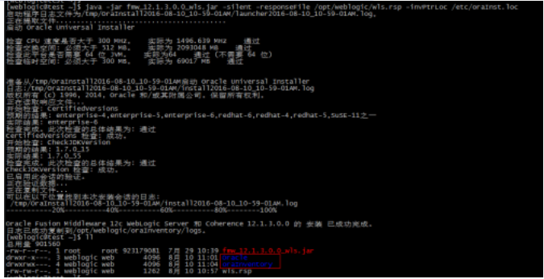
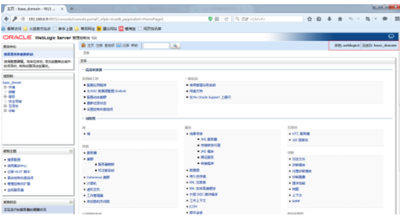

```shell
CentOS 6.3安装配置Weblogic 10  http://www.linuxidc.com/Linux/2014-02/96918.htm
Oracle WebLogic 11g 安装部署文档 PDF http://www.linuxidc.com/Linux/2013-04/83658.htm
Linux部署Weblogic11g http://www.linuxidc.com/Linux/2013-01/77940.htm
Oracle基础教程之安装与配置Weblogic单实例 http://www.linuxidc.com/Linux/2012-02/54418.htm
Linux下Weblogic卸载 http://www.linuxidc.com/Linux/2012-01/51886.htm
Weblogic多机器集群的配置 http://www.linuxidc.com/Linux/2011-12/50577.htm
Weblogic的安装和配置 http://www.linuxidc.com/Linux/2011-12/49082.htm
安装最新的weblogic版本，版本号为 12.1.X（12.1.2,12.1.3）。开始以为和旧版安装一样，使用控制台的方式，下载bin文件，然后一步步在console执行下来就行了。万万没想到，从12C版本后，bin文件不提供了，改成全系统通用的jar文件 （generic.jar）。试了半天原来那种安装方式不能用了，非得用图形界面安装。由于服务器只能远程登录，于是各种百度、各种找材料，最后终于找到一种静默方式的安装。请看下文。
weblogic12C各版本所支持的JDK版本：
fmw_12.1.3.0.0_wls.jar     需要jdk1.7.0_15以上的版本
wls_121200.jar          需要jdk1.7版本；1.8版本不可用
weblogic在安装的时候会对系统进行严格的检查，
包括jdk版本,cpu性能，swap空间，磁盘空间,tmp临时空间[软件在安装时会产生大约1G的日志以及其他必须的文件]等;
一、前期准备
1.新建用户组 web
[root@edwcube3 ~]#
[root@edwcube3 ~]# groupadd web
[root@edwcube3 ~]#
2.新建用户weblogic 并修改用户密码
[root@edwcube3 ~]#
[root@edwcube3 ~]# useradd -g web weblogic  //添加用户，并用-g参数来制定 web用户组
[root@edwcube3 ~]
[root@edwcube3 ~]# passwd weblogic    //passwd命令修改密码
Changing password for user weblogic.
New UNIX password:
Retype new UNIX password:
passwd: all authentication tokens updated successfully.
[root@edwcube3 ~]#
[root@edwcube3 ~]#
3.如果没有安装jdk的话，还需要安装jdk
 第一步：从官网下载压缩包 jdk-7-linux-i586.tar.gz
http://download.oracle.com/otn-pub/java/jdk/7/jdk-7-linux-i586.tar.gz
[root@odstest jdk1.7]$ tar -zxv -f jdk-7u55-linux-i586.tar.gz  -C ./jdk1.7
第三步.移动文件/usr/local
注：具体位置可以根据用户习惯自己移动
[root@odstest /]# mv ./jdk1.7 /usr/local/jdk1.7
第四步.配置环境变量
环境分量分为整个系统的，已经只针对当前用户设置的，我们这边只对weblogic用户设置
~/.bashrc ：仅对当前用户生效
在 ~/.bashrc 最后添加以下部分
JAVA_HOME=/usr/local/jdk1.7
export JRE_HOME=/usr/local/jdk1.7/jre
export CLASSPATH=.:$JAVA_HOME/lib:$JRE_HOME/lib:$CLASSPATH
export PATH=$JAVA_HOME/bin:$JRE_HOME/bin:$PATH
保存，执行 source ~/.bashrc 。使修改生效
退出，重新登陆，查看是否生效
[weblogic@edwcube3 ~]$ java -version
java version "1.7.0_40"
Java(TM) SE Runtime Environment (build 1.7.0_40-b43)
Java HotSpot(TM) Server VM (build 24.0-b56, mixed mode)
[weblogic@edwcube3 ~]$
[weblogic@edwcube3 ~]$
jdk安装完毕~
二、开始安装
Slient Mode静默方式
首先看命令的格式：
java -jar wls_121200.jar -silent -responseFile  file -invPtrLoc file

-response file：响应文件
-invPtrLoc file：初始化环境文件
1、创建响应文件 wls.rsp  [响应文件中的项一定要写全，否则会报参数不足等错误]

[ENGINE]
#DO NOT CHANGE THIS.
Response File Version=1.0.0.0.0
[GENERIC]
#The oracle home location. This can be an existing Oracle Home or a new Oracle Home
ORACLE_HOME=/u02/bea
#Set this variable value to the Installation Type selected. e.g. WebLogic Server, Coherence, Complete with Examples.
INSTALL_TYPE=WebLogic Server
#Provide the My Oracle Support Username. If you wish to ignore Oracle Configuration Manager configuration provide empty string for user name.
MYORACLESUPPORT_USERNAME=
#Provide the My Oracle Support Password
MYORACLESUPPORT_PASSWORD=
#Set this to true if you wish to decline the security updates. Setting this to true and providing empty string for My Oracle Support username will ignore the Oracle Configuration Manager configuration
DECLINE_SECURITY_UPDATES=true
#Set this to true if My Oracle Support Password is specified
SECURITY_UPDATES_VIA_MYORACLESUPPORT=false
#Provide the Proxy Host
PROXY_HOST=
#Provide the Proxy Port
PROXY_PORT=
#Provide the Proxy Username
PROXY_USER=
#Provide the Proxy Password
PROXY_PWD=
#Type String (URL format) Indicates the OCM Repeater URL which should be of the format [scheme[Http/Https]]://[repeater host]:[repeater port]
COLLECTOR_SUPPORTHUB_URL=

2、创建Loc文件 oraInst.loc
inventory_loc=/home/weblogic/oraInventory
inst_group=weblogic


3、保证所需要得目录weblogic用户要用读写权限
   /ghca/bea文件用户weblogic必须要有读写权限
   oraInst.loc，wls.rsp，fmw_12.1.3.0.0_wls.jar 文件用户weblogic必须要有读写权限
4、安装 wls.rsp，oraInst.loc必须指定绝对路径 java -jar fmw_12.1.3.0.0_wls.jar  -silent  -responseFile  /home/weblogic/wls.rsp  -invPtrLoc /home/weblogic/oraInst.loc
$ java -jar fmw_12.1.3.0.0_wls.jar  -silent  -responseFile  /home/weblogic/wls.rsp  -invPtrLoc /home/weblogic/oraInst.loc 
启动程序日志文件为/tmp/OraInstall2016-12-07_11-28-48AM/launcher2016-12-07_11-28-48AM.log。
正在提取文件........
Java HotSpot(TM) Server VM warning: You have loaded library /tmp/orcl3700411247043593693.tmp/Disk1/install/linux/libjni.so which might have disabled stack guard. The VM will try to fix the stack guard now.
It's highly recommended that you fix the library with 'execstack -c ', or link it with '-z noexecstack'.
启动 Oracle Universal Installer
检查 CPU 速度是否大于 300 MHz。   实际为 2128.009 MHz    通过
检查交换空间: 必须大于 512 MB。   实际为 8388604 MB    通过
检查此平台是否需要 64 位 JVM。   实际为32    通过 (不需要 64 位)
检查临时空间: 必须大于 300 MB。   实际为 3559 MB    通过
准备从/tmp/OraInstall2016-12-07_11-28-48AM启动 Oracle Universal Installer
Java HotSpot(TM) Server VM warning: ignoring option MaxPermSize=512m; support was removed in 8.0    ---可忽略
日志:/tmp/OraInstall2016-12-07_11-28-48AM/install2016-12-07_11-28-48AM.log
版权所有 (c) 1996, 2014, Oracle 和/或其附属公司。保留所有权利。
正在读取响应文件...
开始检查: CertifiedVersions
预期的结果: enterprise-4,enterprise-5,enterprise-6,redhat-6,redhat-4,redhat-5,SuSE-11之一
实际结果: (未知操作系统版本)
检查完成。此次检查的总体结果为: 未通过 <<<< 可忽略
问题: 此 Oracle 软件未经当前操作系统认证。
建议案: 确保在正确的平台上安装软件。
警告: 检查:CertifiedVersions 失败。
开始检查: CheckJDKVersion
预期的结果: 1.7.0_15
实际结果: 1.8.0_111
检查完成。此次检查的总体结果为: 通过  
CheckJDKVersion 检查: 成功。
已启用此会话的验证。
正在验证数据...
正在复制文件...
可以在以下位置找到本次安装会话的日志:
 /tmp/OraInstall2016-12-07_11-28-48AM/install2016-12-07_11-28-48AM.log
-----------20%----------40%----------60%----------80%--------100%
Oracle Fusion Middleware 12c WebLogic Server 和 Coherence 12.1.3.0.0 的 安装 已成功完成。
日志已成功复制到/home/weblogic/oraInventory/logs。   -----打印此信息，说明weblogic安装成功了。
5、 创建domain域名
A、通过纯命令行安装
export MW_HOME="/u02/bea"
export WL_HOME="/u02/bea/oracle_common"
[root@WAAA-NM1 bin]# pwd
/ghca/bea/wlserver/common/bin
[root@WAAA-NM1 bin]# ./commEnv.sh
[root@WAAA-NM1 bin]# ./wlst.sh 
Java HotSpot(TM) Server VM warning: ignoring option MaxPermSize=256m; support was removed in 8.0
Initializing WebLogic Scripting Tool (WLST) ...
Jython scans all the jar files it can find at first startup. Depending on the system, this process may take a few minutes to complete, and WLST may not return a prompt right away.
Welcome to WebLogic Server Administration Scripting Shell
Type help() for help on available commands
wls:/offline> readTemplate('/u02/bea/wlserver/common/templates/wls/wls.jar')
wls:/offline/base_domain>cd('Servers/AdminServer')
wls:/offline/base_domain/Server/AdminServer>set('ListenAddress','')
wls:/offline/base_domain/Server/AdminServer>set('ListenPort', 7001)
wls:/offline/base_domain/Server/AdminServer>cd('../..')
wls:/offline/base_domain>cd('Security/base_domain/User/weblogic')
wls:/offline/base_domain/Security/base_domain/User/weblogic>cmo.setPassword('weblogic123')
wls:/offline/base_domain/Security/base_domain/User/weblogic>setOption('OverwriteDomain', 'true')
wls:/offline/base_domain/Security/base_domain/User/weblogic>writeDomain('/u02/bea/user_projects/domains/base_domain') 
closeTemplate()
exit()
PS：最后一步等待时间稍微较长;

B、通过参数文件执行安装
方式1：创建create_domains.py,添加内容：
readTemplate('/home/wls/wlserver/common/templates/wls/wls.jar')
cd('Servers/AdminServer')
set('ListenAddress','ip地址')
set('ListenPort', 7001)
cd('/Security/base_domain/User/weblogic')
cmo.setPassword('weblogic123')
setOption('OverwriteDomain', 'true')
setOption('ServerStartMode', 'prod')
writeDomain('/home/wls/user_projects/domains/dai')
closeTemplate()
exit()
执行安装 ./wlst.sh ./create_domains.py
方式2：创建文件/home/weblogic/create_domain.resp，添加内容:
read template from "/u02/bea/wlserver/common/templates/wls/wls.jar";
set JavaHome "/usr/local/jdk1.8";
set ServerStartMode "dev"; 
find Server "AdminServer" as AdminServer;
set AdminServer.ListenAddress "";
set AdminServer.ListenPort "7001";
set AdminServer.SSL.Enabled "true";
set AdminServer.SSL.ListenPort "7002";
//create a new user
create User "weblogic2" as u2;
set u2.password "weblogic123";
write domain to "/u02/bea/user_projects/domains/base_domain/"; 
// The domain name will be "demo-domain"
close template;
到/home/weblogic/Oracle/Middleware/wlserver/common/bin下执行脚本./config.sh /home/weblogic/create_domain.resp


9、启动
$cd /u02/bea/user_projects/domains/base_domain/bin
$./startWeblogic.sh
参考官网资料：
https://docs.oracle.com/middleware/1213/core/OUIRF/silent.htm#OUIRF337
参考博客：
http://chbinmile.blog.51cto.com/6085145/1880433
http://www.cnblogs.com/dingyingsi/p/5262255.html
-----------------------------------------------------------------------------
linux下静默安装weblogic 12
http://meiling.blog.51cto.com/6220221/1836572
所需软件：
JAVA环境部署文件：jdk-7u55-linux-x64.rpm
Weblogic安装文件：fmw_12.1.3.0.0_wls.jar
一、创建用户和组
创建用户组：groupadd web
创建用户：useradd -g web -m -d /opt/weblogic weblogic
修改密码：passwd weblogic
授权用户：chown -R weblogic:web /opt/weblogic/
useradd 主要参数：
－c：加上备注文字，备注文字保存在passwd的备注栏中。 
－d：指定用户登入时的启始目录。
－D：变更预设值。
－e：指定账号的有效期限，缺省表示永久有效。
－f：指定在密码过期后多少天即关闭该账号。
－g：指定用户所属的起始群组。
－G：指定用户所属的附加群组。
－m：自动建立用户的登入目录。
－M：不要自动建立用户的登入目录。
－n：取消建立以用户名称为名的群组。
－r：建立系统账号。
－s：指定用户登入后所使用的shell。
－u：指定用户ID号。
二、配置JAVA环境
安装jdk：rpm -ivh jdk-7u55-linux-x64.rpm
在/etc/profile最后加入以下内容：
export JAVA_HOME=/usr/java/jdk1.7.0_55
export JRE_HOME=/usr/java/jdk1.7.0_55/jre
export CLASSPATH=$CLASSPATH:$JAVA_HOME/lib:$JAVA_HOME/jre/lib
export PATH=$JAVA_HOME/bin:$JRE_HOME/bin:$PATH
使之生效
source /etc/profile
验证JDK安装成功与否：
#java –version
三、安装weblogic
Slient Mode静默方式
首先看命令的格式：
java -jar wls_121200.jar -silent -responseFile  file -invPtrLoc file
-response file：响应文件
-invPtrLoc file：初始化环境文件
文件详解：
1.创建 oraInst.loc 文件，内容如下

#Oracle Installer Location File Location
inst_group=web 组名称
inventory_loc=/opt/weblogic/oraInventory产品清单目录

注：在Linux服务器上，oraInst.loc文件通常位于/etc目录中

```


```shell
2.创建 wls.rsp 响应文件
su - weblogic
chmod 777 /opt/weblogic/fmw_12.1.3.0.0_wls.jar
wls.rsp这个文件你可以在图形界面安装时，点击保存生产该文件。本机使用的文件内容如下：
#weblogic安装过程路径配置

[ENGINE]
#DO NOT CHANGE THIS.
Response File Version=1.0.0.0.0
[GENERIC]
#The oracle home location. This can be an existing Oracle Home or a new Oracle Home
ORACLE_HOME=/opt/weblogic/Oracle/Middleware
#Set this variable value to the Installation Type selected. e.g. WebLogic Server, Coherence, Complete with Examples.
INSTALL_TYPE=WebLogic Server
#Provide the My Oracle Support Username. If you wish to ignore Oracle Configuration Manager configuration provide empty string for user name.
MYORACLESUPPORT_USERNAME=
#Provide the My Oracle Support Password
MYORACLESUPPORT_PASSWORD=
#Set this to true if you wish to decline the security updates. Setting this to true and providing empty string for My Oracle Support username will ignore the Oracle Configuration Manager configuration
DECLINE_SECURITY_UPDATES=true
#Set this to true if My Oracle Support Password is specified
SECURITY_UPDATES_VIA_MYORACLESUPPORT=false
#Provide the Proxy Host
PROXY_HOST=
#Provide the Proxy Port
PROXY_PORT=
#Provide the Proxy Username
PROXY_USER=
#Provide the Proxy Password
PROXY_PWD=
#Type String (URL format) Indicates the OCM Repeater URL which should be of the format [scheme[Http/Https]]://[repeater host]:[repeater port]
COLLECTOR_SUPPORTHUB_URL=


chmod 664 wls.rsp
3.配置文件创建后，就可以进行安装了:
响应文件必须指定全路径
[weblogic@test ~]$ java -jar fmw_12.1.3.0.0_wls.jar -silent -responseFile /opt/weblogic/wls.rsp -invPtrLoc /etc/oraInst.loc


启动程序日志文件为/tmp/OraInstall2016-08-10_10-59-01AM/launcher2016-08-10_10-59-01AM.log。
正在提取文件.........................................
启动 Oracle Universal Installer
检查 CPU 速度是否大于 300 MHz。 实际为 1496.639 MHz 通过
检查交换空间: 必须大于 512 MB。 实际为 2093048 MB 通过
检查此平台是否需要 64 位 JVM。 实际为64 通过 (不需要 64 位)
检查临时空间: 必须大于 300 MB。 实际为 69017 MB 通过
准备从/tmp/OraInstall2016-08-10_10-59-01AM启动 Oracle Universal Installer
日志:/tmp/OraInstall2016-08-10_10-59-01AM/install2016-08-10_10-59-01AM.log
版权所有 (c) 1996, 2014, Oracle 和/或其附属公司。保留所有权利。
正在读取响应文件...
开始检查: CertifiedVersions
预期的结果: enterprise-4,enterprise-5,enterprise-6,redhat-6,redhat-4,redhat-5,SuSE-11之一
实际结果: enterprise-6
检查完成。此次检查的总体结果为: 通过
CertifiedVersions 检查: 成功。
开始检查: CheckJDKVersion
预期的结果: 1.7.0_15
实际结果: 1.7.0_55
检查完成。此次检查的总体结果为: 通过
CheckJDKVersion 检查: 成功。
已启用此会话的验证。
正在验证数据...
正在复制文件...
可以在以下位置找到本次安装会话的日志:
/tmp/OraInstall2016-08-10_10-59-01AM/install2016-08-10_10-59-01AM.log
-----------20%----------40%----------60%----------80%--------100%
Oracle Fusion Middleware 12c WebLogic Server 和 Coherence 12.1.3.0.0 的 安装 已成功完成。
日志已成功复制到/opt/weblogic/oraInventory/logs。

```



以上表示安装完成

**4.接下来要创建域domain**

4.1 创建存放路径

[weblogic@test ~]$ mkdir -p /opt/weblogic/Oracle/Middleware/user_projects/domains/base_domain/

4.2 创建参数文件

创建文件: create_domain.rsp

内容:

\################################################################################

```shell
readtemplate from "/opt/weblogic/Oracle/Middleware/wlserver/common/templates/wls/wls.jar";
setJavaHome "/usr/java/jdk1.7.0_55"; 
setServerStartMode "dev"; 
findServer "AdminServer"as AdminServer;
setAdminServer.ListenAddress "";
setAdminServer.ListenPort "8001";
setAdminServer.SSL.Enabled "true";
setAdminServer.SSL.ListenPort "8002";
//Wecan directly create a new managed server.
create Server "base"as BASE;
setBASE.ListenAddress "";
setBASE.ListenPort "8003";
//setBASE.SSL.Enabled "true";
//setBASE.SSL.ListenPort "8004″;
//CreateMachine
create Machine "base"as Machinename;
//usetemplates default weblogic user
findUser "weblogic"as u1;
setu1.password "weblogic123";
//createa new user
create User "weblogic2"as u2;
setu2.password "weblogic123";
write domain to "/opt/weblogic/Oracle/Middleware/user_projects/domains/base_domain/"; 
//The domain name will be "demo-domain"
close template;
```

4.3 静默创建域

cd /opt/weblogic/Oracle/Middleware/wlserver/common/bin

[weblogic@test ~]$ cd Oracle/Middleware/wlserver/common/bin

[weblogic@test bin]$ ./config.sh -mode=silent -silent_script=/opt/weblogic/create_domain.rsp -logfile=/opt/weblogic/create_domain.log

出现如下输出：

```shell
<< readtemplate from "/opt/weblogic/Oracle/Middleware/wlserver/common/templates/wls/wls.jar"
>> succeed: readtemplate from "/opt/weblogic/Oracle/Middleware/wlserver/common/templates/wls/wls.jar"
<< setconfig option JavaHome to "/usr/java/jdk1.7.0_55"
>> succeed: setconfig option JavaHome to "/usr/java/jdk1.7.0_55"
<< setconfig option ServerStartMode to "dev"
>> succeed: setconfig option ServerStartMode to "dev"
<< findServer "AdminServer"as AdminServer
>> succeed: findServer "AdminServer"as AdminServer
<< setAdminServer attribute ListenAddress to ""
>> succeed: setAdminServer attribute ListenAddress to ""
<< setAdminServer attribute ListenPort to "8001"
>> succeed: setAdminServer attribute ListenPort to "8001"
<< setAdminServer attribute SSL!Enabled to "true"
>> succeed: setAdminServer attribute SSL!Enabled to "true"
<< setAdminServer attribute SSL!ListenPort to "8002"
>> succeed: setAdminServer attribute SSL!ListenPort to "8002"
<< create Server "base"as BASE
>> succeed: create Server "base"as BASE
<< setBASE attribute ListenAddress to ""
>> succeed: setBASE attribute ListenAddress to ""
<< setBASE attribute ListenPort to "8003"
>> succeed: setBASE attribute ListenPort to "8003"
<< create Machine "base"as Machinename
>> succeed: create Machine "base"as Machinename
<< findUser "weblogic"as u1
>> succeed: findUser "weblogic"as u1
<< setu1 attribute Password to "********"
>> succeed: setu1 attribute Password to "********"
<< create User "weblogic2"as u2
>> succeed: create User "weblogic2"as u2
<< setu2 attribute Password to "********"
>> succeed: setu2 attribute Password to "********"
<< write Domain to "/opt/weblogic/Oracle/Middleware/user_projects/domains/base_domain/"
..........................................................................................
>> succeed: write Domain to "/opt/weblogic/Oracle/Middleware/user_projects/domains/base_domain/"
<< close template
>> succeed: close template
```

```shell
5、WebLogic的后台启动、停止运行的方法
进入目录：/opt/weblogic/Oracle/Middleware/user_projects/domains/base_domain/bin/
[root@test ~]# cd /opt/weblogic/Oracle/Middleware/user_projects/domains/base_domain/bin/
[root@test bin]# nohup ./startWebLogic.sh &
[root@test bin]# nohup ./startWebLogic.sh &    默认日志是在当前启动的目录生成nohup.out
若想自己指定日志名字，可以如下：
[root@test bin]# nohup ./startWebLogic.sh >> 你定义的文件名字 & ｛nohup ./startWebLogic.sh >日志文件名 &｝
最后就可以访问 http://ip:8001/console 进入控制台了
用上面的建的用户登录
```



```shell
Linux 上安装 weblogic12C（静默安装）(一)
作者：_辉  来源：IT165收集  发布日期：2015-01-23 21:43:15
最近负责在linux上安装weblogic，客户说要安装最新的版本，版本号为 12.1.X（12.1.2,12.1.3）。开始以为和旧版安装一样，使用控制台的方式，下载bin文件，然后一步步在console执行下来就行了。万万没想到，从12C版本后，
bin文件不提供了，改成全系统通用的jar文件 （generic.jar）。试了半天原来那种安装方式不能用了，非得用图形界面安装。由于服务器是在其他地方，肯定不能跑到主机的地址那边。于是各种google、各种找材料，
最后终于找到一种静默方式的安装。大家看下文。
PS:经过公司一位大神的指导，可以通过远程图形界面的方式进行安装，即把图形界面直接显示在自己的电脑上，不需要跑到主机的地方。将在第二篇中进行介绍安装方式！
一、前期准备
　　1.新建用户组 web
1.[root@edwcube3~]#
2.[root@edwcube3~]# groupadd web
3.[root@edwcube3~]#
 　　2.新建用户weblogic 并修改用户密码
01.[root@edwcube3~]#
02.[root@edwcube3~]# useradd -g web weblogic  //添加用户，并用-g参数来制定 web用户组
03.[root@edwcube3~]
04.[root@edwcube3~]# passwd weblogic     //passwd命令修改密码
05.Changing pass"http://www.it165.net/edu/ebg/"target="_blank"class="keylink">word foruser weblogic.
06.New UNIX pass"http://www.it165.net/edu/ebg/"target="_blank"class="keylink">word:
07.Retype newUNIX password:
08.passwd: all authentication tokens updated successfully.
09.[root@edwcube3~]#
10.[root@edwcube3~]#
　　3.如果没有安装jdk的话，还需要安装jdk  第一步：从官网下载压缩包 jdk-7-linux-i586.tar.gz http://download.oracle.com/otn-pub/java/jdk/7/jdk-7-linux-i586.tar.gz
1.[root@odstestjdk1.7]$ tar -zxv -f jdk-7u55-linux-i586.tar.gz  -C ./jdk1.7
 第三步.移动文件/usr/local  注：具体位置可以根据用户习惯自己移动
1.[root@odstest/]# mv ./jdk1.7/usr/local/jdk1.7
第四步.配置环境变量 环境分量分为整个系统的，已经只针对当前用户设置的，我们这边只对weblogic用户设置   ~/.bashrc ：仅对当前用户生效 在 ~/.bashrc 最后添加以下部分  
1.JAVA_HOME=/usr/local/jdk1.7
2.export JRE_HOME=/usr/local/jdk1.7/jre
3.export CLASSPATH=.:$JAVA_HOME/lib:$JRE_HOME/lib:$CLASSPATH
4.export PATH=$JAVA_HOME/bin:$JRE_HOME/bin:$PATH
保存，执行 source ~/.bashrc 。使修改生效 退出，重新登陆，查看是否生效  
1.[weblogic@edwcube3~]$ java -version
2.java version '1.7.0_40'
3.Java(TM) SE Runtime Environment (build 1.7.0_40-b43)
4.Java HotSpot(TM) Server VM (build 24.0-b56, mixed mode)
5.[weblogic@edwcube3~]$
6.[weblogic@edwcube3~]$
jdk安装完毕~
二、开始安装
Slient Mode静默方式
首先看命令的格式：
1.java -jar wls_121200.jar -silent -responseFile  file -invPtrLoc file
-response file：响应文件 -invPtrLoc file：初始化环境文件   具体例子：
1.java -jar wls_121200.jar -silent -responseFile /home/exampleuser/response/wls.rsp -invPtrLoc /home/exampleuser/oraInst.loc
文件详解： 1.创建 oraInst.loc 文件，内容如下
1.inventory_loc=/home/weblogic/oraInventory1    产品清单目录
2.#用户的组名称，根据实际的修改
3.inst_group=weblogic                           组名称
用来保存安装时的一些临时文件，和默认安装的组名称 如果原来安装过Oracle的产品那么这步可以省略，不需要指定oraInventory1 目录   命令能够简写如下：  
1.java -jar wls_121200.jar -silent -responseFile /home/exampleuser/response/wls.rsp
2.创建 wls.rsp 响应文件  这个文件你可以在图形界面安装时，点击保存生产该文件。本机使用的文件内容如下：  
1.[ENGINE]
2.#DO NOT CHANGE THIS.
3.Response File Version=1.0.0.0.0
4.[GENERIC]
5.#weblogic的安装路径，根据自己的需要修改
6.ORACLE_HOME=/home/weblogic/Oracle/Middleware  
7.#Set thisvariable value to the Installation Type selected. e.g. WebLogic Server, Coherence, Complete with Examples.
8.INSTALL_TYPE=WebLogic Server
我这边只选择了最基本的Weblogic Server组件，选择其他会稍有不同。   3.配置文件创建后，就可以进行安装了
1.[weblogic@localhostliaowh]$ java -jar wls_121200.jar -silent -response /home/weblogic/liaowh/wls12.rsp -invPtrLoc /home/weblogic/liaowh/oraInst.loc
2.正在提取文件............
3.Java HotSpot(TM) Server VM warning: You have loaded library /tmp/orcl305077197089615615.tmp/Disk1/install/linux/libjni.so which might have disabled stack guard. The VM will tryto fix the stack guard now.
4.It's highly recommended that you fix the library with 'execstack -c ', or link it with '-z noexecstack'.
5.启动 Oracle Universal Installer
等一会，出现
01.预期的结果: 1.7
02.实际结果: 1.7.0_40
03.检查完成。此次检查的总体结果为: 通过
04.CheckJDKVersion 检查: 成功。
05.正在验证数据...
06.正在复制文件...
07.-----------20%----------40%----------60%----------80%--------100%
08.WebLogic Server 12.1.2.0.0的 installation 已成功完成。
09.[weblogic@localhostliaowh]$
就表示成功了。   4.接下来要创建域domain 首先执行setWLSEnv.sh  来配置环境变量
1.[weblogic@localhostbin]$ ./home/weblogic/Oracle/Middleware12/wlserver/server/bin/setWLSEnv.sh
然后手动创建域存放的目录，博主在/home/weblogic/Oracle/Middleware/目录下新建
1.[weblogic@localhostMiddleware12]$ cd user_projects/
2.[weblogic@localhostuser_projects]$ mkdir domains
3.[weblogic@localhostuser_projects]$ cd domains/
4.[weblogic@localhostdomains]$ mkdir hnDomain
5.[weblogic@localhostdomains]$ cd hnDomain/
6.[weblogic@localhosthnDomain]$ pwd
7./home/weblogic/Oracle/Middleware12/user_projects/domains/hnDomain
8.[weblogic@localhosthnDomain]$
进到域目录下，执行命令
1.[weblogic@localhosthnDomain]$ $JAVA_HOME/bin/java $JAVA_OPTIONS -Xmx1024m -XX:MaxPermSize=256m weblogic.Server
来生成域下面的各种文件，包括管理服务器等的配置信息。 之后进入bin目录下，进行启动即可，最后就可以访问 http://ip:7001/console 进入控制台了。   打完收工！ 
```

