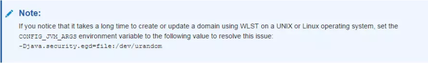
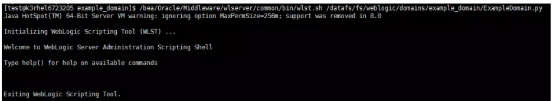
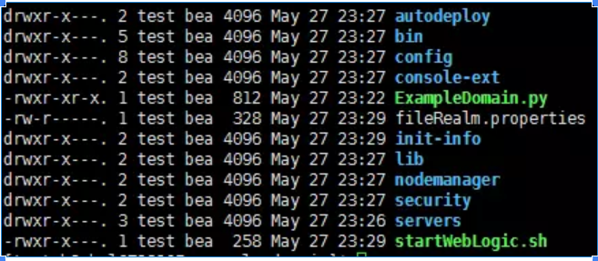
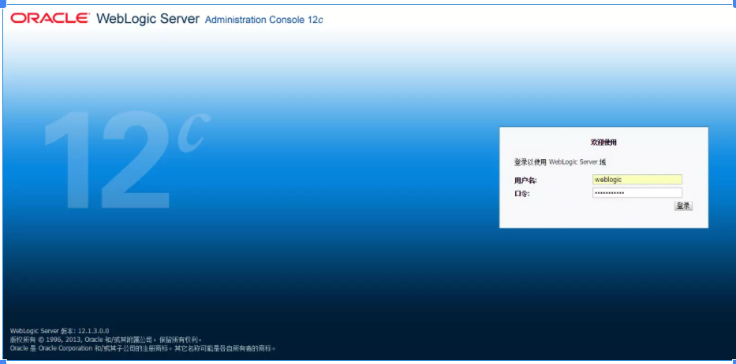
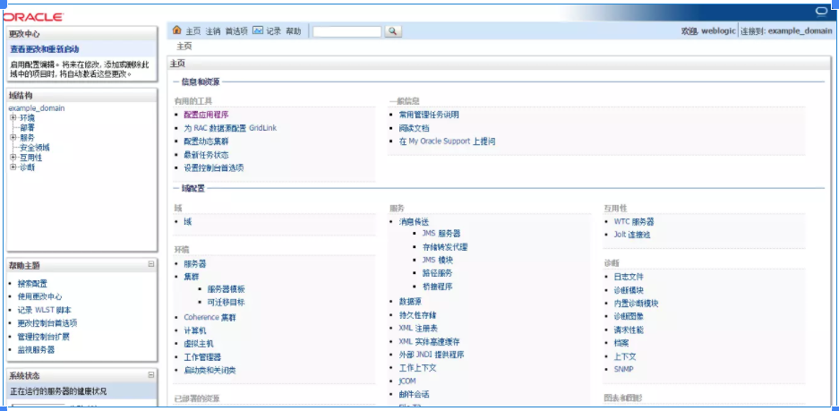

[Weblogic 12c 使用 WLST 新建域](https://segmentfault.com/a/1190000006795936)

从 Weblogic 12c 版本开始，Oracle 移除了 Weblogic 12c 中间件的通过命令行交互形式进行安装和建域的方式。将安装和建域方式默认为通过 Java 界面的形式，在 Windows 系统进行操作时，没有太多的变化，而在 Linux 系统操作时，就变得很麻烦，需要使用远程界面的形式进行操作。

在此基础上，Weblogic 12c 提供了静默安装和静默建域的方式，及通过命令行一步完成，而不再进行命令行多次交互过程。

本文主要介绍使用 Weblogic 12c 提供的 WLST 工具进行静默建域的流程，以供参考。

Weblogic 12c 的安装过程也有静默安装的方式，但由于目前手上没有合适的环境，因此之后通过其他文章说明。

WLST

**WLST** ： WebLogic Scripting Tool ，即 Weblogic 脚本工具。

WebLogic 脚本工具 (WebLogic Scripting Tool , WLST) 是一种命令行脚本界面，系统管理员和操作员用它来监视和管理 WebLogic Server 实例以及域。WLST 脚本环境基于 Java 脚本解释器 Jython。除 WebLogic 脚本功能外，还可以使用解释语言（包括本地变量、条件变量以及流控制语句）的常用功能。WebLogic Server 开发人员和管理员可以按照 Jython 语言语法扩展 WebLogic 脚本语言，以满足其环境需要。（本段摘自[百度百科-wlst](http://baike.baidu.com/view/5105027.htm)）

WLST 工具可以实现多种针对 Weblogic 的操作，在本文中主要演示如何使用 WLST 新建空白域，其他功能可通过 Oracle 的官方操作文档了解。

```shell
以下内容中以具体的例子进行说明。
假设 Weblogic 的安装目录为：/bea/Oracle/Middleware
假设默认的 Weblogic Domain 目录为：/datafs/fs/weblogic/domains
编写 WLST 建域脚本
在 /datafs/fs/weblogic/domains 目录下建立空的域文件夹 example_domain ，绝对目录为 /datafs/fs/weblogic/domains/example_domain 。
复制 /bea/Oracle/Middleware/wlserver/common/templates/scripts/wlst/basicWLSDomain.py 文件到 example_domain 文件夹下，并重命名为 ExampleDomain.py ，该文件将作为创建当前域的脚本文件。
修改脚本
打开 ExampleDomain.py 文件，按照以下代码所示，删除多余的配置并修改该脚本文件：
# Weblogic Domain Template 
# Use Basic Domain Template
readTemplate("/bea/Oracle/Middleware/wlserver/common/templates/wls/wls.jar")

# Config AdminServer Listen Address and Port
cd('Servers/AdminServer')
set('ListenAddress','')
set('ListenPort', 8001)

# Config username and password of Console User
cd('/')
# 'Security/base_domain/User/weblogic' The 'weblogic' is username
cd('Security/base_domain/User/weblogic')
cmo.setPassword('weblogic123')

# If the domain already exists, overwrite the domain
setOption('OverwriteDomain', 'true')
# Config home directory for the JVM to be used when starting the weblogic server
setOption('JavaHome', '/usr/java/jdk1.8.0_91')
# Config the Domain folder path
writeDomain('/datafs/fs/weblogic/domains/example_domain')

# Close Template
closeTemplate()

# Exit script
exit()
脚本流程
使用 readTemplate 函数读取建域模版脚本， Weblogic 预置了多种建域脚本，我们仅使用最基础的建域脚本即可。
设置 AdminServer 的监听地址和端口号， ListenAddress 为监听地址，默认为 '' 表示监听所有本机地址； ListenPort 为监听端口号，这里根据实际情况设置，不冲突即可。
设置用户名密码， 'Security/base_domain/User/weblogic' 中 weblogic 就是用户名， cmo.setPassword('weblogic123') 用于将密码设置为 weblogic123 。
设置域参数：OverwriteDomain 设置为覆盖已有域文件；JavaHome 设置 Weblogic 域运行时用到的 JVM 。
设置域路径并写入，使用 writeDomain 函数设置待写入的域路径，并执行写入过程。
使用 closeTemplate 函数在执行完域写入后关闭域模版。
使用 exit 函数退出脚本。
以上实例为最简单的域创建脚本， WLST 本身提供了丰富的函数进行域创建和域操作，详细的说明请参考 Oracle 的官方文档。
```

执行 WLST 建域脚本



```shell
进入 /datafs/fs/weblogic/domains/example_domain 目录，执行以下命令，通过WLST脚本创建域：
首先执行以下命令设置临时环境变量，用于解决创建域过程过慢问题，该问题在Oracle官方手册中已有说明：
$ export CONFIG_JVM_ARGS='-Djava.security.egd=file:/dev/urandom'
然后执行建域脚本：
$ /bea/Oracle/Middleware/wlserver/common/bin/wlst.sh /datafs/fs/weblogic/domains/example_domain/ExampleDomain.py
执行完成后如下图：
```



若未报错则说明域已创建成功。

当前域目录下已生成相关的文件：



此时可使用以下命令即可启动当前域的 Weblogic Server：（也可根据个人需要采用其他命令启动）

$ nohup ./startWebLogic.sh &

此时可通过浏览器访问Weblogic控制台：



使用脚本中指定的用户名密码即可登录：



修改启动脚本

```shell
此项操作用于解决Weblogic Server启动后首次访问控制台过于缓慢的问题。
进入域下的bin目录，修改 /datafs/fs/weblogic/domains/example_domain/bin/startWebLogic.sh 启动脚本：
# Call setDomainEnv here.

DOMAIN_HOME="/datafs/fs/weblogic/domains/example_domain"

. ${DOMAIN_HOME}/bin/setDomainEnv.sh $*

SAVE_JAVA_OPTIONS="${JAVA_OPTIONS}"

SAVE_CLASSPATH="${CLASSPATH}"
在上述代码段的 . ${DOMAIN_HOME}/bin/setDomainEnv.sh $* 上方，增加以下语句：
JAVA_OPTIONS="${JAVA_OPTIONS} -Djava.security.egd=file:/dev/urandom"
增加完成后如下：
# Call setDomainEnv here.

DOMAIN_HOME="/datafs/fs/weblogic/domains/example_domain"

JAVA_OPTIONS="${JAVA_OPTIONS} -Djava.security.egd=file:/dev/urandom"

. ${DOMAIN_HOME}/bin/setDomainEnv.sh $*

SAVE_JAVA_OPTIONS="${JAVA_OPTIONS}"

SAVE_CLASSPATH="${CLASSPATH}"
保存后，使用域目录下的 /datafs/fs/weblogic/domains/example_domain/startWebLogic.sh 脚本启动即可。
该解决方案的原理和解决 WLST 建域慢的原理相同，基本原理是重设了 Linux 系统下获取随机数的来源。
```

