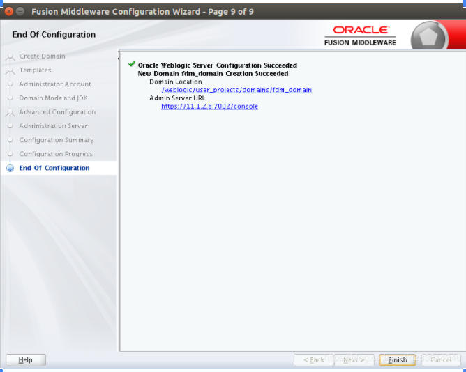

**安装weblogic 12c**

**1、**[**下载weblogic 12c**](https://www.oracle.com/technetwork/middleware/weblogic/downloads/index.html)**，**[**官方文档**](https://docs.oracle.com/middleware/12213/wls/index.html)**，如下：**


**2、解压下载后的包，README.txt里面有安装说明，英文好的可以直接按照说明安装，安装包运行需要JDK8以上支持**


**3、建立weblogic的相关用户和组**

```
# 创建weblogic组
sudo groupadd weblogic

# 创建weblogic用户并指定组
sudo useradd -mg weblogic weblogic

# 修改weblogic密码
sudo passwd weblogic

#创建weblogic目录
sudo mkdir -p /weblogic
sudo chown weblogic:weblogic /weblogic

#切换用户
su - weblogic


```

**4、上传fmw_12.2.1.3.0_wls_quick.jar到ubuntu，如/weblogic**


**5、安装weblogic**

- cd /weblogic 运行java -jar fmw_12.2.1.3.0_wls_quick.jar进行安装，安装成功，如下


**6、配置weblogic应用域（图形界面方式）**

- 6.1 运行/weblogic/wls12213/wlserver/server/bin下的setWLSEnv.sh设置weblogic环境变量


- 6.2 运行mkdir -p /weblogic/user_projects/domains，创建/weblogic/user_projects/domains
- 6.3 运行. /oracle_common/common/bin/config.sh配置weblogic域，需要图形界面支持，不然打不开，界面如下，选“Create a new domain”，Domain Location可以选默认，也可以选上面创建的/weblogic/user_projects/domains/fdm_domain，然后点"Next"


- 6.4 默认，然后点"Next"


- 6.5 输入weblogic管理员用户和密码，建议用户是weblogic，密码长度8位以上，如weblogic123，然后点"Next"


- 6.6 选择模式，有Development模式（开发模式）和Production模式（生产模式），

**两种模式区别如下**

- 开发模式的用户名和密码配置在boot.properties中，启用了自动部署，当自动部署处于启用状态时，管理服务器将监视指定的目录以确定是否有新建的或更新的应用程序。如果管理服务器发现了应用程序有变化，就会自动部署该目录中的所有文件或目录。默认情况下，自动部署目录为域的/autodeploy子目录，在autodeploy目录中找到的任何新文件都将被自动部署。
- 生产模式关闭了自动部署，启动应用时需要输入用户名和密码，当然也可以配个boot.properties。

**两种模式互相转换的方法**

- *生产模式* 转 *开发模式*

第一步：将domain下的/bin/setDomainEnv.sh文件的PRODUCTION_MODE="true"改为PRODUCTION_MODE="false"或者PRODUCTION_MODE=。

第二步：将domain下的config/config.xml文件中的true改为false，或者直接删掉。

第三步：重新运行/bin/startWebLogic.sh即可。

- *开发模式* 转 *生产模式*

第一步：将domain下的bin/setDomainEnv.sh文件中的PRODUCTION_MODE="false"改为PRODUCTION_MODE=“true”。

第二步：重新运行/bin/startWebLogic.sh即可。

选开发模式及JDK，然后点"Next"


- 6.7 选"Administration Server"，然后点"Next"


- 6.8 填上服务器名，IP和端口，点"Next"


- 6.9 配置结果预览，点"Create"创建


- 6.10 正在创建，出现100%就可以了。然后点"Next"


- 6.11 点"Finish"退出，记住Admin Server URL



- 6.12 运行mkdir -p /weblogic/start/logs，创建weblogic启动脚本及日志目录。

新建一个startFdmAdmin.sh，输入以下内容

nohup /weblogic/user_projects/domains/fdm_domain/bin/startWebLogic.sh>/weblogic/start/logs/startfdmAdmin.out & tail -f /weblogic/start/logs/startfdmAdmin.out

- 1
- 2

- 6.13 启动weblogic服务，如果启动很慢的话，解决方法见[weblogic 12c Adminserver启动好慢优化](https://blog.csdn.net/q283614346/article/details/86664976)

cd /weblogic/start sh startFdmAdmin.sh

- 1
- 2

当出现RUNNING时表示启动成功，如下


- 6.14 打开浏览器输入http://11.1.2.8:7001/console，输入上面设置的密码，如下


登录成功的界面如下


**7、配置weblogic应用域（使用WebLogic Scripting Tool (WLST)脚本方式）**

```
7.1 创建的域目录
mkdir -p /weblogic/user_projects/domains

1
7.2 复制basicWLSDomain.py到/weblogic/user_projects/domains
cp /weblogic/wls12213/wlserver/common/templates/scripts/wlst/basicWLSDomain.py /weblogic/user_projects/domains

1
7.3 修改复制过来的basicWLSDomain.py，样例如下
#=======================================================================================
# Open a domain template.
#=======================================================================================

readTemplate("/weblogic/wls12213/wlserver/common/templates/wls/wls.jar")

#=======================================================================================
# Configure the Administration Server and SSL port.
#
# To enable access by both local and remote processes, you should not set the 
# listen address for the server instance (that is, it should be left blank or not set). 
# In this case, the server instance will determine the address of the machine and 
# listen on it. 
#=======================================================================================

cd('Servers/AdminServer')
set('ListenAddress','')
set('ListenPort', 7001)

create('AdminServer','SSL')
cd('SSL/AdminServer')
set('Enabled', 'True')
set('ListenPort', 7002)

#=======================================================================================
# Define the user password for weblogic.
#=======================================================================================

cd('/')
cd('Security/base_domain/User/weblogic')
# Please set password here before using this script, e.g. cmo.setPassword('value')
cmo.setPassword('weblogic123')

#=======================================================================================
# Write the domain and close the domain template.
#=======================================================================================

setOption('OverwriteDomain', 'true')
writeDomain('/weblogic/user_projects/domains/basicWLSDomain')
closeTemplate()

#=======================================================================================
# Exit WLST.
#=======================================================================================

exit()


7.4 执行以下命令，然后等待完成即可（大约15分钟左右）
cd /weblogic/user_projects/domains 
sh /weblogic/wls12213/oracle_common/common/bin/wlst.sh basicWLSDomain.py


```


```
7.5 启动域
cd basicWLSDomain
sh startWebLogic.sh


7.6 启动完成后打开浏览器输入http://11.1.2.8:7001/console，输入上面设置的密码即可
```

