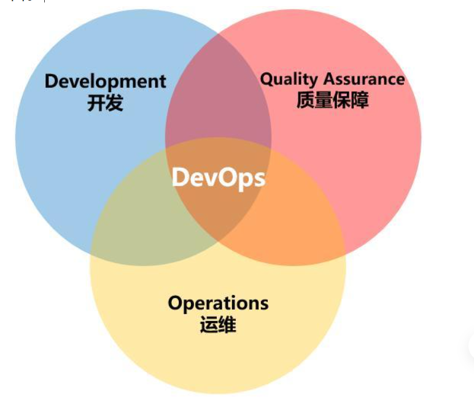

**DevOps到底是什么意思？**

提到DevOps这个词，我相信很多人一定不会陌生。

作为一个热门的概念，DevOps近年来频频出现在各大技术社区和媒体的文章中，备受行业大咖的追捧，也吸引了很多吃瓜群众的围观。

那么，DevOps是什么呢？

有人说它是一种方法，也有人说它是一种工具，还有人说它是一种思想。更有甚者，说它是一种哲学。

越说越玄乎，感觉都要封神啦！DevOps这玩意真的有那么夸张吗？它到底是干嘛用的？为什么行业里都会对它趋之如骛呢？

今天这篇文章，小枣君就和大家好好聊一聊这个DevOps。

**DevOps的起源**

这个故事有点长，从头开始讲起吧。

上个世纪40年代，世界上第一台计算机诞生。从诞生之日起，它就离不开程序（Program）的驱动。而负责编写程序的人，就被称为“程序员”（Programmer）。

程序员是计算机的驾驭者，也是极其稀缺的人才。那个时候，只有高学历、名校出身的人，才有资格成为程序员，操控计算机。

随着人类科技的不断发展，PC和Internet陆续问世，我们进入了全民拥抱信息化的时代。越来越多的企业开始将计算机作为办公用的工具，用以提升生产力。而普通个人用户也开始将计算机作为娱乐工具，用以改善生活品质。

于是，计算机的程序，开始变成了一门生意。程序，逐步演进为“软件（software）”，变成了最赚钱的产品之一。

在软件产业里，程序员有了更专业的称谓，叫做“软件开发工程师（Software Development Engineer）”，也就是我们常说的“码农”。

我们知道，一个软件从零开始到最终交付，大概包括以下几个阶段：规划、编码、构建、测试、发布、部署和维护。

最初，程序比较简单，工作量不大，程序员一个人可以完成所有阶段的工作。

随着软件产业的日益发展壮大，软件的规模也在逐渐变得庞大。软件的复杂度不断攀升。一个人已经hold不住了，就开始出现了精细化分工。

码农的队伍扩大，工种增加。除了软件开发工程师之外，又有了软件测试工程师，软件运维工程师。

分工之后，传统的软件开发流程是这样的：

软件开发人员花费数周和数月编写代码，然后将代码交给QA（质量保障）团队进行测试，然后将最终的发布版交给运维团队去布署。所有的这三个阶段，即开发，测试，布署。

早期所采用的软件交付模型，称之为“瀑布（Waterfall）模型”。

瀑布模型，简而言之，就是等一个阶段所有工作完成之后，再进入下一个阶段。

这种模型适合条件比较理想化（用户需求非常明确、开发时间非常充足）的项目。大家按部就班，轮流执行自己的职责即可。

但是，项目不可能是单向运作的。客户也是有需求的。产品也是会有问题的，需要改进的。

随着时间推移，用户对系统的需求不断增加，与此同时，用户给的时间周期却越来越少。在这个情况下，大家发现，笨重迟缓的瀑布式开发已经不合时宜了。

于是，软件开发团队引入了一个新的概念，那就是大名鼎鼎的——“敏捷开发（Agile Development）”。

敏捷开发在2000年左右开始被世人所关注，是一种能应对快速变化需求的软件开发能力。其实简单来说，就是把大项目变成小项目，把大时间点变成小时间点，然后这样：

有两个词经常会伴随着DevOps出现，那就是CI和CD。CI是Continuous Integration（持续集成），而CD对应多个英文，Continuous Delivery（持续交付）或Continuous Deployment（持续部署）。

美其名曰：“持续（Continuous）”，其实就是“加速——反复——加速——反复……”，这样子。

画个图大家可能更明白一点：

敏捷开发大幅提高了开发团队的工作效率，让版本的更新速度变得更快。

很多人可能会觉得，“更新版本的速度快了，风险不是更大了吗？”

其实，事实并非如此。

敏捷开发可以帮助更快地发现问题，产品被更快地交付到用户手中，团队可以更快地得到用户的反馈，从而进行更快地响应。而且，DevOps小步快跑的形式带来的版本变化是比较小的，风险会更小（如下图所示）。即使出现问题，修复起来也会相对容易一些。

虽然敏捷开发大幅提升了软件开发的效率和版本更新的速度，但是它的效果仅限于开发环节。研发们发现，运维那边，依旧是铁板一块，成为了新的瓶颈。

运维工程师，和开发工程师有着完全不同的思维逻辑。运维团队的座右铭，很简单，就是“稳定压倒一切”。运维的核心诉求，就是不出问题。

什么情况下最容易出问题？发生改变的时候最容易出问题。所以说，运维非常排斥“改变”。

于是乎，矛盾就在两者之间集中爆发了。

这个时候，我们的DevOps，隆重登场了。

**DevOps到底是什么**

DevOps这个词，其实就是Development和Operations两个词的组合。它的英文发音是 /de'vps/，类似于“迪沃普斯”。

DevOps的维基百科定义是这样的：

DevOps是一组过程、方法与系统的统称，用于促进开发、技术运营和质量保障（QA）部门之间的沟通、协作与整合。

这个定位稍微有点抽象，但是并不难理解。反正它不是某一个特定软件、工具或平台的名字。

从目标来看，DevOps就是让开发人员和运维人员更好地沟通合作，通过自动化流程来使得软件整体过程更加快捷和可靠。

破墙工具

很多人可能觉得，所谓DevOps，不就是Dev+Ops嘛，把两个团队合并，或者将运维划归开发，不就完事了嘛，简单粗暴。

注意，这个观点是不对的。这也是DevOps这些年一直难以落地的主要原因。

想要将DevOps真正落地，首先第一点，是思维转变，也就是“洗脑”。不仅是运维的要洗，开发的也要洗。员工要洗，领导更要洗。

DevOps并不仅仅是组织架构变革，更是企业文化和思想观念的变革。如果不能改变观念，即使将员工放在一起，也不会产生火花。

除了洗脑之外，就是根据DevOps思想重新梳理全流程的规范和标准。

在DevOps的流程下，运维人员会在项目开发期间就介入到开发过程中，了解开发人员使用的系统架构和技术路线，从而制定适当的运维方案。而开发人员也会在运维的初期参与到系统部署中，并提供系统部署的优化建议。

DevOps的实施，促进开发和运维人员的沟通，增进彼此的理（gan）解（qing）。

在思维和流程改变的同时，想要充分落地DevOps，当然离不开软件和平台的支持。

目前支持DevOps的软件实在是太多了。限于篇幅，就不一一介绍了。话说回来，现在DevOps之所以被吹得天花乱坠，也有这些软件和平台的功劳，可以趁机卖钱啊。

DevOps生态圈中令人眼花缭乱的工具

上述这些关键要素里面，技术（工具和平台）是最容易实现的，流程次之，思维转变反而最困难。

换言之，DevOps考验的不仅是一家企业的技术，更是管理水平和企业文化。

对比前面所说的瀑布式开发和敏捷开发，我们可以明显看出，DevOps贯穿了软件全生命周期，而不仅限于开发阶段。

下面这张图，更明显地说明了DevOps所处的位置，还有它的价值：

**DevOps的发展现状**

DevOps这个词来源于2009年在比利时根特市举办的首届DevOpsDays大会，为了在Twitter上更方便的传播，由DevOpsDays缩写为DevOps。

目前，DevOps处于高速增长的阶段。尤其是在大企业中，DevOps受到了广泛的欢迎。

根据2018年的调查发现，74%的受访者已经接受了DevOps，而前一年这一比例为66%。

越大的企业，越喜欢DevOps。包括Adobe、Amazon、Apple、Airbnb、Ebay、Etsy、Facebook、LinkedIn、Netflix、NASA、Starbucks、Walmart、Sony等公司，都在采用DevOps。

如今，DevOps几乎已经成为了软件工程的代名词。

DevOps迅猛发展，相关专业人才的薪资待遇也跟着水涨船高。

根据调研，DevOps工程师在美国的平均年薪为130000美金，在中国平均年薪也在40万-50万区间，能力强者年薪百万也是比比皆是。

数据来自招聘网站

薪资的猛涨，又带动了IT工程师们学习和认证的热潮。

DevOps的认证目前最受欢迎的就是EXIN DevOps Master和EXIN DevOps Professional。这些认证的培训费用不低，但是仍然吸引了很多人踊跃报名。

EXIN DevOps认证体系

**DevOps与虚拟化、容器、微服务**

这几年云计算技术突飞猛进，大家应该对虚拟化、容器、微服务这些概念并不陌生。当我们提到这些概念的时候，也会偶尔提及DevOps。

它们之间有什么联系呢？

其实很简单。

大家可以设想一下，如果要对一项工作进行精细化分工，我们是对一个大铁疙瘩进行加工方便？还是拆成一块一块进行加工更加方便？

显然是拆分之后会更加方便。

所谓“微服务”，就是将原来黑盒化的一个整体产品进行拆分（解耦），从一个提供多种服务的整体，拆成各自提供不同服务的多个个体。如下图所示：

单体式架构（Monolithic）→ 微服务架构

微服务架构下，不同的工程师可以对各自负责的模块进行处理，例如开发、测试、部署、迭代。

而虚拟化，其实就是一种敏捷的云计算服务。它从硬件上，将一个系统“划分”为多个系统，系统之间相互隔离，为微服务提供便利。

容器就更彻底了，不是划分为不同的操作系统，而是在操作系统上划分为不同的“运行环境”（Container），占用资源更少，部署速度更快。

明白了吧？虚拟化和容器，其实为DevOps提供了很好的前提条件。开发环境和部署环境都可以更好地隔离了，减小了相互之间的影响。

这也是DevOps为什么09年时不火，现在越来越火的一个主要原因之一。

**最后的话**

天下武功，无坚不摧，唯快不破。

时代发展到现在，客户的需求瞬息万变，市场的风向也难以预测。作为企业，想要生存下去，只有让自己变得更快。作为员工，必须让自己眼光更加长远，内心更加包容。

