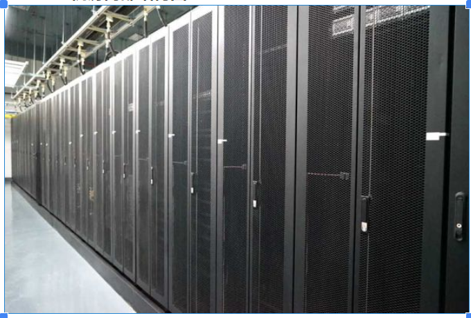
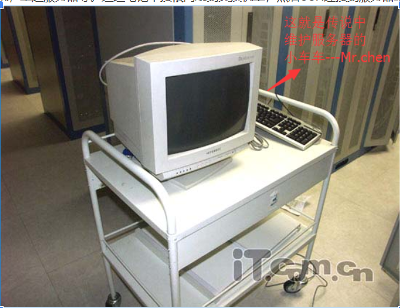
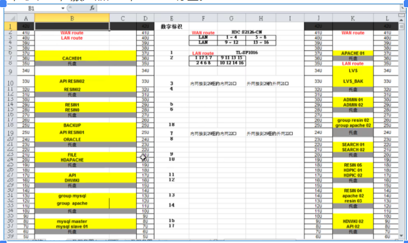
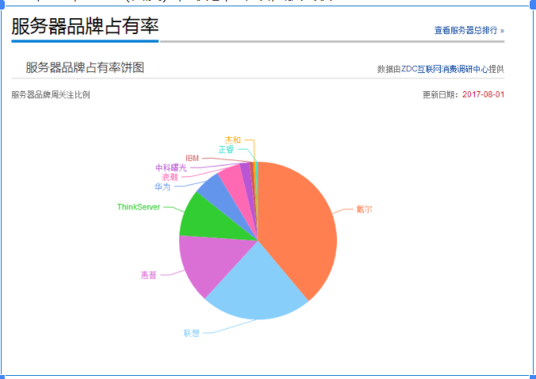
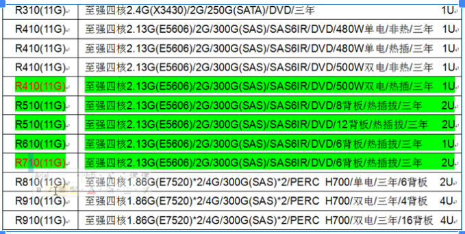

**1.1 IDC机房**

**1.1.1 带宽计算**

带宽流量计算公式：

1 Byte=8bit，1KB=1024B，1MB=1024KB，1GB=1024MB

B表示Byte，工业标准是1000.

一般我们家装ADSL宽带，常说1M带宽，我们发现下载速度仅能在120-130K之间，这是为什么呢？是宽带接入公司欺骗我们吗？答：不是的。

因为接入商说宣称的1M宽带的单位是以比特（bit）为单位算的，而我们常说的下载速度是按字节（byte）计算的，因此1Mb=125Kbyte，因此，我们说的下载速度是接入商说的带宽除以8的结果。这样解释后，你应该明白了吧。

**1.1.2 IDC机房内部结构图**

**1.1.3 如何进入机房维护服务器？**

一般来说，要先和公司的负责IDC机房客服或销售人员事先打好招呼（邮件或电话），然后才能维护机房。机房一般都不在公司内，而是托管在固定的地点（有温度，湿度指标）。

进入机房前要出示个人身份证，并在他们提供的本子上签字（名字，身份证信息，进入理由及进入时间，维护什么等）。有时会有机房销售或客服人员陪同。签字后，好一点的机房会发给你鞋套，需要套在鞋上，防止灰尘，垃圾带到机房内部影响服务器运行。

**1.1.4 进入机房后如何维护具体服务器？**

正常情况机房的温度比较低（具体见附录），而且，进入机房可以听到非常嘈杂的机器运行的声音。

服务器的运行是没有显示器的，需要维护服务器时，机房会提供显示器（显示器一般会放在一个平板小车上（有多个），键盘，鼠标等一般还需要签字申请使用，使用后归还，小车推回原处）。

当找到显示器后，把小车推到你的公司的机柜的服务器所在处。此时可以把显示器接好电源，接上服务器的接口，然后插上键盘和鼠标（U口），开始维护服务器--如安装系统，重起服务器等。通过笔记本接根网线到交换机上，然后SSH连接到服务器里。

**1.1.5 什么情况下需要去机房维护**

（1）公司购买了新服务器，可能需要把服务器拉到公司，你装完系统，配置好基础配置，然后拉到机房上架，也可能直接拉到机房安装系统（如机房有公司的人员的时候）。

（2）机器运行异常，无法远程维护了，机房人员帮助未果，需要重装系统（远程控制卡可代替去机房）等。远程控制卡最好是独立的（非集成）。

- 独立远程控制卡：可以重启，安装系统，查看启动过程，屏幕输出
- 集成远程控制卡：只能重启，关机，查看一些服务器状态

（3）网络异常，如网线，交换机等。

**最好办法：**

1）求人不如求已：机房有公司维护人员，服务器配置远程控制卡自助解决。

2）机房人员帮助：让他重启服务，甚至让他接显示器看屏幕状态，或服务面板。还可能把密码给她让他登陆看看状态。但是机房人员一般技术，素质不是特别高。操作过程很慢。

3）自己的人跑机房

4）如果不是特别紧急，可以请机房人员帮忙维护。电话（事先报备的）说名字，身份证，机柜号，服务器位置，IP地址标签。

**1.1.6 机房带宽及机柜价格实际数据：**

电：商业电费1元+，500-750W，一小时0.5-0.75度。一台服务器一年的电量：0.7*24*365=6132度

带宽费：

200-1000元/M/月（北京BGP机房价格），按1M/月/500计算，1M一年6000元

**1.1.6.1 酒仙桥（兆维）数据维护中心**

**独享价格**

| 机型     | IP数 | 带宽     | 报价        |
| -------- | ---- | -------- | ----------- |
| 半个机柜 | 7    | 100M独享 | 360000元/年 |
| 一个机柜 | 16   | 100M独享 | 450000元/年 |
| /        | 16   | 100M独享 | 300000元/年 |

**1.1.6.2 北苑联通数据中心**

**100M共享**

| 机型 | IP数 | 带宽     | 报价       |
| ---- | ---- | -------- | ---------- |
| 1U   | 1    | 100M共享 | 6500元/年  |
| 2U   | 1    | 100M共享 | 7500元/年  |
| 4U   | 1    | 100M共享 | 11000元/年 |
| PC   | 2    | 100M共享 | 11000元/年 |

**1.1.7 BGP机房：多线路机房**

**1.1.7.1 什么是bgp?**

bgp边界网关协议，是一种用来在不同的运营商之间传递大量路由信息的路由协议。

**1.1.7.2 什么是BGP机房？**

简单说，BGP机房就是将IDC网络和多个运营商互联起来，实现单IP绑定在多条线路上，所有互联运营商（电信，网通等）的用户访问IDC的网络，都会智能的走相应的线路，达到访问速度都很快的目的。

**1.1.7.3 BGP机房有什么优点？**

1. 服务器只需要设置一个IP地址，最佳访问路由是由网络上的骨干路由器根据路由跳数与其他技术指标来确定的，不会占用服务器的任何系统资源。服务器的上行路由与下行路由都能选择最优的路径，所以能真正实现高速的单IP高速访问。
2. 由于BGP协议本身具有冗余备份，消除环路的特点，所以当IDC服务商有多余BGP互联线路时可以实现路由的相互备份，在一条线路出现故障时路由会自动切换到其他线路。
3. 使用BGP协议还可以使网络具有很强的扩展性可以将IDC网络与其他运营商互联，轻松实现单IP多线路，做到所有互联运营商的用户访问都很快。这个是双IP双线无法比拟的。更多BGP信息可参考http://baike.baidu.com/view/360.htm

**1.1.7.4 既然BGP这么好，单线机房还有人用吗？**

外地有大量的单线机房，还有人会用么？当然会，因为成本的关系。

1）CDN会用。CDN通过智能DNS解析判断用户的地域及运营商来源，进而，重新分配最近的适合用户访问的线路。这大大降低了带宽成本（单线路带宽成本可能仅有M/20-50元/月，甚至更低。）

2）游戏公司，下载站等，如QQ游戏，业务里标着电信，网通，让用户选择去接入。

3）其它

**1.1.8 机房带宽共享和独享：**

**共享：**

100M共享：适合个人，小企业1-2台机器，业务量小的用户。

特点是：多个用户（公司）共同使用这个线路，因为会互相争抢资源，因此不是很稳定，但价格便宜。4000-7000元，单台服务器。

**独享：**

独自享有，即假如购买10M，完全自己用。不会有和别的客户争用带宽的情况。一般的正规企业都是独享。北京的价格200-700元/M/月，高的也有过1000元/M/月的。

**如果带宽超了？**

关于带宽，机房一般是会有限制的，根据经验高于购买带宽的10%-20%，就无法在跑上去了。当你发现MRTG流量图接近带宽顶峰后，线条很平的时候，很可能就表示带宽跑满了。此时用户在访问就会出现比较慢的情况。

**2.1 服务器选型**

**2.1.1 互联网公司常用的服务器品牌：**

DELL，HP，IBM（百度），联想，华硕，航天联志

其中，DELL是一款性价比不错的品牌，大多数互联网公司的选择。

**2.1.2 早期约8年前（2009年前）的DELL服务器系列**

| 单位 | 型号            |                          |
| ---- | --------------- | ------------------------ |
| 1u   | dell 1850，1950 | 可用于Web，lvs等         |
| 2u   | dell 2850，2950 | 可用于mysql db存储等     |
| 4u   | dell 6850       | 可用于oracle，共享存储等 |

**2.1.3 近期约最近3-4年DELL服务器系列**

**2.1.4 生产环境负载均衡集群系统架构设备选购案例**

选购依据：价格，性能，冗余

硬件需求：

**2.1.4.1 负载均衡器硬件选择及raid级别**

| LVS1主 | DELL R610 1U | CPU E5606*2 | 4G*2 内存 | 硬盘：SAS 146G*2 RAID1 |
| ------ | ------------ | ----------- | --------- | ---------------------- |
| LVS2主 | DELL R610 1U | CPU E5606*2 | 4G*2 内存 | 硬盘：SAS 146G*2 RAID1 |

**提示：**

负载均衡器很重要，需要稳定，对CPU，内存有一定要求，磁盘大小要求不高；

**2.1.4.2 WEB层硬件选择及raid级别**

| www主站1业务（两台） | DELL R710 | CPU E5606*2 | 4G*4内存 | 硬盘：SAS 300G*2 RAID0 |
| -------------------- | --------- | ----------- | -------- | ---------------------- |
| www主站1业务（两台） | DELL R710 | CPU E5606*2 | 4G*4内存 | 硬盘：SAS 300G*2 RAID0 |

**提示：**

这里也可以选R610.如果机房机器海量，考虑到老跑机房换硬盘装系统的成本，也可以考虑SAS146*3 raid5

**2.1.4.3 数据库层硬件选择及raid级别（适合mysql和oracle）**

| MYSQL 主库1-1   | DELL R710 | CPU E5606*2 | 4G*8 内存 | 硬盘：SAS 600G*6（或146G*6） RAID 10 |
| --------------- | --------- | ----------- | --------- | ------------------------------------ |
| MYSQL 主库1-2   | DELL R710 | CPU E5606*2 | 4G*8 内存 | 硬盘：SAS 600G*6（或146G*6） RAID 10 |
| MYSQL 从库1-1： | DELL R710 | CPU E5606*2 | 4G*4 内存 | 硬盘：SAS 15k 600G*4 RAID0 或RAID5   |
| MYSQL 从库1-2： | DELL R710 | CPU E5606*2 | 4G*4 内存 | 硬盘：SAS 15k 600G*4 RAID0 或RAID5   |
| MYSQL 从库2-1： | DELL R710 | CPU E5606*2 | 4G*4 内存 | 硬盘：SAS 15k 600G*4 RAID0 或RAID5   |
| MYSQL 从库2-2： | DELL R710 | CPU E5606*2 | 4G*4 内存 | 硬盘：SAS 15k 600G*4 RAID0 或RAID5   |

**提示1：**

这里需要注意主从库RAID后，硬盘大小要一致。性能和维护折中考虑，从库也可考虑做raid5等。从库也可以根据硬件使用情况，跑多实例数据库，提升利用率。

**2.1.4.4 存储层硬件选择及raid级别**

**数据备份硬件选择及raid级别：**

| DELL R610 | E5606*2 | 16G内存 | 硬盘：SATA 10k 2T*4 可以不做raid交叉备份    |
| --------- | ------- | ------- | ------------------------------------------- |
| DELL R710 | E5606*2 | 16G内存 | 硬盘：SATA 10k 2T*6 raid5,做raid5是折中方案 |

**提示：**

备份服务器一般考虑容量和冗余即可，对性能要求不高。

**共享存储NFS硬件选择及raid级别：**

| NFS1:DELL R710 | E5606 | 16G内存 | 硬盘：SAS 15k 600G*6 RAID10 RAID5 RAID 0 |
| -------------- | ----- | ------- | ---------------------------------------- |
| NFS1:DELL R710 | E5606 | 16G内存 | 硬盘：SAS 15k 600G*6 RAID10 RAID5        |

分布式存储MFS，GFS

普通服务器配置就可以了

**2.1.4.5 监控管理网关层硬件选择及raid级别**

监控及报警服务器兼出口网关等：DELL R610，E5606*1 8G内存，146G*2 RAID1

**提示：**

也可以不单独采购，和备份或共享服务器使用同一台机器。

**2.1.4.6 cache服务器**

Memcache：内存够大，无需磁盘空间

**提示：**

也可以不单独采购，和备份或共享服务器使用同一台机器。

**2.1.4.7 网络设备：【采用全千兆交换机】**

CISCO，H3C，DLINK（3000元）

提示：所有服务器要带独立的远程管理卡。（具体可以百度）