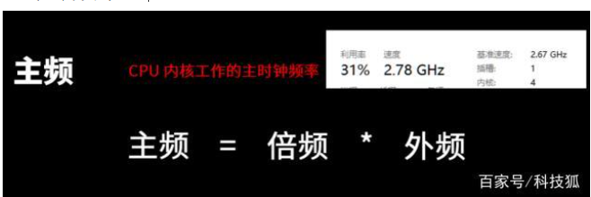
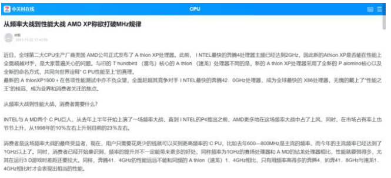

从宏观人类的意义上来说，CPU 是目前人类科技含量最高，工艺最复杂，结构最精细的产物结晶。

从微观每个人的角度上来说，CPU 好像也就不过是个商品，还是大家都能买得起的那种。

但，并不是所有人都懂 CPU 构成，甚至，连 CPU 怎么选购都不知道，那，要不要来了解下 CPU 的构成 以及 CPU 如何选购？

**正文**

众所周知，计算机只能识别 1 和 0，为什么呢？根本原因在于 CPU 或者说所有的电子元件，只能有两种状态：变(1)、不变(0)/ 开（1）、关（0） 。

但是知道这个和 CPU 有什么关系呢，CPU 的根本任务就是**执行指令预算**，也就是1 0 1010101010101000101010101010101010010101010101010101001这个过程到底是怎样实现的呢。这就要从 CPU 的内部结构开始说起了:

cpu 内部主要是由一大堆的**运算器、控制器、寄存器**组成。

**运算器** 负责算术运算（+ - * / 基本运算和附加运算）和逻辑运算（包括 移位、逻辑测试或比较两个值等）。**控制器** 则高级一点，负责应对所有的信息情况，调度运算器把计算做好。**寄存器** 就稍微复杂一点，既要对接控制器的命令，传达命令给运算器；还要帮运算器记录处理完或者将要处理的数据。

在这三种元件外，还有**缓存（cache），总线，核心显卡**等

如果这么说你理解不了，没有关系，我们用一个例子来说明一下：假设 CPU 是一个工厂，**一个核心就是工厂的一个车间**

那么**运算器** 就是工厂里的普工，只负责生产（运算）

而 **寄存器** 呢，就是一个工具人，有时需要传递信息（数据），有时需要搬运物资（数据）。

**控制器**则是车间主管，管理调剂所有普工和工具人，压榨他们的劳动价值。

直到有一天，工厂发现一个车间（核心）效率不够，就只能**增加车间（核心）**来提高整个工厂效率。

但是，渐渐的，又有新问题出现，工具人虽然效率高，但是数量不多，而随着越来越多的原材料（数据）涌入，工具人搬不过来。这时工厂就整了一个小板车（cache），专门用来运输、寄存工具人搬不过来的数据，而且各工厂可以共享其中一部分（intel 的 L3 cache）。

随着车间数量（核心数目）增加到八，工厂发现有些时候出货量挺高的（全车间都开工），但有些时候只有一两个个车间开工，其它车间都在围观（调度问题）。

而且整个工厂一起开工，用电量和发热量也急剧上升，但是各车间的效率（频率）就是上不去，此外，还要担心电力供给、散热、物资（数据）运输等各类问题。

终于，在投入了大研发后，工厂的厂房布局设计（**架构**）有了大改进，

各部门之间的交通更便利了；并且，工厂也重新招聘短小精悍的工人（提升制程工艺），将以前那种牛高马大，光吃不干的大块头全部淘汰了。至此，同样大的车间，能融入更多的工人干活了，而且短小精悍的工人，吃的饭还少（功耗低）。

但，工厂的难题还有很多，有些是内部问题，有些是外部问题，在这种内忧外患的情景下，intel 不由得又挤了一管牙膏压压惊。

怎么样，这个例子能让你们理解 CPU 里运作的过程了嘛，对应的一些参数了解了嘛？没有的话，我就再补充说明一些很重要的参数

**参数详解**

**核心线程**

核心是 CPU 处理数据的一个大单位，理论上来说，**核心数越多，干活的效率越高**，或者说可以同时干的事情越多，就像一个工厂，这个车间可以生产这个零部件，那个车间可以生产另外一个零部件。

而**线程**则是**提高核心的使用效率**，比如在这个车间生产这个零部件的时候，有些工艺是需要等待的，而在这个等待的时候，工人们都闲着，那线程技术就会让这个暂时闲置的核心干其它的事，持续压榨工人的剩余劳动价值。

因为CPU 的工作过程非常块，在足够长的时间段上，可以看作是CPU同时干了两件事，也就是把一颗单核的CPU 变成了双核。

但核心线程并不一定是越多越好的，因为 CPU 还有一个很重要的指标

**频率**

CPU 的频率简单说是 CPU 运算时的工作频率（CPU 内部的数字时钟信号频率），是单位时间1 S 内产生的脉冲信号个数。

虽然频率高的 CPU 不一定能比低的强，但频率的高低的确关系到整个 CPU 的运算速度。

影响到频率高度的因素非常之多，诸如 CPU 的架构、流水线设计、内部寄存器设计、支持的指令甚至是功耗、温度这些物理因素，所以说 CPU 出厂频率就是综合多种考虑，以木桶效应下的最小值作为 CPU 的最高频率。

那么，**CPU 的主频**又是什么呢？主频是指 CPU 内核工作的主时钟频率。

主频有一个公式：**主频 = 倍频 \* 外频** ，为什么会有这个公式呢？这就要从很久以前 CPU 大战的时候说起，那时 CPU 的频率和外频是一样的，但 CPU 厂商为了竞争（宣传），就通过提升 CPU 的频率来占据市场。而与此同时，其它硬件的工作频率也就是外频，却没有提升，依旧沿用旧有的标准。

这样下来，整个系统就不能很好的同步交流了，于是在这个时候，Intel 就创造性的提出了**倍频** 的概念，让 CPU 频率运行在外频的某个倍率上，这样频率较高的 CPU 就能和较低的外频进行同步交流了。

至于超频，简单提一句，根据上面 CPU 主频的计算公式，超频是通过**提升 外频或者倍频 来提升CPU 主频**，让 CPU 性能提升的一种手段。

**超频有风险，收益太低**，建议不要轻易操作。特别是现在 CPU 厂家要么早已压榨完CPU的性能（AMD），要么贼奸的把超频算计在内（intel），而超频对于实际体验来说，就是那几帧或者那几秒的事情，性价比真的太低了。

**架构和工艺**

虽然频率一定程度上反映了 CPU 的性能，但是单纯追求高主频会让功耗急剧上升，从经济上来说并不合算，现在的 CPU 厂商早就放弃了单纯追求高主频带来的性能提升，转而提高**每瓦性能**。而这个是通过什么实现的呢？CPU 的 架构 和工艺

架构是什么意思？在说架构前，你需要知道一个概念：**指令集**，指令集是CPU 执行计算任务时的规范或者说语言。换句话说， CPU 在计算时是依照指令集的规范来实现的，而架构就是实现这个指令集的物理结构。

打个比方，我们如果要计算 1+1，我们规定在算盘上最右边的珠子一个对应一个1，那 1+1 就是拨动两个最右边的珠子，这就是指令集和架构，优化这两个东西，就能使得 CPU 的效率提升。

当然，里面的过程太复杂（我也不懂），所以大家理解万岁。 而工艺是指**制造CPU或GPU 里 晶体管门电路 的尺寸**，单位为纳米。

制造工艺越低，CPU 里所含的晶体管越多，CPU功能也就越丰富，同时功耗也会降低，频率也能拉高。核心面积也将减少，这就意味着，同样大的晶圆，能造出的 CPU 越多，价格就更低。制造工艺的提升当然也不全是好事，一方面，新工艺总会有未知的问题，而打磨旧工艺，有些时候说不定也能有提升...不行了，我摊牌了，intel 你还要打磨你的14nm 多少年啊！ 最后，再说说

**TDP 热设计功耗**

一般来说，TDP 是指对散热方案设计的最低功耗设计，散热器只要满足 > TDP 就可以及时排出 CPU 发出的热量，即能保证 CPU 正常工作。但后来随着 intel 睿频2.0 的应用，引入了PL1、PL2、PL3、PL4和Tau ，在这四个不同的阶段，就会有不同的热量，所以 一般选购散热器时，都应考虑稍高于TDP 的散热器。

PL1是CPU能够长期工作的阈值，一般设定为TDP；PL2是CPU段时间能够超TDP工作的阈值，Intel推荐PL2比PL1高25%；PL3/PL4一般厂家不设置，这里略过；Tau是CPU能够坚持在PL2的时间长度。

**分类推荐**

那说了这么多参数，和你我选购 CPU 有什么关系呢。容我想想好像真没太大关系，不过当你都能清楚 CPU 的构造、参数后，你对你选购的 CPU 就会更有底气，也能一眼看出嘤嘤嘤今年是不是又挤了牙膏，农厂今年是不是继续 YES。

话说回选购，尽管上面有那么多参数，就算能看懂后，依旧不能很好的衡量 CPU 的综合性能，这时你就要知道，其实有两个参数可以很直观并且客观的反映 CPU 的性能，第一个是 价格，一般在同品牌的前提下，越贵的自然就越好。

第二个就是 跑分，性能越强的，跑分分数就越高，

而再根据这些分数排序，就有 天梯图 的出现，性能越强的 CPU ，**天梯的位置也就越高**。

所以，买 CPU 看不懂原理参数，没有大关系的，**结合你的钱和 CPU 的分数**，就能选出比较适合你的CPU （应该是对你而言 性价比最高的 CPU）

此外，其实 两家 CPU 厂商早也给分好类，就等你入手，以主流的**intel 酷睿系列**和 **AMD 的锐龙系列**来说，它们的产品定位由低至高依次为：

虽然 CPU 的定位是这样，但是，**电脑是看整体硬件性能的，所以需要合理搭配**。

**一点鸟语:**同样定位的前提下，AMD 的综合性能会强上一筹，Intel 的游戏性能略微胜出，但是 AMD 的价格却又低了一点， AMD，YES！但是，如果你只是一个臭打游戏的，那我还是比较建议你购买 intel 的U，配上老黄的显卡，这可能还是目前最稳妥的打游戏解决方案。

**总结**

如果是选购 CPU，那直接点的就是**看跑分（天梯图）、软件/游戏的实测以及价格**。但如果是**想学 CPU 的构造之类**的，说实话，我也只是略懂些皮毛，这篇文章可能帮不到你太多。最后，我还是想要再强调一次，**电脑是整个系统，并不仅仅只是靠某个部件强就强的**。