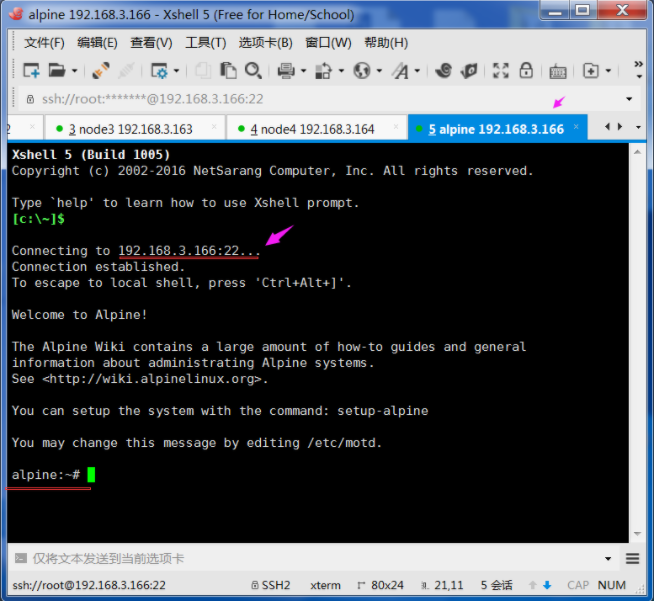

```
Alpine Linux使用简介
目录：
一、Alpine简要介绍
二、Alpine本地安装
三、Alpine在Docker下运行
四、Alpine的配置和使用
    4.1网络相关文件
    4.2更新国内源
    4.3软件包管理工具apk的基本使用
    4.4开启SSH服务
    4.5安装nginx
一、Alpine简要介绍
    Alpine 的意思是“高山的”，比如 Alpine plants高山植物，Alpine skiing高山滑雪、the alpine resort阿尔卑斯山胜地。
    Alpine Linux 网站首页注明“Small！Simple！Secure！Alpine Linux is a security-oriented, lightweight Linux distribution based on musl libc and busybox.”概括了以下特点：
1、小巧：基于Musl libc和busybox，和busybox一样小巧，最小的Docker镜像只有5MB；
2、安全：面向安全的轻量发行版；
3、简单：提供APK包管理工具，软件的搜索、安装、删除、升级都非常方便。
4、适合容器使用：由于小巧、功能完备，非常适合作为容器的基础镜像。
二、Alpine本地安装
Alpine Linux是一个完整的操作系统，像其他操作系统一样，可以将Alpine安装到本地硬盘中。我们可以创建一个VirtualBox虚拟机，在VirtualBox 下安装该系统，以便进行测试使用。具体安装过程，参见我写的另一篇文章《Alpine linux硬盘安装》，地址：http://blog.csdn.net/csdn_duomaomao/article/details/76053229。
主要是在安装过程中，指定一些电脑的基本设置，比如键盘布局、主机名、网卡、IP地址、root口令修改、时区设置、软件仓库地址、SSH服务器、NTP客户端、系统安装方式、磁盘格式化等。
三、Alpine在Docker下运行
1、Docker下的运行
官方 Alpine 镜像的文档：http://gliderlabs.viewdocs.io/docker-alpine/
可以使用Docker Toolbox，创建一台Docker虚拟主机，在该主机的Docker环境下运行alpine的 Docker容器。该容器就是一个Alpine Linux系统，
docker pull alpine
docker run -it --name myalpine alpine
2、作为Docker容器的基础镜像
以Alpine为基础镜像，创建一个MySQL容器，镜像大小只有36.5MB，
同样的方式使用Ubuntu系统作为基础镜像，镜像大小有184MB，
Dockerfile文件的内容：
FROM alpine:3.6
RUN apk add --no-cache mysql-client
ENTRYPOINT ["mysql"]
创建一个test/mysqlclient:1.0镜像
docker build -t test/mysqlclient:1.0 .
四、Alpine的配置和使用
4.1网络相关文件
#主机名文件
/etc/hostname    
#使用新设置的主机名立刻生效,执行如下命令：
hostname -F /etc/hostname   
#主机IP和域名映射文件
/etc/hosts    
#文件内容为：
192.168.99.100    alpine.csdn.net
#DNS 服务器配置文件
/etc/resolv.conf   
#文件内容为：
nameserver 218.2.135.1
nameserver 202.102.24.35
#网卡配置文件
/etc/network/interfaces
#文件内容为：
auto lo
iface lo inet loopback
auto eth0
iface eth0 inet static
      address 192.168.3.166
      netmask 255.255.255.0
      gateway 192.168.3.254
#修改完相关配置以后，重新启动网络服务：
/etc/init.d/networking restart
网络相关的文档，详细参见：https://wiki.alpinelinux.org/wiki/Configure_Networking
4.2更新国内源
# Alpine的源文件为：
/etc/apk/repositories，
# 默认的源地址为：http://dl-cdn.alpinelinux.org/
#可以编辑源文件 /etc/apk/repositories，
#采用国内阿里云的源，文件内容为：
https://mirrors.aliyun.com/alpine/v3.6/main/
https://mirrors.aliyun.com/alpine/v3.6/community/
# 如果采用中国科技大学的源，文件内容为：
https://mirrors.ustc.edu.cn/alpine/v3.6/main/
https://mirrors.ustc.edu.cn/alpine/v3.6/community/
4.3软件包管理工具apk的基本使用
alpine 提供了非常好用的apk软件包管理工具，
可以方便地安装、删除、更新软件。
#查询openssh相关的软件包
apk search  openssh   
#安装一个软件包
apk add  xxx  
#删除已安装的xxx软件包
apk del  xxx   
#获取更多apk包管理的命令参数
apk --help   
#比如安装常用的网络相关工具：
#更新软件包索引文件
apk update    
#用于文本方式查看网页，用于测试http协议
apk add curl  
#提供了查看网络连接的协议端口的命令ss，可以替代netstat命令
apk add iproute2  
#drill 命令可以替代dig和nslookup DNS查询命令
apk add drill   
 #测试192.168.3.166的80端口，查看web服务是否能正常访问。
curl 192.168.3.166  
#查看建立的TCP连接
ss -ta   
#查询域名的信息
drill blog.csdn.net @8.8.8.8    
#根据IP地址，反向查找域名
drill -x 8.8.8.8 @47.94.71.34    
4.4开启SSH服务
#安装openssh-server服务器
apk add openssh-server
#修改配置文件 /etc/ssh/sshd_config，
#如果要想使用root用户远程管理，需要修改参数为：
PermitRootLogin yes
#将ssh服务配置为开机自动启动
 rc-update add sshd
#如果你想立刻生效，可以执行命令：
/etc/init.d/sshd restart
4.5安装nginx
#安装Nginx软件并更新到最新，
apk add --update nginx   
#手工启动Nginx
/etc/init.d/nginx  
#将Nginx添加到启动服务中，下次开机自动运行
rc-update add nginx    
#测试Nginx服务是否正常,使用curl访问，
#默认配置会返回nginx的404页面错误，标明服务已正常：
curl 192.168.3.166
【附图】
01-在Docker主机中，下载alpine镜像
```


02-查看镜像信息，运行alpine容器，查看容器信息


03-在Alpine容器系统中安装常用网络工具-完成部分安装


04-完成常用网络工具的安装


05-在容器中，查看Alpine容器的IP地址


06-在Docker虚拟主机中使用docker build生成Docker镜像的过程


07-生成Docker镜像的大小，只有36.5MB


08-网络相关配置文件及内容


09-重启网络服务 networking restart


10-软件仓库源的文件内容


11-apk软件包管理常用命令-updae-search-add-del


12-使用curl查看Nginx网站的页面反馈-查看TCP网络状态


13-使用drill查询blog.csdn.net网站域名信息1


13-使用drill查询blog.csdn.net网站域名信息2


14-修改ssh配置文件，运行Root用户使用ssh登录


15-使用Xshell客户端工具，ssh登录到3.166的Alpine机器上



16-更新APK软件包仓库的索引文件


17-安装Nginx


18-重启Nginx服务-将Nginx设置为开机自动启动


```
【注意事项】:因为Alpine采用的是musl libc，不是通常用的glibc，在使用DNS时，Alpine（musl libc）在DNS解析文件/etc/resolv.conf中，不使用domain或 search选项。在使用DNS作为服务发现时，要查看相应的文档来解决。相关链接：http://gliderlabs.viewdocs.io/docker-alpine/caveats/
【心得体会】：
http://wiki.alpinelinux.org 网站上内容非常丰富，英文也非常简单，几乎所有的问题都能在该网站上找到答案，强烈推荐该网站。
【参考链接】：
Alpine Linux package management
http://wiki.alpinelinux.org/wiki/Alpine_Linux_package_management
Alpine Linux，一个只有5M的Docker镜像
http://www.infoq.com/cn/news/2016/01/Alpine-Linux-5M-Docker
Alpine Linux 源使用帮助
http://mirrors.ustc.edu.cn/help/alpine.html
Alpine Linux配置使用技巧【一个只有5M的操作系统（转）】
http://www.cnblogs.com/zhangmingcheng/p/7122386.html
docker（10）：virtualbox安装使用 alpinelinux   
http://blog.csdn.net/freewebsys/article/details/53638227
版权声明：本文为博主原创文章，或转载自网络，欢迎转载分享，让这世界越来越好。 https://blog.csdn.net/CSDN_duomaomao/article/details/76152416
```

