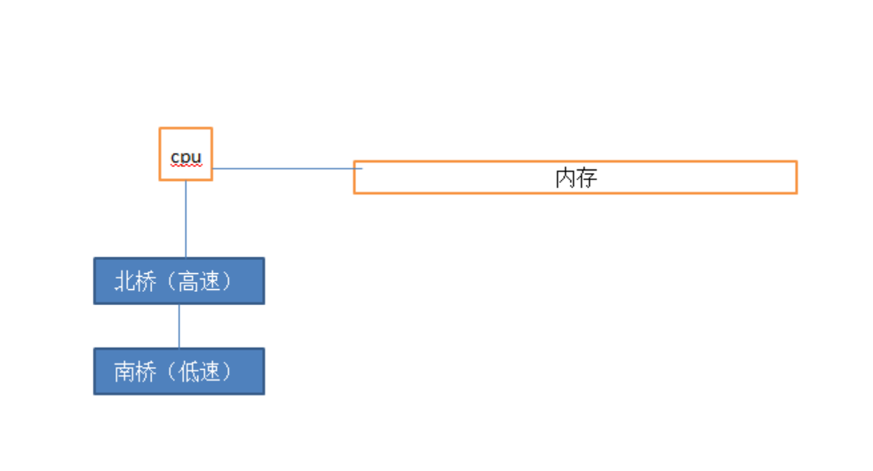
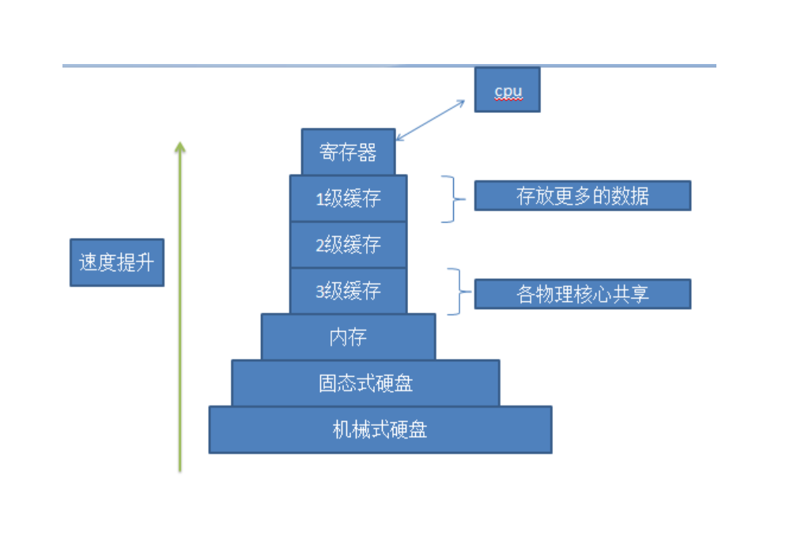
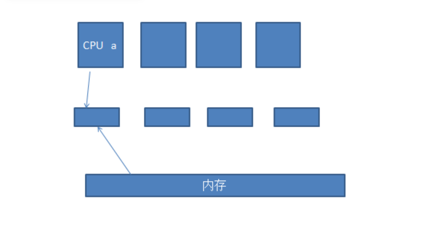
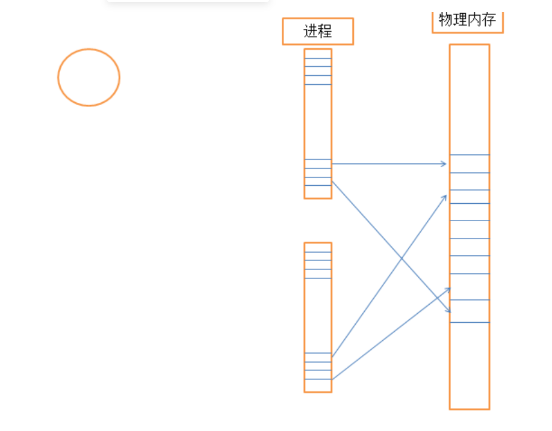

Linux系统基础原理：    call：调用，系统调用，库调用，有的库调用就是系统调用的二次封装。    cpu环0 只能cpu执行的特权执行，用到特权指令的进程，必须通过调用或者内核来实现    cpu环3 所有的进程都可以执行的指令    内核功能：        进程管理，文件系统，网络功能，驱动程序，内存管理，安全功能    模式切换：        用户空间 <------>  内核空间    单cpu，划分为时间片，根据优先级去切换进程    进程：process，运行中的程序        有自己的生命周期    内核为每个运行的进程创建一个task struct：        存储进程的结构体，追踪每一个进程（例如进程ID等信息）        多个任务，会维护一个 链表，task list        task struct：    进程的创建：        内核创建init进程：总进程            进程都由父进程创建：                fork()进程创建而来                clone()：子进程跟父进程共享内存空间                CoW:写时复制，子进程如果写操作，会重新获取新的内存地址                子进程只是用来完成某些功能，完成后，就可以销毁了。            linux而言，进程优先级：                0-139：                    1-99：实时优先级 -- 越大，优先级越高                    100-139：静态优先级                            数字越小，优先级越高                优先级分了Nice值：                    -20 ，19 ===>对应100,139                140个带有优先级的进程队列    ，扫描每个队列的首部。也就是每个优先级队列的第一个任务                同时还有一个过期队列，运行完的和运行的相互调换，不断运行，最终同一优先级的进程运行结束。                Big O 标准:                    O(1):很理想    进程内存：        进程是不可能直接访问硬件的，包括内存。内核完成资源分配。        task struct 保存了线性地址和物理地址的一一映射，这个映射关系通过CPU 的MMU 来完成。        访问的数据不在 ，需要重新从磁盘加载，这就是缺页异常        虚拟内存集：可以被交换出去，交换回来（某一刻用完了上面的数据，就可以交换出去，让别人用        常驻内存集：不可以被交换出去，交换回来        IPC：进程间同信            同一主机：                发信号：signal：常用方式                共享内存，shared memory                口令：            夸主机：                RPC：远程过程调用                socket：基于套接字同信    Linux内核：抢占式多任务，多个任务，抢时间点    进程类型:        守护进程(批处理进程)：daemon，在系统引导过程中启动的进程，与终端无关        用户进程（前台进程）：通过终端启动的进程            注：有些进程，前台进程，送到后台，以守护进程运行    进程状态：        运行态：        就绪态：        睡眠态：            可中断睡眠：可随时叫醒            不可中断睡眠：如IO 过程，此时进程睡眠中，不可中断，等都读取到，才能叫醒。                    （磁盘数据，加载到内核内存，在复制到内存中）        停止态：暂停在内存中，除非手动唤醒，启动        僵死态：父进程挂了。    进程的分类:        CPU-Bound:CPU密集型        IO-Bound：IO密集型

Linux操作系统原理高阶：    模式切换：        如果调用内核计算，X86cpu 分为环0,1,2,3， 环0是特权指令，环3是用户空间指令，所以调用内核，就要模式切换为内核模式，使用特权指令。    内核空间不是提高生产力的主要因素：        内核空间指令占用的时间多，但是用户空间很少，表明此程序效率低，而一般生产力，是靠用户空间来产生。    计算机发展时代：        第一代：真空管        第二代：晶体管，批处理系统        第三代：集成电路，多道程序设计，cpu开始分时，时间片        第四代：大规模集成电路（LSI)     MMU：内存管理单元，为了使内存分页（并不是所有的cpu都有，这里说X86）        CPU的主要功能，主要从内存中取到指令，解码指令，cpu可以执行的指令。        cpu有三个工作单元：很可能三者不止一个，并行执行            取指单元            解码单元            执行单元         cpu还有一个指令寄存器：            有个指针，指向内存中下一个指令的内存地址，以及执行状态等        cpu运行过程中，如果挂起去执行别的程序，称为上下文切换。但是cpu内的寄存器，需要把之前运行的各种状态保存下来，如运行了一半，以及指令，即保存现场。如果程序重新装载回来，要把之前保存的，拿出来。                    -------这些东西是保存在内存中。    task strcut：-------这些东西是保存在内存中。    --进程的cpu亲缘性，提高缓存命中率    cpu多核，超线程（多线程）    早期的cpu需要提高频率，现在是提高核心数，并行执行        某一时刻，一个进程只能一个核心    多线程，并行执行。提高使用率。        linux轻量级线程，对于linux内核来说，调度时，都是进程级别的。    每一颗cpu核心都有自己的进程队列：        两个队列：            等待执行的队列            过期的队列        内核会重新均衡，为了让空闲的提高利用率，但是这样会出现缓存降低命中率    SMP：对称的多处理器机制（如 4颗cpu）    程序局部性原理：        空间局部性：            邻近的数据也会被访问到        时间局部性：            访问过的数据，还会再次被访问到    NUMA：非一致性内存访问        每一颗cpu都有自己专用的外部内存空间，把内存切分 ，这样避免了内存争抢，但是如果一个进程在cpu a上，再调度回来，可能不在a上，这样就需要将之前的cpu 的寄存器内容复制一份，但是这样效率又降低了，所以使用绑定cpu，亲缘性。    cpu只能操作寄存器。        通写，回写机制            通写：从一级缓存，cpu一直控制，直到写到内存，但是可靠性高            回写：写到一级缓存，就可以了，cpu干别的事，可靠性低，但是效率高    缓存的 n路关联 (n-way associate)I/O设备：    设备控制器和设备本身    控制器：集成在主板上的一块芯片或一组芯片    驱动程序，通常应该有设备生产商：位与内核中    每个控制器都有少量的用于通信的寄存器，集成在控制器内部的。每个寄存器表现为一个IO端口    多有的寄存器组合成为设备的IO 端口空间（地址空间）    输入输出实现三种方式：        

1、盲等待方式（轮询），不断的遍历IO 设备 是否有数据的，并不理想       

2、中断的方式，通知CPU中断当前正在进行的进程            有一个可编程中断控制器，可以直接跟CPU通信。            每一个IO设备要有一个中断号，对中断控制器发出请求，中断控制器在通知CPU，CPU在通过中断号，找到相应的IO设备，CPU激活内核，进而CPU 将进程切换出去，内核自己运行在CPU上，内核获取中断请求。            启动服务都要到内核注册套接字            内核处理中断分为两步：                中断上半部：把网卡缓存数据转到内核缓存，必须要处理，否则信号就消失了。                中断下半部：真正处理这个请求        

3、DMA设备：直接内存访问，类似CPU的控制器，拥有该设备的IO设备，可以直接将自己缓存中的数据接进到内核缓存中。    OS级别：        CPU：被抽象成时间片        内存：虚拟地址空间，比如32bit的os，寻址空间是4G，但是内存不可能正好就给你一个进程使用                        所以，比如某时刻只有2G内存寻址空间，但是你要3G的寻址空间，此时就需要虚拟地址空间。        I/O：文件（内核中，层层抽象成文件）        进程：资源抽象            资源集合：                cpu时间                内存地址空间：抽象为虚拟地址空间，每个进程认为自己是4G的 32bit                            进程都默认知道，内核使用1G，进程最多使用3G                            需要3G，并不是一次性分配各3G                IO：打开的多个文件，fd（文件描述符 区分）0,1,2（输入，输出，错误输出）                    正常的文件                    设备文件                    管道文件        进程：task struct            内核为每一个进程维护的一个，将物理内存映射成线性内存        物理内存 且分为固定大小的page frame（页框），每个4K        MMU：            线性地址转换为内存物理地址，cpu在拿物理地址访问        MMU之前还有一个缓存（TLB：转换后援缓存器），如果缓存没有，再找MMU，MMU是页表，缓存是结果，所以不大        