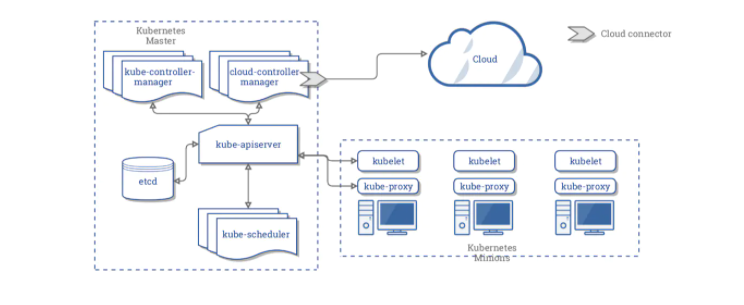
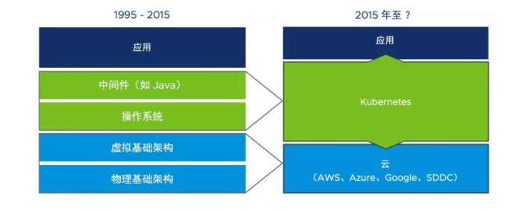
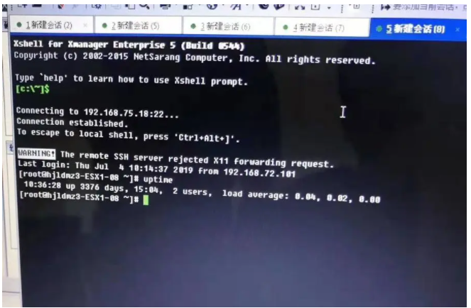
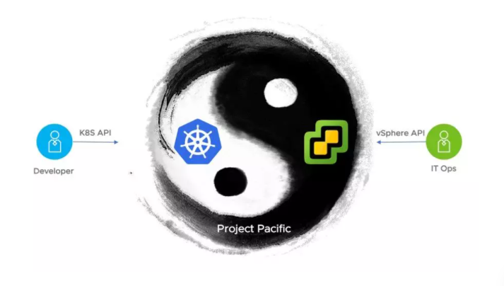

最近VMware发布了虚拟化和容器的融合平台Project Pacific，市场反响很热烈。很多客户和合作伙伴都对这个技术表示出了浓厚的兴趣。Project Pacific到底会给企业IT带来什么样的变化？为什么你需要重点关注这个技术呢？

为了更好的理解Project Pacific的定位和能力，我们先来梳理一下企业环境中主流虚拟化和容器平台的现状。

Kubernetes是什么？



Kubernetes架构

一般介绍Kubernetes，都是从官网的这张图片开始的。

- Kubernetes有管理节点（master）、计算节点（worker node）。

- Etcd存储所有Kubernetes可以调度对象的元数据。

- Kube-scheduler调度用户的POD部署请求，通过Kubelet在worker节点上管理单个POD的生命周期。

- 所有对Kubernetes的操作都通过kube-apiserver与其他组件交互。

- Kube-controller-manager持续观测集群中对象的状态，并尽可能的使其与用户设置的预期状态一致。

  

```
for{desired:= getDesiredState()current:= getCurrentState()makeChanges(desired, current)}
```

表面上看来Kubernetes就是一个容器调度平台，实际上它是一个吹风机！噢，不对，实际上透过它简洁的设计思想，Kubernetes还可以做的更多。

Kubernetes的联合创始人Joe 和 Craig在不同的场合对Kubernetes有过多种的描述。

1. 其中大家最熟悉的就是Joe曾经说过，“Kubernetes是一个平台的平台，可以用来构建新的平台”。Kubernetes有着非常灵活的扩展性，通过CRD（Custom Resource Definition）的机制用户可以将Kubernetes扩展成符合自己使用习惯的差异化平台。VMware的Project Pacific也利用了这种扩展性，使用户可以通过Kubernetes API管理虚拟化环境。
2. Kubernetes是一个database加一个controller。

Etcd就是database，CRD就是用户定义的表结构，Kubernetes框架原生提供对内置的和扩展资源对象的CRUD的API。controller根据用户插入数据库的描述信息，调用平台各种资源尽可能的满足用户预期的状态。举个例子，你可以通过扩展Kubernetes，用新的CRD去控制电灯，使灯的状态可以声明式的描述。

1. Kubernetes是一个实现最终一致性的分布式内核。

Kubernetes是一个内核，借鉴了最终一致性的原则。如果用户想启动5个POD的实例，Kubernetes在接到命令以后就会一步一步控制集群的资源去靠近用户的期望，如果资源只能满足启动4个POD，它会先启动4个POD，剩下的一个设置为Pending状态，直到新资源的加入，满足要求后启动，在Running状态的4个POD可以先行为用户提供服务。如果不使用最终一致性和异步的思想，当用户的部署请求无法满足，会同步返回失败，直接导致服务不可用。

通过以上从不同层面对Kubernetes的解释，我们能看到Kubernetes不仅仅是容器调度平台，通过扩展，它可以完成更多的任务，同时管理云原生的和传统的应用。它会成为未来10年的承载企业应用的主要平台。



企业级应用的运行技术栈

但是好像还少了什么东西？Kubernetes总是需要运行在一个什么地方，但是它似乎没有定义应该如何管理它的底层运行环境。在官网的Kubernetes描述中，[What is Kubernetes?](https://links.jianshu.com/go?to=https%3A%2F%2Fkubernetes.io%2Fdocs%2Fconcepts%2Foverview%2Fwhat-is-kubernetes%2F) 我们发现，底层物理或者云资源的管理、集群和节点的生命周期管理、甚至是外部的负载均衡等功能都不在Kubernetes的设计范围内。Kubernetes通过 [Cloud Provider](https://links.jianshu.com/go?to=https%3A%2F%2Fkubernetes.io%2Fdocs%2Fconcepts%2Fcluster-administration%2Fcloud-providers%2F) 的扩展机制，让底层的资源管理方提供扩展能力（比如引入节点AZ的概念、自动配置svc LB等），使Kubernetes更好的与特定的云平台配合使用。

所以，无论是在公有云还是私有云运行Kubernetes，底层至少有一个能够管理物理或者云资源，并且对接Kubernetes的provider。目前私有云中可以选择vSphere或者物理机上运行Linux，但是由于Linux并不是一个Kubernetes的provider，所以很多工作需要手动完成，比如对节点打标签、分配AZ、手动建立负载均衡等操作。

关于容器应该运行在虚拟化还是物理机上，大家可以参考我在两年前写的一篇文章，[容器与虚拟化](https://www.jianshu.com/p/ae8cae825b33) 。到今天为止整体逻辑还是有效的，其中部分观点也符合CNCF推荐的使用Kubernetes的最佳实践。

vSphere是什么？

vSphere对于企业IT人员应该非常熟悉了，它是VMware在十多年前推出的虚拟化平台，是经历了复杂的企业使用场景考验的、具有企业级特性的产品。

什么是企业级特性？对企业来说，机器上架以后能够最快的对外提供安全、易维护的资源池服务就是企业级特性，计划内、计划外的故障和变更能够高效的、有把握的完成就是企业级特性。对于IT人员来说，让大家减少人肉运维、告别996，多点时间陪伴家人就是企业级特性。

因为vSphere是Type 1的hypervisor，和通用的操作系统比较，ESXI的关注点更聚焦，只做硬件管理和虚拟化运行时管理。没有通用的操作系统需要承载应用的负担，所以暴露的被攻击面更小。设计之初就是为了长时间、稳定运行的，比如绝大部分的patch是不需要重启ESXI的。



一台运行10年的ESXI

如上图所示的运行超过10年的ESXI实例，在VMware售后团队处理的case中经常遇到。

关于性能的疑问

Project Pacific 在发布的时候公布了一个测试数据，在ESXI上运行的容器性能比裸机上的容器高8%。虽然随着硬件性能的提升和分布式架构的流行，极限的性能不再是用户重点考虑的因素，但是很多用户也有疑惑为什么在虚拟化平台上的容器比裸机上更快呢？

其实主要的原因是ESXI对于NUMA架构的优化。参考，[How ESXi NUMA Scheduling Works](https://links.jianshu.com/go?to=%5Bhttps%3A%2F%2Fdocs.vmware.com%2Fen%2FVMware-vSphere%2F6.5%2Fcom.vmware.vsphere.resmgmt.doc%2FGUID-BD4A462D-5CDC-4483-968B-1DCF103C4208.html%5D(https%3A%2F%2Fdocs.vmware.com%2Fen%2FVMware-vSphere%2F6.5%2Fcom.vmware.vsphere.resmgmt.doc%2FGUID-BD4A462D-5CDC-4483-968B-1DCF103C4208.html)) 。

简单来说，通用的linux在调度时会尽量平衡一个主机上所有CPU的工作量，并尽可能的使所有CPU的整体利用率达到最高。这种调度策略在NUMA架构上，会导致CPU在某些场景下需要频繁访问其他CPU attach的内存的数据（remote access），导致性能下降。而ESXI的调度策略，是以VM整体资源隔离和调度为优先级任务。所以几乎没有跨NUMA单元的内存访问。

在Pacific的测试过程中，大约有99%的单元内部内存访问（local access），而物理机上的linux大约有50%的local access。以上的原因造成了测试结果的差异。

为什么你要关注VMware Project Pacific？

以上可以看出，vSphere和Kubernetes从设计思想、用户群体、到解决问题的目标都是不同的。但是现实的环境中，企业对这两类平台都是有需求的。

由于不同部门考核目标的差异，运维和开发对于技术选择的审美偏好是有区别的。运维人员追求稳定、安全、可视化、可掌控的成熟产品，开发人员更喜欢灵活的、能快速上手、新奇的热点技术。vSphere满足了企业运维人员对一个优秀产品的所有幻想，而Kubernetes则是开发人员眼中的神兵利器。当然了，随着企业应用架构形态的演化，逐步可能在传统运维和开发之间建立新的团队来调和双方的需求和供给，有可能叫云架构师、SRE或者Platform engineer，康威定律还在生效，对吧？

现阶段为了兼顾传统应用和云原生应用，很多企业内部都有两套技术栈，一套vSphere运行传统应用，一套Kubernetes运行云原生应用。虽然Kubernetes是可以运行在vSphere“之上”的虚拟机里，利用虚拟化的资源池，但是用户最大的挑战并不是资源池的共享，而是这两套技术栈的管理方式、工具、技能是完全不一样的，比如，容器和虚拟机的网络、存储、备份恢复等实践都不在同一个频道上。

如果有一个平台既稳定又灵活、即有成熟的运维工具又能支持最新的开发技术、既能兼容广泛的硬件生态又能运行时尚的应用框架、既有内置的安全机制又开放选择权给开发人员，那么对于开发团队和运维团队是一个双赢的局面。

Project Pacific就是这样的一个平台。

- 通过融合虚拟化和容器的运行环境，对同一个资源池和对象，提供两个控制平面。开发和运维都可以使用自己习惯的方式工作，极大的提升了两个部门协同工作的效率。
- Project Pacific统一了容器和虚拟化对底层计算、网络、存储资源的使用方式，将成熟的企业级运维经验和工具传递给现代化的容器应用。
- Project Pacific改变了以往以单个虚拟机或者容器运维的方式，提供以应用整体为边界的运维能力。
- 



融合的平台

有了Project Pacific以后的工作流程就是这样的，

=> 机器上架

=> 通过VCF部署私有云（大概3-4个小时）

=> 运维人员在vCenter中创建Namespace（应用）并配置策略（配额、安全等），并交付开发团队

=> 开发团队在Namespace里面用kubectl 创建任何它需要的对象（容器、虚拟机、k8s集群、各种服务、FaaS等）

=> 运维人员用现有的成熟工具做day2的工作（甚至不知道k8s的存在）

Project Pacific 具体技术实现可参考，[容器与虚拟化的完美融合](https://www.jianshu.com/p/33c00e140df5) 。

广告：VMware推出了Kubernetes的学习网站。 [https://kubernetes.academy/](https://links.jianshu.com/go?to=https%3A%2F%2Fkubernetes.academy%2F)