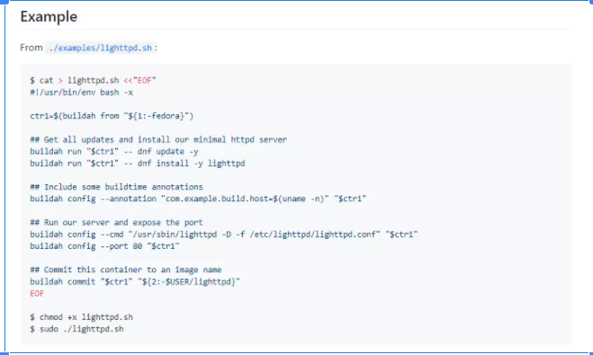
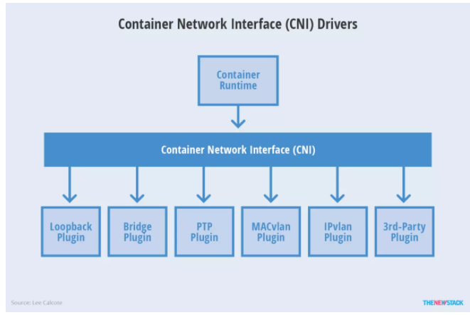

什么是 Linux 容器？

Linux 容器是由 Linux 内核所提供的具有特定隔离功能的进程，Linux 容器技术能够让你对应用及其整个运行时环境（包括全部所需文件）一起进行打包或隔离。从而让你在不同环境（如开发、测试和生产等环境）之间轻松迁移应用的同时，还可保留应用的全部功能。

Linux 容器还有利于明确划分职责范围，减少开发和运维团队间的冲突。这样，开发人员可以全心投入应用开发，而运维团队则可专注于基础架构维护。由于 Linux 容器基于开源技术构建，还将便于你在未来轻松采用各类更新、更强的技术产品。包括 CRI-O、Kubernetes 和 Docker 在内的容器技术，可帮助你的团队有效简化、加速和编排应用的开发与部署。

什么是 Docker？

Docker 是一个开源的应用容器引擎，属于 Linux 容器的一种封装，Docker 提供简单易用的容器使用接口，让开发者可以打包他们的应用以及依赖包到一个可移植的容器中，然后发布到任何流行的 Linux 机器上。容器是完全使用沙箱机制，相互之间不会有任何接口。

Docker 是目前最流行的 Linux 容器解决方案，即使 Docker 是目前管理 Linux 容器的一个非常方便的工具，但它也有两个缺点：

1. Docker 需要在你的系统上运行一个守护进程。
2. Docker 是以 root 身份在你的系统上运行该守护程序。

这些缺点的存在可能有一定的安全隐患，为了解决这些问题，下一代容器化工具 Podman 出现了 。

什么是 Podman ？

Podman 是一个开源的容器运行时项目，可在大多数 Linux 平台上使用。Podman 提供与 Docker 非常相似的功能。正如前面提到的那样，它不需要在你的系统上运行任何守护进程，并且它也可以在没有 root 权限的情况下运行。

Podman 可以管理和运行任何符合 OCI（Open Container Initiative）规范的容器和容器镜像。Podman 提供了一个与 Docker 兼容的命令行前端来管理 Docker 镜像。

1. Podman 官网地址：[https://podman.io/](https://links.jianshu.com/go?to=https%3A%2F%2Fpodman.io%2F)
2. Podman 项目地址：[https://github.com/containers/libpod](https://links.jianshu.com/go?to=https%3A%2F%2Fgithub.com%2Fcontainers%2Flibpod)

安装 Podman

Podman 目前已支持大多数发行版本通过软件包来进行安装，下面我们来举几个常用发行版本的例子。

- Fedora / CentOS

$ sudo yum -y install podman

- Ubuntu

$ sudo apt-get update -qq$ sudo apt-get install -qq -y software-properties-common uidmap$ sudo add-apt-repository -y ppa:projectatomic/ppa$ sudo apt-get update -qq$ sudo apt-get-qq -y install podman

- MacOS

$ brew cask install podman

- RHEL 7

$ sudo subscription-manager repos --enable=rhel-7-server-extras-rpms$ sudo yum -y install podman

- Arch Linux

$ sudo pacman -S podman

更多系统的安装方法，可参考官方文档：[https://github.com/containers/libpod/blob/master/install.md](https://links.jianshu.com/go?to=https%3A%2F%2Fgithub.com%2Fcontainers%2Flibpod%2Fblob%2Fmaster%2Finstall.md)

使用 Podman

使用 Podman 非常的简单，Podman 的指令跟 Docker 大多数都是相同的。下面我们来看几个常用的例子：

```shell
运行一个容器
$ podman run -dt -p 8080:8080/tcp  \-e HTTPD_VAR_RUN=/var/run/httpd  \-e HTTPD_MAIN_CONF_D_PATH=/etc/httpd/conf.d \-e HTTPD_MAIN_CONF_PATH=/etc/httpd/conf \-e HTTPD_CONTAINER_SCRIPTS_PATH=/usr/share/container-scripts/httpd/ \registry.fedoraproject.org/f27/httpd /usr/bin/run-httpd
列出运行的容器
$ podman ps -a
分析一个运行的容器
$ podman inspect -l | grep IPAddress\":"SecondaryIPAddresses": null,"IPAddress": "",
查看一个运行中容器的日志
$ sudo podman logs --latest10.88.0.1--[07/Feb/2018:15:22:11+0000]"GET / HTTP/1.1"200612"-""curl/7.55.1""-"10.88.0.1--[07/Feb/2018:15:22:30+0000]"GET / HTTP/1.1"200612"-""curl/7.55.1""-"10.88.0.1--[07/Feb/2018:15:22:30+0000]"GET / HTTP/1.1"200612"-""curl/7.55.1""-"10.88.0.1--[07/Feb/2018:15:22:31+0000]"GET / HTTP/1.1"200612"-""curl/7.55.1""-"10.88.0.1--[07/Feb/2018:15:22:31+0000]"GET / HTTP/1.1"200612"-""curl/7.55.1""-"
查看一个运行容器中的进程资源使用情况
$ sudo podman top <container_id>  UID   PID  PPID  C STIME TTY          TIME CMD    03187331863009:21?00:00:00 nginx: master process nginx -g daemon off;1013188931873009:21?00:00:00 nginx: worker process
停止一个运行中的容器
$ sudo podman stop --latest
删除一个容器
$ sudo podman rm --latest
以上这些特性基本上都和 Docker 一样，Podman 除了兼容这些特性外，还支持了一些新的特性。
给容器设置一个检查点
$ sudo podman container checkpoint <container_id>
需要 CRIU 3.11 以上版本支持，CRIU 项目地址：https://criu.org/
根据检查点位置恢复容器
$ sudo podman container restore <container_id>
迁移容器
Podman 支持将容器从一台机器迁移到另一台机器。
首先，在源机器上对容器设置检查点，并将容器打包到指定位置。
$ sudo podman container checkpoint <container_id>-e /tmp/checkpoint.tar.gz$ scp /tmp/checkpoint.tar.gz <destination_system>:/tmp
其次，在目标机器上使用源机器上传输过来的打包文件对容器进行恢复。
$ sudo podman container restore -i /tmp/checkpoint.tar.gz
配置别名
如果习惯了使用 Docker 命令，可以直接给 Podman 配置一个别名来实现无缝转移。你只需要在 .bashrc 下加入以下行内容即可：
$ echo "alias docker=podman" >> .bashrc$ source .bashrc
Podman 如何实现开机重启容器
由于 Podman 不再使用守护进程管理服务，所以不能通过守护进程去实现自动重启容器的功能。那如果要实现开机自动重启容器，又该如何实现呢？
其实方法很简单，现在大多数系统都已经采用 Systemd 作为守护进程管理工具。这里我们就可以使用 Systemd 来实现 Podman 开机重启容器，这里我们以启动一个 Nginx 容器为例子。
首先，我们先运行一个 Nginx 容器。
$ sudo podman run -t -d -p 80:80--name nginx nginx
然后，在建立一个 Systemd 服务配置文件。
$ vim /etc/systemd/system/nginx_container.service[Unit]Description=PodmanNginxServiceAfter=network.targetAfter=network-online.target[Service]Type=simpleExecStart=/usr/bin/podman start -a nginxExecStop=/usr/bin/podman stop -t 10 nginxRestart=always[Install]WantedBy=multi-user.target
接下来，启用这个 Systemd 服务。
$ sudo systemctl daemon-reload$ sudo systemctl enable nginx_container.service$ sudo systemctl start nginx_container.service
服务启用成功后，我们可以通过 systemctl status 命令查看到这个服务的运行状况。
$ sudo systemctl status nginx_container.service● nginx_container.service -PodmanNginxServiceLoaded: loaded (/etc/systemd/system/nginx_container.service; enabled; vendor preset: disabled)Active: active (running) since Sat2019-08-2020:59:26UTC;1min 41s ago MainPID:845(podman)Tasks:16(limit:4915)Memory:37.6M   CGroup:/system.slice/nginx_container.service           └─845/usr/bin/podman start -a nginxAug2020:59:26Ubuntu-dev.novalocal systemd[1]:StartedPodmanNginxService.
之后每次系统重启后 Systemd 都会自动启动这个服务所对应的容器。
```

其它相关工具

Podman 只是 OCI 容器生态系统计划中的一部分，主要专注于帮助用户维护和修改符合 OCI 规范容器镜像。其它的组件还有 Buildah、Skopeo 等。

Buildah

虽然 Podman 也可以支持用户构建 Docker 镜像，但是构建速度比较慢。并且默认情况下使用 VFS 存储驱动程序会消耗大量磁盘空间。

Buildah 是一个专注于构建 OCI 容器镜像的工具，Buildah 构建速度非常快并使用覆盖存储驱动程序，可以节约大量的空间。

Buildah 基于 fork-exec 模型，不以守护进程运行。Buildah 支持 Dockerfile 中的所有命令。你可以直接使用 Dockerfiles 来构建镜像，并且不需要任何 root 权限。 Buildah 也支持用自己的语法文件构建镜像，可以允许将其他脚本语言集成到构建过程中。

下面是一个使用 Buidah 自有语法构建的例子。



Buildah 和 Podman 之间的一个主要区别是：Podman 用于运行和管理容器， 允许我们使用熟悉的容器 CLI 命令在生产环境中管理和维护这些镜像和容器，而 Buildah 主用于构建容器。

项目地址：[https://github.com/containers/buildah](https://links.jianshu.com/go?to=https%3A%2F%2Fgithub.com%2Fcontainers%2Fbuildah)

Skopeo

Skopeo 是一个镜像管理工具，允许我们通过 Push、Pull和复制镜像来处理 Docker 和符合 OCI 规范的镜像。

项目地址：[https://github.com/containers/skopeo](https://links.jianshu.com/go?to=https%3A%2F%2Fgithub.com%2Fcontainers%2Fskopeo)

延伸阅读

什么是 OCI？

OCI (Open Container Initiative)，是一个轻量级，开放的治理结构（项目）。在 Linux 基金会的支持下成立，致力于围绕容器格式和运行时创建开放的行业标准。

OCI 项目由 Docker、CoreOS 和容器行业中的其它领导者在 2015 年 6 月的时候启动，OCI 的技术委员会成员包括 Red Hat、Microsoft、Docker、Cruise、IBM、Google、Red Hat 和 SUSE 等。

什么是 CRI？

CRI（Container Runtime Interface）是 Kubernetes v1.5 引入的容器运行时接口，它将 Kubelet 与容器运行时解耦，将原来完全面向 Pod 级别的内部接口拆分成面向 Sandbox 和 Container 的 gRPC 接口，并将镜像管理和容器管理分离到不同的服务。


什么是 CNI？

CNI（Container Network Interface）是 CNCF 旗下的一个项目，是 Google 和 CoreOS 主导制定的容器网络标准。CNI 包含方法规范、参数规范等，是 Linux 容器网络配置的一组标准和库，用户可以根据这些标准和库来开发自己的容器网络插件。CNI 已经被 Kubernetes、Mesos、Cloud Foundry、RKT 等使用，同时 Calico、Weave 等项目都在为 CNI 提供插件。



总结

本文介绍三个了符合 CRI 标准的容器工具 Podman、 Buildah 和 Skopeo。这三个工具都是基于 *nix 传统的 fork-exec 模型，解决了由于 Docker 守护程序导致的启动和安全问题，提高了容器的性能和安全。