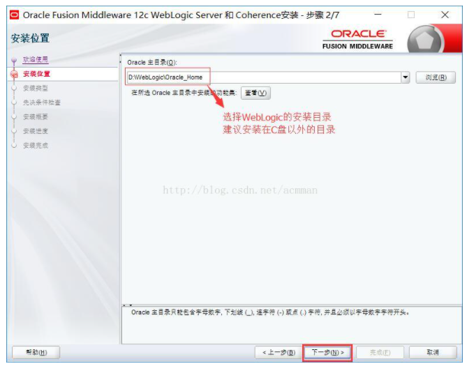

**一、WebLogic的介绍**

  WebLogic是美国bea公司出品的一个application server，确切的说是一个基于Javaee架构的中间件，纯java开发的，最新版本WebLogic Server 9.0是迄今为止发布的最卓越的BEA应用服务器。BEA WebLogic是用于开发、集成、部署和管理大型分布式Web应用、网络应用和数据库应用的Java应用服务器。将Java的动态功能和Java Enterprise标准的安全性引入大型网络应用的开发、集成、部署和管理之中。完全遵循J2EE 1.4规范。

WebLogic与Tomcat的区别：

  WebLogic更加强大。weblogic是j2ee的应用服务器（application server），包括ejb ,jsp,servlet,jms等等，全能型的。是商业软件里排名第一的容器（JSP、servlet、EJB等），并提供其他如JAVA编辑等工具，是一个综合的开发及运行环境。

  WebLogic应该是J2EE Container(Web Container + EJB Container + XXX规范)，而Tomcat只能算Web Container，是官方指定的JSP&Servlet容器。只实现了JSP/Servlet的相关规范，不支持EJB。不过Tomcat配合jboss和apache可以实现j2ee应用服务器功能

**二、WebLogic下载**

来到Oracle的WebLogic Server主页：

http://www.oracle.com/technetwork/middleware/weblogic/overview/index.html

点击Downloads：

进入Downloads界面之后，点击Download file进行下载：

注意：

(1)别忘记点击上面的“同意”条款。

(2)点击下拉框选择下载的版本，分别为简版/普通和完全版。

我们这里选择下载的是Generic版本。大家可以根据自己的需要选择下载。

如果Oracle抽了，大家去这里下载12.2.3的版本：

https://pan.baidu.com/share/link?shareid=2935789172&uk=1493614172&fid=1093830637966671

我们下载完毕之后，会有一个压缩包：

三、WebLogic安装

将我们下载的压缩包解压：

打开目录中的Disk/install安装目录，找到名为ng.cmd的脚本文件：

双击打开脚本文件，弹出一个黑色的控制台：

稍等片刻，就会出现WebLogic的安装界面：

我们接下来按照以下步骤进行安装：

点击“下一步”

点击“下一步”

点击“下一步”

点击“下一步”

点击“下一步”

点击“下一步”

点击“安装”

点击“下一步”

点击完成，WebLogic就安装完毕了。接下来会弹出WebLogic的配置界面。

三、WebLogic的配置

安装完毕之后，会弹出配置窗口，我们按照以下操作进行配置：

点击“下一步”

点击“下一步”

点击“下一步”

点击“下一步”

点击“下一步”

点击“下一步”

点击“下一步”

点击“下一步”

点击“下一步”

点击“下一步”

点击“下一步”

点击“下一步”

点击“下一步”

点击“下一步”

点击“创建”

点击“下一步”

看到完成界面，就说明我们的WebLogic的安装与配置都已经完成了。

四、简单操作WebLogic

找到我们刚才安装的WebLogic的所在目录：

打开\user_projects\domains\base_domain目录：

点击该目录下的startWebLogic.cmd脚本，运行WebLogic。

我们在网页浏览器中输入"http://localhost:7001/console"地址，

就可以访问WebLogic的控制台了：

输入我们之前填写的管理员的账号密码，登录到WebLogic管理系统中：

至此，我们的WebLogic的安装与配置就讲解完毕。请关注后面的WebLogic的后续文章。

**转载请注明出处：**http://blog.csdn.net/acmman/article/details/70093877

