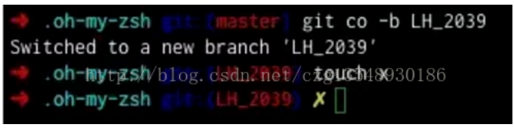

**什么是Zsh**

Zsh是一款强大的虚拟终端，既是一个系统的虚拟终端，也可以作为一个脚本语言的交互解析器。

Zsh的一些特性

兼容bash，原来使用bash的兄弟切换过来毫无压力。

强大的历史纪录功能，在用或者方向上键查找历史命令时，zsh支持限制查找。比如输入ls然后再按方向上键,则只会查找用过的ls命令。而此时使用则会仍然按之前的方式查找，忽略ls。

多个终端会话共享历史记录。经常有多个窗口，tab，tmux的多个session，panel。这些命令历史不能共享实在是很糟糕的回忆。但是有了zsh之后，这些确实成了回忆了,所有的命令历史都可以共享。

智能拼写纠正，输入gtep mactalk * -R，系统会提示：zsh: correct 'gtep' to 'grep' [nyae]?比妹纸贴心吧，她们向来都是让你猜的……

各种补全：路径补全、命令补全，命令参数补全，插件内容补全等等。触发补全只需要按一下或两下tab键，补全项可以使用ctrl+n/p/f/b上下左右切换。比如你想杀掉java的进程，只需要输入kill java + tab键，如果只有一个java进程，zsh 会自动替换为进程的 pid，如果有多个则会出现选择项供你选择。ssh+空格+两个tab键，zsh会列出所有访问过的主机和用户名进行补全

智能跳转，安装了autojump之后，zsh 会自动记录你访问过的目录，通过 j + 目录名 可以直接进行目录跳转，而且目录名支持模糊匹配和自动补全，例如你访问过hadoop-1.0.0目录，输入j hado 即可正确跳转。j –stat 可以看你的历史路径库。

目录浏览和跳转：输入 d，即可列出你在这个会话里访问的目录列表，输入列表前的序号，即可直接跳转。

在当前目录下输入 .. 或 … ，或直接输入当前目录名都可以跳转，你甚至不再需要输入cd命令了。

通配符搜索：ls -l **/*.sh，可以递归显示当前目录下的 shell 文件，文件少时可以代替find，文件太多还是用find。

Zsh默认不兼容Bash，不过Zsh实现中包含了一个屌炸天的仿真模式(emulation mode)支持对两种主流的Bourne衍生版shell（bash、ksh）和C shell的仿真(csh的支持并不完整)。在Bash的仿真模式下，可以使用与Bash相同的语法和命令集合，从而达到近乎完全兼容的目的。

```
为了激活对Bash的仿真，需要显式执行
$ emulate bash
等效于
$ emulate sh
更详细介绍可到官网了解，zsh官网：http://www.zsh.org/
安装
Redhat/Centos
$ yum install zsh
Debian/Ubuntu
$ apt-get install zsh
设置默认shell为zsh
$ chsh -s $(which zsh)
完成后可以使用下面这条命令检查是否设置成功
$ echo $SHELL
```

**什么是Oh My Zsh**

Oh My Zsh是一款社区驱动的命令行工具，正如它的主页上说的，Oh My Zsh 是一种生活方式。它基于zsh命令行，提供了主题配置，插件机制，已经内置的便捷操作。给我们一种全新的方式使用命令行。

Oh My Zsh这个名字听起来就很有意思，它是基于zsh命令行的一个扩展工具集，提供了丰富的扩展功能。

Oh My Zsh只是一个对zsh命令行环境的配置包装框架，但它不提供命令行窗口，更不是一个独立的APP。

更详细介绍可到官网了解，Oh My Zsh官网：http://ohmyz.sh

```
安装Oh My Zsh
前提条件：必须已安装ZSH
我们可以在命令行中输入这个命令来查看我们的电脑上是否安装了zsh命令行
$ zsh --version
如果安装了，这个命令就会输出zsh当前的版本号。确定 zsh 已经安装后，我们就可以继续安装Oh My Zsh了。
安装Oh My Zsh
Oh My Zsh 的安装方式非常简单，可以通过curl或wget的方式，用一条命令即可安装。
curl 方式
$ sh -c"$(curl -fsSL https://raw.github.com/robbyrussell/oh-my-zsh/master/tools/install.sh)"
wget 方式
$ sh -c"$(wget https://raw.github.com/robbyrussell/oh-my-zsh/master/tools/install.sh -O -)"
安装过程中输出如下
Cloning Oh My Zsh...
Cloning into '/root/.oh-my-zsh'...
remote: Counting objects: 712, done.
remote: Compressing objects: 100% (584/584), done.
remote: Total 712 (delta 15), reused 522 (delta 4), pack-reused 0
Receiving objects: 100% (712/712), 443.58 KiB | 27.00 KiB/s, done.
Resolving deltas: 100% (15/15), done.
Checking connectivity... done.
Looking for an existing zsh config...
Using the Oh My Zsh template file and adding it to ~/.zshrc
Copying your current PATH and adding it to the end of ~/.zshrc for you.
Time to change your default shell to zsh!
        __                                     __
 ____  / /_     ____ ___  __  __   ____  _____/ /_
/ __ \/ __ \   / __ `__ \/ / / /  /_  / / ___/ __ \
/ /_/ / / / /  / / / / / / /_/ /    / /_(__  ) / / /
\____/_/ /_/  /_/ /_/ /_/\__, /    /___/____/_/ /_/
                       /____/                       ....is now installed!
Please look over the ~/.zshrc file to select plugins, themes, and options.
p.s. Follow us at https://twitter.com/ohmyzsh.
p.p.s. Get stickers and t-shirts at http://shop.planetargon.com.
到这里，Oh My Zsh 就安装成功了。
Oh My Zsh目录结构
进入~/.oh-my-zsh目录后，看看该目录的结构
$ ls ~/.oh-my-zsh
cache  custom  lib  log  MIT-LICENSE.txt  oh-my-zsh.sh  plugins  README.markdown  templates  themes  tools
lib 提供了核心功能的脚本库
tools 提供安装、升级等功能的快捷工具
plugins 自带插件的存在放位置
templates 自带模板的存在放位置
themes  自带主题文件的存在放位置
custom 个性化配置目录，自安装的插件和主题可放这里
```

设置主题

安装完毕后，我们就可以使用了，咱们先来简单配置一下。

Oh My Zsh 提供了很多主题风格，我们可以根据自己的喜好，设置主题风格，主题的配置在 ~/.zshrc 文件中可以看到，用一个自己熟悉的编辑器打开这个文件，可以找到这一项：

ZSH_THEME="robbyrussel"

可以看到，我们默认使用的主题叫做robbyrussel。 它的显示效果嘛，大概是这样



```
Oh My Zsh默认自带了一些默认主题，存放在~/.oh-my-zsh/themes目录中。我们可以查看这些主题
$ ls ~/.oh-my-zsh/themes
3den.zsh-theme                essembeh.zsh-theme            junkfood.zsh-theme            rgm.zsh-theme
Soliah.zsh-theme              evan.zsh-theme                kafeitu.zsh-theme             risto.zsh-theme
adben.zsh-theme               example.zsh-theme             kardan.zsh-theme              rixius.zsh-theme
af-magic.zsh-theme            fino-time.zsh-theme           kennethreitz.zsh-theme        rkj-repos.zsh-theme
afowler.zsh-theme             fino.zsh-theme                kiwi.zsh-theme                rkj.zsh-theme
agnoster.zsh-theme            fishy.zsh-theme               kolo.zsh-theme                robbyrussell.zsh-theme
alanpeabody.zsh-theme         flazz.zsh-theme               kphoen.zsh-theme              sammy.zsh-theme
amuse.zsh-theme               fletcherm.zsh-theme           lambda.zsh-theme              simonoff.zsh-theme
apple.zsh-theme               fox.zsh-theme                 linuxonly.zsh-theme           simple.zsh-theme
arrow.zsh-theme               frisk.zsh-theme               lukerandall.zsh-theme         skaro.zsh-theme
....
```

```
怎么样，默认主题的数量相当多吧，这就是社区驱动的力量。
这么多的主题可以满足你的各种偏好了，我们只需在./zshrc文件中配置需要的主题即可，比如我们想用lambda.zsh-theme这个主题，我们只要这样配置
ZSH_THEME="lambda"
然后保存这个文件文件，再打开一个新的命令行窗口即可看到效果了。那么这么多的主题如何快速找到哪些是我们喜欢的呢，我们还可以这样设置
ZSH_THEME="random"
我们将主题设置为随机，这样在我们每次打开命令行窗口的时候，都会随机在默认主题中选择一个。这样我们如果觉得当前的主题比较喜欢，可以直接使用 echo 命令输出当前主题的名称
$ echo $ZSH_THEME
然后再将他设置到配置文件中即可。
如果这些默认主题还不能满足你的需要，我们还可以到这里找到更多的主题
https://github.com/robbyrussell/oh-my-zsh/wiki/Themes
https://github.com/robbyrussell/oh-my-zsh/wiki/External-themes
https://github.com/unixorn/awesome-zsh-plugins#themes
启用插件
Oh My Zsh 默认自带了一些默认主题，存放在~/.oh-my-zsh/plugins目录中。我们可以查看这些插件
$ ls ~/.oh-my-zsh/plugins
adb               brew         coffee             dirpersist      fastfile         gitignore                 httpie     last-working-dir  nanoc                  pod         rebar       sprunge        terminitor  vault              zeus
ant               brew-cask    colemak            django          fbterm           git-prompt                iwhois     lein              nmap                   postgres    redis-cli   ssh-agent      terraform   vim-interaction    zsh-navigation-tools
apache2-macports  bundler      colored-man-pages  dnf             fedora           git-remote-branch         jake-node  lighthouse        node                   pow         repo        stack          textastic   vi-mode            zsh_reload
archlinux         bwana        colorize           docker          forklift         glassfish                 jhbuild    lol               npm                    powder      rsync       sublime        textmate    virtualenv
asdf              cabal        command-not-found  docker-compose  frontend-search  gnu-utils                 jira       macports          nvm                    powify      ruby        sudo           thefuck     virtualenvwrapper
autoenv           cake         common-aliases     emacs           gas              go                        jruby      man               nyan                   profiles    rvm         supervisor     themes      vundle
autojump          cakephp3     compleat           ember-cli       geeknote         golang                    jsontools  marked2           osx                    pyenv       safe-paste  suse           thor        wakeonlan
autopep8          capistrano   composer           emoji           gem              gpg-agent                 jump       mercurial         pass                   pylint      sbt         svn            tmux        wd
aws               cask         copydir            emoji-clock     git              gradle                    kate       meteor            paver                  python      scala       svn-fast-info  tmux-cssh   web-search
battery           catimg       copyfile           emotty          git-extras       grails                    kitchen    mix               pep8                   rails       scd         symfony        tmuxinator  wp-cli
bbedit            celery       cp                 encode64        gitfast          grunt                     knife      mix-fast          per-directory-history  rake        screen      symfony2       torrent     xcode
bgnotify          chruby       cpanm              extract         git-flow         gulp                      knife_ssh  mosh              perl                   rake-fast   scw         systemadmin    tugboat     yii
boot2docker       chucknorris  debian             fabric          git-flow-avh     heroku                    laravel    mvn               phing                  rand-quote  sfffe       systemd        ubuntu      yii2
bower             cloudapp     dircycle           fancy-ctrl-z    github           history                   laravel4   mysql-macports    pip                    rbenv       singlechar  taskwarrior    urltools    yum
branch            codeclimate  dirhistory         fasd            git-hubflow      history-substring-search  laravel5   n98-magerun       pj                     rbfu        spring      terminalapp    vagrant     z
Oh My Zsh默认是只启用git插件
plugins=(git)
如需启用更多插件，可加入需启用插件的名称。如下
plugins=(git wd web-search historyhistory-substring-search)
推荐几个好用插件
zsh-history-substring-search
https://github.com/robbyrussell/oh-my-zsh/tree/master/plugins/history-substring-search
zsh-syntax-highlighting
https://github.com/zsh-users/zsh-syntax-highlighting
zsh-autosuggestions
https://github.com/zsh-users/zsh-autosuggestions
更多插件可参考
https://github.com/robbyrussell/oh-my-zsh/wiki/Plugins
https://github.com/unixorn/awesome-zsh-plugins
https://github.com/robbyrussell/oh-my-zsh/wiki/Plugins-Overview
一些小技巧
给history命令增加时间
.zshrc中加入以下行
$ vim ~/.zshrc
HIST_STAMPS="yyyy-mm-dd"
source ~/.zshrc
如果没用oh my zsh的话可用如下alias
$ aliashistory='fc -il 1'
更新oh-my-zsh
设置自动更新oh-my-zsh
默认情况下，当oh-my-zsh有更新时，都会给你提示。如果希望让oh-my-zsh自动更新，在~/.zshrc 中添加下面这句
DISABLE_UPDATE_PROMPT=true
要手动更新，可以执行
$ upgrade_oh_my_zsh
卸载oh my zsh
直接在终端中，运行uninstall_oh_my_zsh既可以卸载。
参考文档
http://www.google.com
http://ohmyz.sh/
http://swiftcafe.io/2015/10/31/cafe-time-omz/
```

