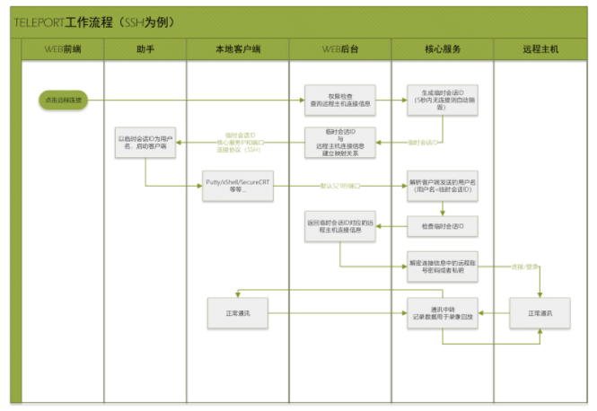
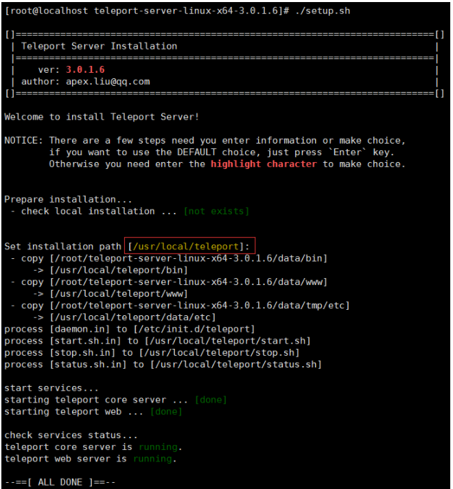
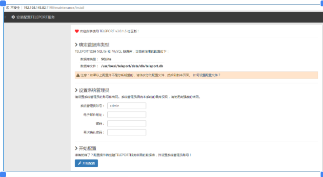
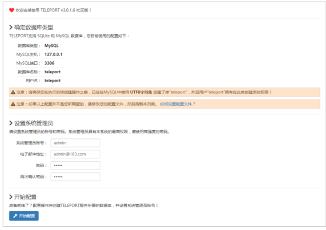
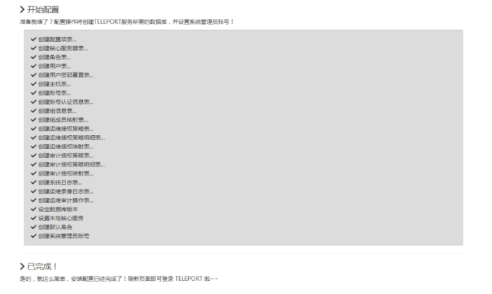

**简单易用的堡垒机系统—Teleport**

**官方文档：**[**http://teleport.eomsoft.net/doc#!1**](http://teleport.eomsoft.net/doc#!1)

 **一、****Teleport介绍**

Teleport是触维软件推出的一款简单易用的堡垒机系统，具有小巧、易用、易于集成的特点，支持RDP和SSH协议的跳转。

Teleport由两大部分构成：

- Teleport跳板核心服务
- WEB操作界面

Teleport非常小巧且极易安装部署：**仅需一分钟，就可以安装部署一套您自己的堡垒机系统！！**

**支持的操作系统**

Teleport支持部署到Linux系统中，目前支持的系统版本如下：

- Ubuntu 14.04 64位 及以上版本
- CentOS 6.2 64位 及以上版本
- Debian 6.0 64位 及以上版本
- Redhat 6.2 64位 及以上版本

**依赖环境**

  因为Teleport内建了所需的脚本引擎、WEB服务等模块，因此不需要额外安装其他的库或者模块，整个系统的安装与部署非常方便。

**应用模式**

- Teleport是一个完整的堡垒机系统，可以直接安装使用。同时Teleport也提供了应用接口，可以与您现有的运维系统集成。如何使用，由您说了算！
- 开箱即用 我们提供Teleport机架式服务器，开箱即可使用；
- 直接使用 将Teleport安装部署在一台服务器上，即可直接使用；
- 系统集成 利用Teleport开放的应用接口，将Teleport堡垒机功能与您现有运维系统集成到一起；

**工作原理**



**二、Linux平台部署****Teleport**

**1、安装****Teleport**

首先您需要到下载区下载最新的teleport的Linux版本安装包。为方便理解，本文中假定Teleport的版本为1.2.3.4。

将下载得到的安装包放到临时目录中，然后执行下列命令：

tar -zxvf teleport-server-linux-x64-3.0.1.6.tar.gz

cd teleport-server-linux-x64-3.0.1.6/

sudo ./setup.sh

仅需几秒钟，安装就已完成，并且teleport服务也成功启动运行了：



现在，您的堡垒机已经准备就绪，可以访问了。

**2、****Teleport配置（**考虑后期堡垒机性能问题，推荐选择MySQL数据库**）**

安装完成后，请访问 http://您的堡垒机IP地址:7190 进行配置管理。默认管理员账号 admin，默认管理员密码 admin。



```
数据库配置格式参考：https://github.com/eomsoft/teleport/wiki/deployment-config

2.1 MySQL数据库安装及配置（可选）

2.1.1 安装mysql
# yum install -y mariadb mariadb-server
# systemctl start mariadb

2.1.2 数据库授权
MariaDB [mysql]>create database teleport default character set utf8 collate utf8_general_ci;  //创建数据库一定要指定utf8，否则会出现乱码
MariaDB [mysql]> grant all privileges on teleport to 'teleport'@'127.0.0.1' identified by '123456';
Query OK, 0 rows affected (0.00 sec)
MariaDB [mysql]> flush privileges;
Query OK, 0 rows affected (0.00 sec)

2.1.3 修改 /usr/local/teleport/data/etc/web.ini
[database]
; database in use, should be sqlite/mysql, default to sqlite.
; type=sqlite
type=mysql
; sqlite-file=/usr/local/teleport/data/db/teleport.db
mysql-host=127.0.0.1
mysql-port=3306
mysql-db=teleport
mysql-prefix=tp_
mysql-user=teleport
mysql-password=123456

```

2.1.4 刷新页面



**3、点击【开始配置】，执行安装**



**4、Teleport服务管理**

启动teleport服务：/etc/init.d/teleport start 

停止teleport服务：/etc/init.d/teleport stop 

重新启动teleport服务：/etc/init.d/teleport restart 

查看Teleport服务的运行状况：/etc/init.d/teleport status

**5、在浏览器访问**

安装完成后，请以管理员身份登录，首次安装的系统会进行数据库的创建和初始化操作，完成之后刷新页面即可进入teleport主界面。

**6、修改web默认端口（可选）**

默认情况下，teleport的WEB服务使用7190端口，安装后可按如下地址访问：

http://您的堡垒机IP地址:7190

如果您需要更改默认端口号，请修改配置文件（注意，两个配置文件均涉及到web端口，要一并修改）。

/usr/local/teleport/data/etc/web.ini

/usr/local/teleport/data/etc/core.ini

重要提示：修改完配置文件后，需要重新启动teleport服务使修改生效！

