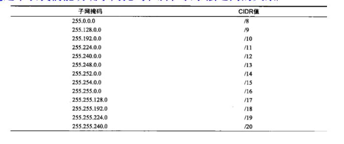
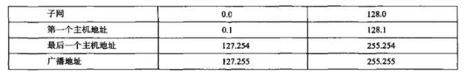

**目录**

**文章目录**

\#**子网划分理论基础**

\##**为什么进行子网划分**

- 减少网络流量，无论什么样的流量，我们都希望它少些，网络流量亦如此。如果没有可信赖的路由器，网络流量可能导致整个网络停顿，但有了路由器后，大部分流量都将呆在本地网络内，只有前往其他网络的分组将穿越路由器。路由器增加广播域，广播域越多，每个广播轻松划分子网域就越小，而每个网段的网络流量也越少。
- 优化网络性能，这是减少网络流量的结果。
- 简化管理，与庞大的网络相比，在一系列相连的小网络中找出并隔离网络问题更容易。
- 有助于覆盖大型地理区域，WAN链路比LAN链路的速度慢得多，且更昂贵;单个大跨度的大型网络在前面说的各个方面都可能出现问题，而将多个小网络连接起来可提高系统的效率。

\##**明确需求**

我们创建子网的时候，一定是根据一定的要求创建的，这个要求就是我们实际的网络需求。一般我们按如下步骤来明确我们的网络需求：

(1)确定需要的网络ID数:

- 每个LAN子网一个;
- 每条广域网连接一个。

(2)确定每个子网所需的主机数:

- 每个TCPIIP主机一个;
- 每个路由器接口一个。

(3)根据上述需求，确定如下内容:

- 一个用于整个网络的子网掩码;
- 每个物理网段的唯一子网ID;
- 每个子网的主机范围。

\##**知识点**

- ip地址：我们需要知道网络地址分为A,B,C三类，并且知道ip地址是由网段号(net_id)+主机号（host_id）组成的.想要详细了解ip地址可以参考我这篇博文：[为什么百度查到的ip和ipconfig查到的不一样；详解公网Ip和私网ip；详解网络分类ＡＢＣ；](http://blog.csdn.net/gui951753/article/details/79210535)
- 子网掩码：要让子网划分方案管用，网络中的每台机器都必须知道主机地址的哪部分为子网地址，这是通过给每台机器分配子网掩码实现的。子网掩码是一个长32位的值，让IP分组的接收方能够将IP地址的网络ID部分和主机ID部分区分开来。网络管理员创建由1和0组成的32位子网掩码，其中的1表示lP地址的相应部分为网络地址或子网地址。

**并非所有网络都需要子网，这意味着网络可使用默认子网掩码。这相当于说IP地址不包含子网地址。下表列出了A类、B类和C类网络的默认子网掩码。 **

- CIDR:( Classless Inter-Domain Routing，元类域间路由选择).我们需要了解这种网络表示法。形式如：192.168.10.32/28。前面的数字是我们的网络地址，后面的28表示用28位来表示网络位，用32-28=4位来表示主机位。通过这种记法，我们能明确两个信息：

- - 网络地址：192.168.10.32
  - 子网掩码：255.255.255.240

**通过下表我们能明确子网掩码和斜杠表示法之间的关系**

其中/8-/15只能用于A类网络，/16-/23可用于A类和B类网络，而/24-/30可用于A类、B类和C类网络。这就是大多数公司都使用A类网络地址的一大原因，因为它们可使用所有的子网掩码，进行网络设计时的灵活性最大。

\#**子网划分常见问题**

- 选定的子网掩码将创建多少个子网?

2^x个，其中x是子网掩码借用的主机位数。如：192.168.10.32/28，我们知道C类ip的默认子网掩码为：255.255.255.0，而由上文的CIDR知识，我们了解到这个ip的实际子网掩码是：255.255.255.240。原本最后一个字节应该是0（00000000），现在却是240（11110000）。故其借用了主机位4位来充当网络位。

** 这个地方不懂的话可以结合我后面的实际案例一起来看**

- 每个子网可包含多少台主机?

2^y-2台，其中y是没被借用的主机位的位数。-2是因为，主机位全为0的部分是这个子网的网段号（Net_id），全为1的部分是这个网段的广播地址。

- 有哪些合法的子网?

算出子网的步长（增量）。一个例子是256-192 = 64，即子网掩码为192时，步长为64。从0开始不断增加剧，直到到达子网掩码值，中间的结果就是子网，即0、64、128和192，

- 每个子网的广播地址是什么?

主机位全为1就是该子网的广播地址。一般我们这样计算：**广播地址总是下一个子网前面的数.**前面确定了子网为0、64、128和192，例如，子网0的广播地址为63，因为下一个子网为64;子网64的广播地址为127，因为下一个子网为128，以此类推。请记住，最后一个子网的广播地址总是255

- 每个子网可包含哪些主机地址?

合法的主机地址位于两个子网之间，但全为0和全为1的地址除外。例如，如果子网号（网段号）为64，而广播地址为127，则合法的主机地址范围为65-126，即子网地址和广播地址之间的数字。

\#**子网划分实例精析**

\##**C类子网划分实例分析**

首先我们要知道C类可使用的全部子网掩码：

\###**已知网络地址和子网掩码，求子网划分结果**

- **案例一：**

255.255.255.128 (/25)

128的二进制表示为10000000，只有1位用于定义子网，余下7位用于定义主机。这里将对C类网络192.168.10.0进行子网划分。

网络地址=192.168.10.0

子网掩码=255.255.255.128

回答五大问题：

- - 多少个子网?

在128( 10000000 )中，取值为1的位数为1，借用了一位主机位，因此答案为2^1=2。

- - 每个子网多少台主机?

有7个主机位取值为o( 10000000)，还剩下7位主机位，因此答案是2^7-2= 126台主机。

- - 有哪些合法的子网?

256 -128 = 128。也就是子网的增量是128.因此子网为0和128

- - 每个子网的广播地址是什么?

在下一个子网之前的数字中，所有主机位的取值都为1，是当前子网的广播地址。对于子网0，下一个子网为128，因此其广播地址为127

- - 每个子网包含哪些合法的主机地址?

合法的主机地址为子网地址和广播地址之间的数字。要确定主机地址，最简单的方法是写出子网地址和广播地址，这样合法的主机地址就显而易见了。

下面我分别用图表和图画来表示该子网划分，以希望大家能有一个更深刻的理解。

- **案例二：**

255.255.255.192 (/26)

在第二个示例中，我们将使用子网掩码255.255.255.192对网络192.168.10.0进行子网划分。

网络地址=192.168.10.0

子网掩码=255.255.255.192

下面来回答五大问题

- - 多少个子网?

在192(11000000)中，取值为1的位数为2，因此答案为2^2=4个子网。

- - 每个子网多少台主机?有6个主机位的取值为o(11000000)，因此答案是2^6-2=62台主机。
  - 有哪些合法的子网?

256 -192 = 64。所以子网的步长[增量]为64，因此子网为0、64、128和192

- - 每个子网的广播地址是什么?

在下一个子网之前的数字中，所有主机位的取值都为1，是当前子网的广播地址。对于子网0，下一个子网为64，因此其广播地址为63。以此类推。

- - 合法的主机地址有哪些?

合法的主机地址为子网地址和广播地址之间的数字。要确定主机地址，最简单的方法是写出子网地址和广播地址，这样合法的主机地址就显而易见了。

下面我分别使用图表和图画来更形象的展示这五大问题的答案。

- **案例三：**

从这个案例开始，我不再一一回答这五大问题，大部分的思考是重复的，我只给出问题和图表类型的答案。

255.255.255.224 (/27)

这次我们将使用子网掩码255.255.255.224对网络192.168.10.0进行子网划分。

网络地址=192.168.10.0

子网掩码=255.255.255.224

下表是图表类型的子网划分结果

- **案例四：**

255.255.255.240 (/28)

再来看一个示例:

网络地址=192.168.10.0

子网掩码=255.255.255.240

子网划分结果：

- **案例五：**

255.255.255.248 (/29)

继续练习:

网络地址=192.168.10.0

子网掩码=255.255.255.248

子网划分结果：

\###**已知IP地址和子网掩码求子网划分**

**案例1： **

已知ip地址=192.168.10.33 ，子网掩码=255.255.255.224，求该网络的子网划分。

1. 求出子网增量：

由于子网掩码是224，所以子网步长为256-224=32

1. 求有哪些合法子网：

由上文知道，子网的步长为32.因此子网为0、32、64等等

1. 求出该Ip地址对应的子网号。

因为主机地址33位于子网32和64之间，因此属于子网192.168.10.32

1. 求该子网对应的广播地址：

下一个子网为64，因此子网32的广播地址为63(广播地址总是下一个子网之前的数字)。

1. 求合法的主机地址范围：

33~62(子网和广播地址之间的数字)。

**案例2： **

ip地址=192.168.10.174

子网掩码=255.255.255.240.合法的主机地址范围是多少呢?

**解答：**子网掩码为240，因此将256减去240，结果为16，这是子网增量。要确定所属的子网，只需从零开始不断增加16，并在超过主机地址174后停止:0、16、32、48、64、80、96、112、128、144、160、176等。主机地址174位于160和176之间，因此所属的子网为160。广播地址为175，合法的主机地址范围为161~174。

**案例3：**

ip地址=192.168.10.17

子网掩码=255.255.255.252 该IP地址属于哪个子网?该子网的广播地址是什么?

**解答：**256 -252= 4，因此子网为0、4、8、12、16、20等(除非专门指出，否则总是从0开始)。主机地址17位于子网16和20之间，因此属于子网192.168.10.16，而该子网的广播地址为19，合法的主机地址范围为17-18。

\##B类地址子网划分实例

B类地址可使用的CIDR地址表：

**注意：**在B类地址中，有16位可用于主机地址。这意昧着最多可将其中的14位用于子网划分，因为至少需要保留2位用于主机编址。使用/16意味着不对B类网络进行子网划分，但它是一个可使用的子网掩码。

\###**已知网络地址和子网掩码求子网划分**

**案例1：**

255.255.128.0 (/17)

网络地址=172.16.0.0

子网掩码=255.255.128.0

- 多少个子网?

2^1 =2 (与C类网络相同)借用了一位主机位。

- 每个子网多少台主机?

2^15 -2 = 32766 (主机位一共15位，第三个字节7位，第四个字节8位)。

- 有哪些合法的子网?

256 -128 = 128，因此子网为0和128。鉴于子网划分是在第三个字节中进行的，因此子网号实际上为0.0和128.0

- 每个子网的广播地址是什么?（跟C类相同，广播地址总是下一个子网前面的数）
- 合法的主机地址是什么?（子网号与广播地址之间的地址就是合法的主机地址）

用图表来表示出上面的参数

**案例2：**

255.255.255.128 (/25)

**这是一个非常难但是却十分适合生产环境的子网划分组合**

网络地址=172.16.0.0

子网掩码=255.255.255.128

- 多少个子网?

2^9=512。一共借用了9个主机位

- 每个子网多少台主机?

2^7-2 = 126。 还有16-9=7位主机位

- 有哪些合法的子网?

这是比较棘手的部分。这个地方的子网增量应该是 256-255=1，因此第三个字节的可能取值为0、1 、2、3…255;但别忘了，第四个字节还有一个子网位。还记得前面如何在C类网络中处理只有一个子网位的情况吗?这里的处理方式相同。也就是说第三个字节的每个取值都有0和128这两种情况。例如，如果第三个字节的取值为3，则对应的两个子网为3.0和3.128。因此总共有512个子网。

- 每个子网的广播地址是什么?（下一个子网地址的前一位）
- 合法的主机地址是什么?（介于子网地址和该子网的广播地址之间的就是主机地址）

下面用图表列出这个例子的子网划分结果：

\###**已知ip地址和子网掩码求子网划分**

当使用cidr表示子网划分，**网络位的位数>24时，比如/25，/27.我们只需要考虑第四个字节。<=24时，我们只需要考虑第三个字节，因为第四个字节的主机位并没有被借用，并没有参与到子网划分。**

- 问题:172.16.10.33/27属于哪个子网?该子网的广播地址是多少?

答案:这里只需考虑第四个字节。256-224=32，故第四个字节的变化为0、32、64…。33位于32和64之间，但子网号还有一部分位于第三个字节，因此

答案是该地址位于子网10.32中。由于下一个子网为10.64，该子网的广播地址为172.16.10.63

- 问题:IP地址=172.16.66.10;子网掩码=255.255.192.0(/18)属于哪个子网?该子网的广播地址是多少?

答案:这里需要考虑的是第三个字节，而不是第四个字节。256-192=64，因此子网为0.0、64.0、128.0等。所属的子网为172.16.64.0。由于下一个子网为128.0，该子网的广播地址为172.16.127.255。

- 问题:IP地址=172.16.50.10;子网掩码=255.255.224.0(/19)属于哪个子网?该子网的广播地址是多少?

答案:只需要考虑第三个字节。256-224=32，因此子网为0.0、32.0、64.0等(所属的子网为172.16.32.0，因而其广播地址为172.16.63.255，因为下一个子网为64.0。

- 问题:IP地址=172.16.45.14;子网掩码=255.255.255.252(/30)属于哪个子网?该子网的广播地址是多少?

答案:这里需要考虑哪个字节呢?第四个。256-252=4，因此子网为0、4、8、12、16等。所属的子网为172.16.45.12，而该子网的广播地址为172.16.45.15，因为下一个子网为172.16.45.16。

\##**A类子网划分实例**

A类网络的子网划分与B类和C类网络没有什么不同，但需要处理的是24位，而B类和C类网络中需处理的分别是16位和8位。

可用于A类的所有子网掩码：

\###**已知网络地址和子网掩码求子网划分**

**案例1：**

255.255.240.0(/20)

网络地址=10.0.0.0

子网掩码=255.255.240.0(/20)时，12位用于子网划分，余下12位用于主机编址。

- 多少个子网?

2^12=4096。

- 每个子网的主机数?

2^12-2=4094

- 有哪些合法的子网?

需要考虑哪些字节?借用的主机号来自于第二和第三个字节，因此要考虑第二个和第三个字节，在第二个字节中，子网号的间隔为1;在第三个字节中，子网号为0、16、32等，因为256-240=160

- 每个子网的广播地址是什么?
- 合法的主机地址是什么?

具体划分如表中所示：

**案例2：**

网络地址=10.0.0.0

子网掩码=255.255.255.192(/26)

这个例子将第二个、第三个和第四个字节用于划分子网。

- 多少个子网?

2^18=262144。

- 每个子网的主机数?

2^6-2=62。

- 有哪些合法的子网?

在第二个和第三个字节中，子网号间隔为1，而在第四个字节中，子网号间隔为64

- 每个子网的广播地址是什么?
- 合法的主机地址是什么?

下面只列出最后一部分的子网划分

\###**已知ip地址和子网掩码求子网划分**

**最后一个案例：**

ip地址=10.1.3.65/23

求该ip地址对应的子网以及该子网合法的主机地址和广播地址：

**回答：**首先，如果不知道/23对应的子网掩码，你就回答不了这个问题。它对应的子网掩码为255.255.254.0。这里需要注意的字节为第三个。256-254=2，因此第三个字节的子网号为0、2、4、6等。在这个问题中，主机位于子网2.0中，而下一个子网为4.0，因此该子网的广播地址为3.255。10.1.2.1~10.1.3.254中的任何地址都是该子网中合法的主机地址。