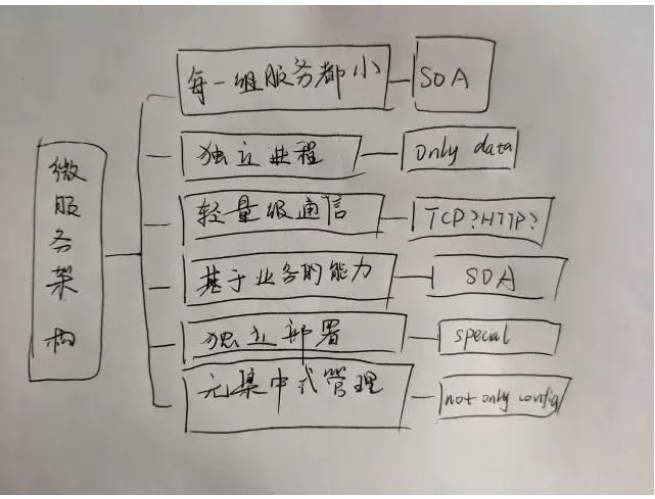

Hello，Microservices

什么是微服务

微服务Microservices之父，马丁.福勒，对微服务大概的概述如下：

就目前而言，对于微服务业界并没有一个统一的、标准的定义（While there is no precise definition of this architectural style ) 。但通在其常而言，微服务架构是一种架构模式或者说是一种架构风格，它提倡将单一应用程序划分成一组小的服务，每个服务运行独立的自己的进程中，服务之间互相协调、互相配合，为用户提供最终价值。服务之间采用轻量级的通信机制互相沟通（通常是基于 HTTP 的 RESTful API ) 。每个服务都围绕着具体业务进行构建，并且能够被独立地部署到生产环境、类生产环境等。另外，应尽量避免统一的、集中式的服务管理机制，对具体的一个服务而言，应根据业务上下文，选择合适的语言、工具对其进行构建，可以有一个非常轻量级的集中式管理来协调这些服务。可以使用不同的语言来编写服务，也可以使用不同的数据存储。

根据马丁.福勒的描述，我总结了一下几点：

花了一个月时间梳理了一下公司的微服务核心架构，原来也不是太难.

小服务

小服务，没有特定的标准或者规范，但他在总体规范上一定是小的。

进程独立

每一组服务都是独立运行的，可能我这个服务运行在tomcat容器，而另一个服务运行在jetty上。可以通过进程方式，不断的横向扩展整个服务。

通信

过去的协议都是很重的，就像ESB，就像SOAP，轻通信，着意味着相比过去更智能更轻量的服务相互调用，就所谓smart endpoints and dumb pipes，这些endpoint都是解耦的，完成一个业务通信调用串起这些micro service就像是linux系统中通过管道串起一系列命令业务。

过去的业务，我们通常会考虑各种各样的依赖关系，考虑系统耦合带来的问题。微服务，可以让开发者更专注于业务的逻辑开发。

部署

不止业务要独立，部署也要独立。不过这也意味着，传统的开发流程会出现一定程度的改变，开发的适合也要有一定的运维指责

管理

传统的企业级SOA服务往往很大，不易于管理，耦合性高，团队开发成本比较大。微服务，可以让团队各思其政的选择技术实现，不同的service可以根据各自的需要选择不同的技术栈来实现其业务逻辑。

微服务的利与弊

为什么用微服务呢？因为好玩？

不是的。下面是我从网络上找到说的比较全的优点：

优点每个服务足够内聚，足够小，代码容易理解这样能聚焦一个指定的业务功能或业务需求

开发简单、开发效率提高，一个服务可能就是专一的只干一件事。

微服务能够被小团队单独开发，这个小团队是 2 到 5 人的开发人员组成。

微服务是松藕合的，是有功能意义的服务，无论是在开发阶段或部署阶段都是独立的。

微服务能使用不同的语言开发。

易于和第三方集成，微服务允许容易且灵活的方式集成自动部署，通过持续集成工具，如Jenkins,Hudson,bamboo。

微服务易于被一个开发人员理解，修改和维护，这样小团队能够更关注自己的工作成果。无需- - 通过合作才能体现价值。微服务允许你利用融合最新技术。

微服务只是业务逻辑的代码，不会和 HTML,CSS或其他界面组件混合。

每个微服务都有自己的存储能力，可以有自己的数据库。也可以有统一数据库。

总的来说，微服务的优势，就是在于，面对大的系统，可以有效的减少复杂程度，使服务架构的逻辑更清晰明了。

但是这样也会带来很多问题，就譬如分布式环境下的数据一致性，测试的复杂性，运维的复杂性。

什么组织适合使用微服务？

微服务带了种种优点，种种弊端，那么什么组织适合使用微服务？

墨菲定律（设计系统）和康威定律（系统划分）

康威定律，是一个五十多年前就被提出来的微服务概念。在康威的这篇文章中，最有名的一句话就是：

Organizations which design systems are constrained to produce designs which are copies of the communication structures of these organizations. - Melvin Conway(1967)

中文直译大概的意思就是：设计系统的组织，其产生的设计等同于组织之内、组织之间的沟通结构。看看下面的图片（来源于互联网，侵删），再想想Apple的产品、微软的产品设计，就能形象生动的理解这句话。

花了一个月时间梳理了一下公司的微服务核心架构，原来也不是太难.

感兴趣的各位可以研究一下

架构演化

架构是不断演化出来的，微服务也是这样，当从各大科技公司，规模大到一定程度，完全需要演化成更进一步管理的技术架构体系。

花了一个月时间梳理了一下公司的微服务核心架构，原来也不是太难.

传统的团队，都是面向过程化的，产品想完了去找策划，策划完了找开发，接着顺着一步一步找。我们做技术都是为了产品的，一旦过程出来了什么问题，回溯寻找问题会非常耗时。

花了一个月时间梳理了一下公司的微服务核心架构，原来也不是太难.

使用了微服务架构体系，团队组织方式需要转变成跨职能团队，即每个团队都有产品专家，策划专家，开发专家，运维专家，他们使用API方式发布他们的功能，而平台使用他们的功能发布产品

花了一个月时间梳理了一下公司的微服务核心架构，原来也不是太难.

花了一个月时间梳理了一下公司的微服务核心架构，原来也不是太难.

微服务技术架构体系

下面我分享一下大部分公司都使用的微服务技术架构体系。

花了一个月时间梳理了一下公司的微服务核心架构，原来也不是太难.

服务发现

主流的服务发现，分为三种

花了一个月时间梳理了一下公司的微服务核心架构，原来也不是太难.

第一种，开发人员开发了程序以后，会找运维配一个域名，服务的话通过dns就能找到我们对应的服务

缺点是，由于服务没有负载均衡功能，对负载均衡服务，可能会有相当大的性能问题。

花了一个月时间梳理了一下公司的微服务核心架构，原来也不是太难.

第二种，是目前普遍的做法。可以参考我上篇博客分析的zuul网关，每一个服务都通过服务端内置的功能注册到注册中心，服务消费者不断轮询注册中心发现对应的服务，使用内置负载均衡调用服务。

缺点是，对多语言环境不是很好，你需要单独给消费者的客户端开发服务发现和负载均衡功能。当然了，这个方法通常都是用在spring cloud上的。

花了一个月时间梳理了一下公司的微服务核心架构，原来也不是太难.

第三种，是将客户端和负载均衡放在同一个主机，而不是同一个进程内。

这种方法相对第一种第二种方法来说，改善了他们的缺点，但是会极大增加运维成本。

网关

微服务的网关是什么？

我们可以联系生活实际想一下。每一个大的公司，都会有一偏属于自己的建筑区，而这建筑区内，都有不少的门卫。如果有外来人员进入公司，会先和门卫打好招呼，才能进去。

将生活实际联系到微服务上，就不难理解网关的意思了。

网关有什么用

花了一个月时间梳理了一下公司的微服务核心架构，原来也不是太难.

- 反向路由：很多时候，公司不想让外部人员看到我们公司的内部，就需要网关来进行反向路由。即将外部请求转换成内部具体服务条用
- 安全认证：网络中会有很多恶意访问，譬如爬虫，譬如黑客攻击，网关维护安全功能。
- 限流熔断：参考我学好分布式zookepper的博客，当请求很多服务不堪重负，会让我们的服务自动关闭，导致不能用服务。限流熔断可以有效的避免这类问题
- 日志监控：所有的外面的请求都会经过网关，这样我们就可以使用网关来记录日志信息
- 灰度发布，蓝绿部署。是指能够平滑过渡的一种发布方式。在其上可以进行A/B testing，即让一部分用户继续用产品特性A，一部分用户开始用产品特性B，如果用户对B没有什么反对意见，那么逐步扩大范围，把所有用户都迁移到B上面来。

开源网关Zuul架构

花了一个月时间梳理了一下公司的微服务核心架构，原来也不是太难.

zuul网关核心其实是一个servlet，所有请求都会经过zuul servlet传到zuulFilter Runner，然后分发到三种过滤器。

先说说架构图左半部分，分别是使用Groovy实现的前置路由过滤器，路由过滤器，后置路由过滤器。

一般请求都会先经过前置路由过滤器处理，一般的自定义java封装逻辑也会在这里实现。

路由过滤器，实现的是找到对应的微服务进行调用。

调用完了，响应回来，会经过后置路由过滤器，通过后置路由过滤器我们可以封装日志审计的处理。

可以说zuul网关最大的特色就是它三层过滤器。

架构图右半部分，是zuul网关设计的自定义过滤器加载机制。网关内部会有生产者消费者模型，自动的将过滤器脚本发布到zuul网关读取加载运行。

配置中心

以前，开发人员把配置文件放在开发文件里面，这样会有很多隐患。譬如，配置规范不同，无法追溯配置人员。一旦需要大规模改动配置，改动时间会很长，无法追溯配置人员，从而影响整个产品，后果是我们承担不起的。

因此就有配置中心这个喽~

现在的开源中心有百度配置中心 Disconf，spring cloud config，Apollo，今天重点说说现在应用质量不错的配置中心阿波罗。

携程开源的Apollo

开源地址：github.com/ctripcorp/a…

花了一个月时间梳理了一下公司的微服务核心架构，原来也不是太难.

apollo的配置中心规模比较大，本地应用会有响应的配置中心客户端，可以定时同步配置中心里的配置。如果配置中心怠机，会使用缓存来进行配置。

通讯方式

关于通讯方式，一般市面也就是两种远程调用方式，我整理了一个表格：

花了一个月时间梳理了一下公司的微服务核心架构，原来也不是太难.

监控预警

监控预警对于微服务很重要，一个可靠的监控预警体系对微服务运行至关重要。一般监控分为如下层次：

花了一个月时间梳理了一下公司的微服务核心架构，原来也不是太难.

从基础设施到用户端，层层有监控，全方位，多角度，每一个层面都很重要。总体来说，微服务可分5个监控点：日志监控，Metrics监控，健康检查，调用链检查，告警系统

监控架构

下面的图是大部分公司的一种监控架构图。每一个服务都有一个agent，agent收集到关键信息，会传到一些MQ中，为了解耦。同时将日志传入ELK，将Metrics传入InfluxDB时间序列库。而像nagios，可以定期向agent发起信息检查微服务。

花了一个月时间梳理了一下公司的微服务核心架构，原来也不是太难.

调用链监控APM

很多公司都有调用链监控，就譬如阿里有鹰眼监控，点评的Cat，大部分调用链监控（没错，我指的Zipkin）架构是这样的

花了一个月时间梳理了一下公司的微服务核心架构，原来也不是太难.

当请求进入Web容器的时候，会经过创建Tracer，连接spans（模拟潜在的分布式工作的延迟，该模块还包含在系统网络间传递跟踪上下文信息的工具包，如通过http headers）。Spans有一个上下文，其中包含tracer标识符，将其放在表示分布式操作的树的正确位置。当我们把图中的各种span放到后端的时候，我们的服务调用链会动态的生成调用链。

下面是一些市场上用的比较多的调用链监控：

1、Pinpointgithub地址：GitHub - naver/pinpoint: Pinpoint is an open source APM (Application Performance Management) tool for large-scale distributed systems written in Java.对java领域的性能分析有兴趣的朋友都应该看看这个开源项目，这个是一个韩国团队开源出来的，通过JavaAgent的机制来做字节码代码植入，实现加入traceid和抓取性能数据的目的。NewRelic、Oneapm之类的工具在java平台上的性能分析也是类似的机制。

2、SkyWalkinggithub地址：wu-sheng/sky-walking这是国内一位叫吴晟的兄弟开源的，也是一个对JAVA分布式应用程序集群的业务运行情况进行追踪、告警和分析的系统，在github上也有400多颗星了。功能相对pinpoint还是稍弱一些，插件还没那么丰富，不过也很难得了。

3、Zipkin官网：OpenZipkin · A distributed tracing systemgithub地址：GitHub - openzipkin/zipkin: Zipkin is a distributed tracing system这个是twitter开源出来的，也是参考Dapper的体系来做的。

Zipkin的java应用端是通过一个叫Brave的组件来实现对应用内部的性能分析数据采集。Brave的github地址：github.com/openzipkin/…这个组件通过实现一系列的java拦截器，来做到对http/servlet请求、数据库访问的调用过程跟踪。然后通过在spring之类的配置文件里加入这些拦截器，完成对java应用的性能数据采集。

4、CATgithub地址：GitHub - dianping/cat: Central Application Tracking这个是大众点评开源出来的，实现的功能也还是蛮丰富的，国内也有一些公司在用了。不过他实现跟踪的手段，是要在代码里硬编码写一些“埋点”，也就是侵入式的。这样做有利有弊，好处是可以在自己需要的地方加埋点，比较有针对性；坏处是必须改动现有系统，很多开发团队不愿意。

5、Xhprof/Xhgui这两个工具的组合，是针对PHP应用提供APM能力的工具，也是非侵入式的。Xhprof github地址：GitHub - preinheimer/xhprof: XHGUI is a GUI for the XHProf PHP extension, using a database backend, and pretty graphs to make it easy to use and interpret.Xhgui github地址：GitHub - perftools/xhgui: A graphical interface for XHProf data built on MongoDB我对PHP不熟，不过网上介绍这两个工具的资料还是蛮多的。

花了一个月时间梳理了一下公司的微服务核心架构，原来也不是太难.

熔断、隔离、限流、降级

面对巨大的突发流量下，大型公司一般会采用一系列的熔断（系统自动将服务关闭防止让出现的问题最大化）、隔离（将服务和服务隔离，防止一个服务挂了其他服务不能访问）、限流（单位时间内之允许一定数量用户访问）、降级（当整个微服务架构整体的负载超出了预设的上限阈值或即将到来的流量预计将会超过预设的阈值时，为了保证重要或基本的服务能正常运行，我们可以将一些 不重要或 不紧急 的服务或任务进行服务的 延迟使用 或 暂停使用）措施。

下面介绍一下hystrix的运行流程（没找到架构图不好意思）：

花了一个月时间梳理了一下公司的微服务核心架构，原来也不是太难.

每一个微服务调用时，都会使用hystrix的command方式（上图的左上角那个），然后使用command同步的，或者是响应式的，或者是异步的，判断电路是否熔断（顺着图从左往右看），

如果断路则走降级fallback；

如果这个线闭合着，但是线程资源没了，队列满了，则走限流措施（看图的第5步）；

如果走完了，执行成功了，则走run()方法，获取response，但是这个过程如果出错了，则继续走降级fallback.

同时，看图最上面有一个后缀是health的，这是一个计算整个链路是否健康的组件，每一步操作都被它记录着。

容器与服务编排引擎

从物理机到虚拟机，从虚拟机到容器；从物理集群到open stack，open stack到kubernetes；科技不断的变化，我们的认知也没刷新。

我们从容器开始说起，它首先是一个相对独立的运行环境，在这一点有点类似于虚拟机，但是不像虚拟机那样彻底。  虚拟机会将虚拟硬件、内核（即操作系统）以及用户空间打包在新虚拟机当中，虚拟机能够利用“虚拟机管理程序”运行在物理设备之上。虚拟机依赖于hypervisor，其通常被安装在“裸金属”系统硬件之上，这导致hypervisor在某些方面被认为是一种操作系统。

一旦 hypervisor安装完成， 就可以从系统可用计算资源当中分配虚拟机实例了，每台虚拟机都能够获得唯一的操作系统和负载(应用程序)。简言之，虚拟机先需要虚拟一个物理环境，然后构建一个完整的操作系统，再搭建一层Runtime，然后供应用程序运行。

对于容器环境来说，不需要安装主机操作系统，直接将容器层(比如LXC或libcontainer)安装在主机操作系统(通常是Linux变种)之上。在安装完容器层之后，就可以从系统可用计算资源当中分配容器实例了，并且企业应用可以被部署在容器当中。但是，每个容器化应用都会共享相同的操作系统(单个主机操作系统)。容器可以看成一个装好了一组特定应用的虚拟机，它直接利用了宿主机的内核，抽象层比虚拟机更少，更加轻量化，启动速度极快。

相比于虚拟机，容器拥有更高的资源使用效率，因为它并不需要为每个应用分配单独的操作系统——实例规模更小、创建和迁移速度也更快。这意味相比于虚拟机，单个操作系统能够承载更多的容器。云提供商十分热衷于容器技术，因为在相同的硬件设备当中，可以部署数量更多的容器实例。

此外，容器易于迁移，但是只能被迁移到具有兼容操作系统内核的其他服务器当中，这样就会给迁移选择带来限制。因为容器不像虚拟机那样同样对内核或者虚拟硬件进行打包，所以每套容器都拥有自己的隔离化用户空间，从而使得多套容器能够运行在同一主机系统之上。

我们可以看到全部操作系统层级的架构都可实现跨容器共享，惟一需要独立构建的就是二进制文件与库。正因为如此，容器才拥有极为出色的轻量化特性。

我们最常用的容器是daocker，网址如下[https://www.docker.com/](https://links.jianshu.com/go?to=https%3A%2F%2Fwww.docker.com%2F)

容器编排

过去虚拟机可以通过云平台open stack管理虚拟化，容器时代如何管理容器呢？这就要看看容器编排引擎了。

Apache mesos

mesos是基于master，slave架构，框架决定如何利用资源，master负责管理机器，slave会定期的将机器情况报告给master，master再将信息给框架。master是高可用的，因为zk，也有leader的存在。下面是架构图

花了一个月时间梳理了一下公司的微服务核心架构，原来也不是太难.

kubernetes

kubernetes是最近十分火热的开源容器编排引擎，具体可以参考kubernetes中文文档

花了一个月时间梳理了一下公司的微服务核心架构，原来也不是太难.

Kubernetes设计理念和功能其实就是一个类似Linux的分层架构，先说说每一个Kubernetes节点内部，kubelet管理全局全局pod，而每一个pod承载着一个或多个容器，kube-proxy负责网络代理和负载均衡 。

Kubernetes节点外部，则是对应的控制管理服务器，负责统一管理各个节点调度分配与运行。

