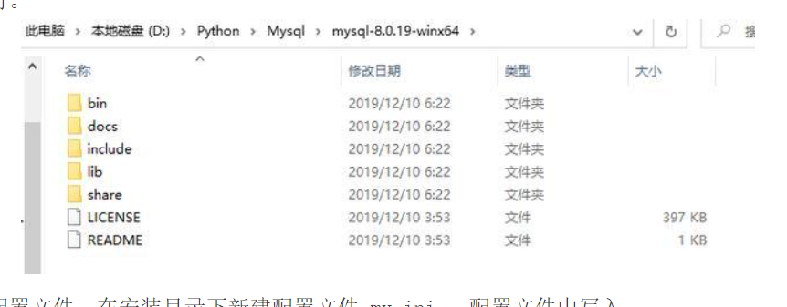
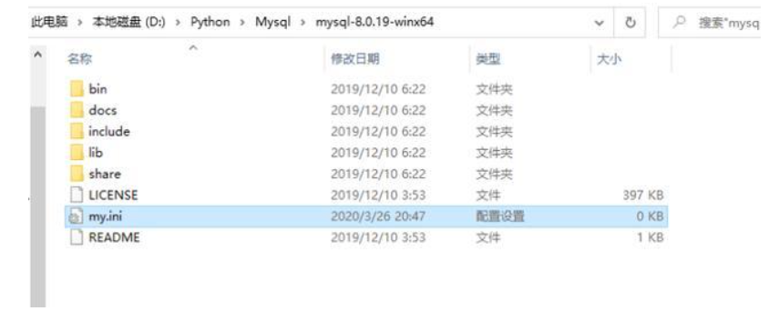
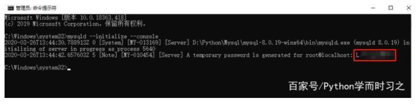
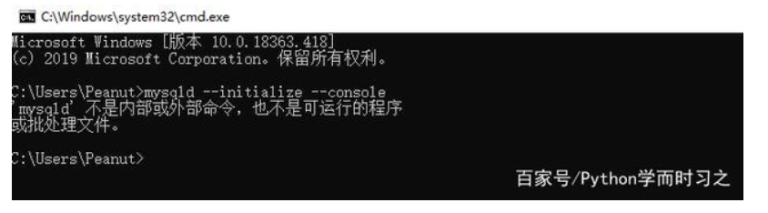
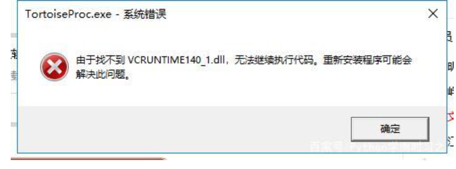

2018 年，MySQL 8.0 正式版 8.0.11 已发布，官方表示 MySQL 8 要比 MySQL 5.7 快两倍，还带来了大量的改进和更快的性能，今天就带大家来安装最新Mysql 8.0.19.

\1. 下载安装包

首先到 MySQL 8 Installer 的下载页面，链接如下：

www.mysql.com

进入首页，然后点击 'Download'，

选择最新版本8.0.19，也可以根据自己的需求下载其他版本

不需要 'Login'，直接选择'No thanks, just start my download' 选项进入下载页面

下载好的最新mysql-8.0.19-winx64如下：

\2. 安装

解压至安装目录。首先是确定MySQL 8 的安装目录，可以自行决定，我是将其安装在 D:\Python\Mysql\mysql-8.0.19-winx64目录下，解压安装包至安装目录下即可。

配置文件。在安装目录下新建配置文件 my.ini ，配置文件中写入：

[mysqld] port=3306 basedir =D:\Python\Mysql\mysql-8.0.19-winx64 datadir =D:\Python\Mysql\mysqlData\ max_allowed_packet = 20M

保存即可，其中 datadir 为数据存储目录，小编将其放在了 D:\Python\Mysql\mysqlData\ 目录下，你可以对应地进行修改。，如下图所示！

初始化 MySQL 8 。打开命令行，进入 MySQL 的 bin 目录下，之后进行初始化，命令为：

mysqld --initialize --console

初始化成功后，命令行会打印出 root 用户的初始密码（记得保存，如果没有报错或者忘记的话，删掉初始化的 datadir 目录再次进行初始化即可），过程如下图：

启动 MySQL 服务。在启动服务前，首先要将 MySQL 8 安装为 Windows 的系统服务，在 MySQL 的 bin 目录执行命令如下：

mysqld --install mysql8

其中 mysql8 为服务名称，你可以自行修改成想要的名字。

服务注册成功后，就可以启动 MySQL 服务了，执行命令：

net start mysql8

登录 MySQL在bin 目录下执行输入刚刚保存的密码。然后需要修改 root 用户密码。

mysql -uroot -p

修改密码首次登录 MySQL 时需要修改 root 用户密码，不然是无法进行操作的

ALTERUSER'root'@'localhost'IDENTIFIEDWITH mysql_native_password BY '211314'; FLUSHPRIVILEGES;

小编修改密码为 ******，你可以按照你的要求进行设置，之后就可以进行操作了。

验证。通过客户端连接 MySQL 8，输入用户名密码无报错即为登录成功

至此Mysql 8.0.19已经成功的安装在你的计算机上了。

在安装的过程中并没有那么的顺利，遇到几个问题，特在此总结：

问题1:初始化Mysql的时候出现以下问题

问题分析：没有配置Mysql的环境变量

处理办法：

1.桌面右键 '此电脑'，找到 '属性'。然后找到 '高级系统变量'

2.在此页面下找到 '高级',然后选择'环境变量'

3.找到自己Mysql的安装路径，然后复制此路径

3.在 '系统变量' 下找到 ‘path’,点击新建。粘贴刚才复制的路径

4.点击确定，问题解决！

问题2：配置好环境之后初始化Mysql出现以下问题

问题分析：

我们知道14.0版本对应Visual Studio2015。所以如果电脑上安装过VS2015，是不会提示缺少该dll。

如果系统没有安装Visual Studio 2015的Visual C ++ Redistributable，则Mysql或其他应用程序无法与MSVCP140.dll库进行通信。

解决方案：

下载。

