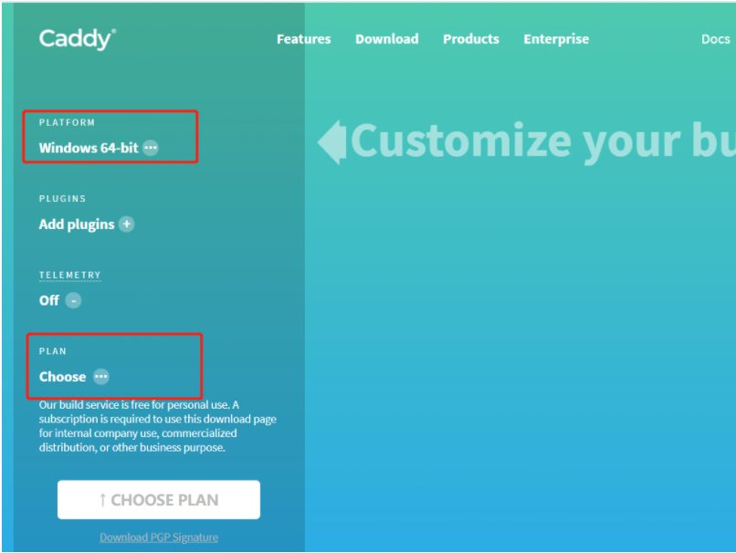
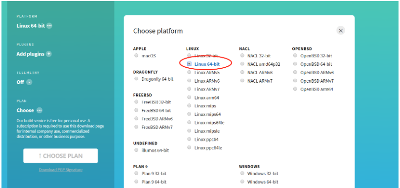
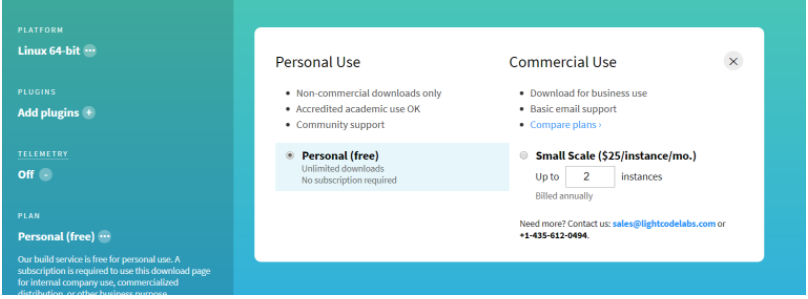
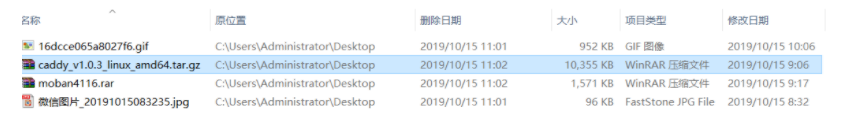
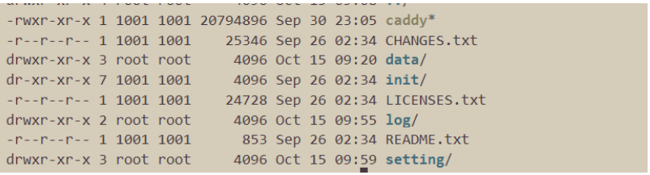

**何为caddy，用过nginx的同学一定知道nginx是干嘛使得，那么caddy你也可以理解为他跟nginx干的是同一件事。**

*今天来简单入门一下caddy。* 前提:

1. 一台云服务器或服务器，我这里linux64 ubantu

首先去官网下载caddy，当然官网有多种安装方式(我这里选择下载安装) [caddy 官网下载](https://caddyserver.com/download)。



PLATFORM 选择 linux 64



PLAN 选择个人



然后就可以下载到tar.gz包，使用wincp上传到服务器上，将文件解压



tar -zxvf caddy_v1.0.3_linux_amd64.tar.gz

解压后如下，data、setting、log是我自己创建的。



**data 放内容数据。** **setting 放caddy的配置文件 Caddyfile** **log 放日志**

然后在setting文件夹下新建caddy配置文件Caddyfile

touch Caddyfile

然后编写配置文件

```shell
vim Caddyfile


添加如下信息

http://love.laocat.cn
gzip
log /opt/caddy/server/log/access.log
root /opt/caddy/server/data/moban/
index index.html


来逐一解释：
第一行可填写域名、ip、ip:port、可多个、可一个。（如何不指定http则caddy或自行申请证书，监听80,443端口）
第二行为gzip 熟悉nginx的同学应该也熟悉他。
第三行为配置log存放目录
第四行指定站点的根目录
第五行设置用作“索引”文件的文件名列表 下边的为未配置项的解释
tls为配置https服务 可配置 tls off tls email 一者关闭 二者 email是用于与受信任的CA生成证书的电子邮件地址。
如果有多个server要配置，则可以加入花括号来区分，如下

http://love.laocat.cn {
gzip
log /opt/caddy/server/log/access.log
root /opt/caddy/server/data/moban/
index index.html
}
http://haha.laocat.cn {
gzip
log /opt/caddy/server/log/access.log
root /opt/caddy/server/data/moban/
tls laocat@icloud.com
index index.html
}


```

具体配置可阅读官网文档。[caddy官网文档](https://caddyserver.com/docs)

然后到server目录下启动caddy，因新建配置文件目录，则需要指定caddy加载某个配置文件。

./caddy -conf /opt/caddy/server/setting/Caddyfile

启动后则会显示已经成功启动服务，访问xxx域名或ip:port(截图就不放了) 然后访问xxx域名或ip:port，如下图：


已经正常加载到了我所想要的内容。

写在后边，caddy是go语言开发，相对nginx较为简单，配置文件易懂，且较易入门，至于后台启动，推荐docker 或者 nohup。这里就不详细介绍了。

