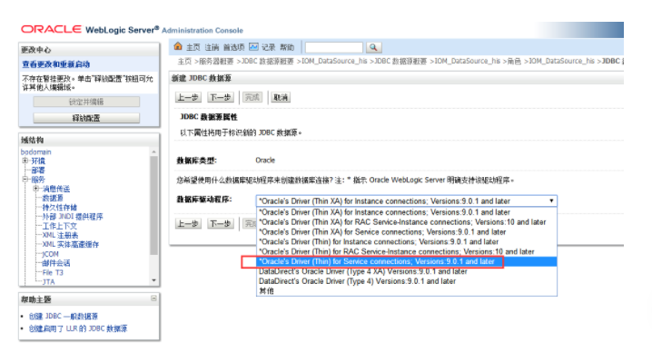

数据源配置过程:可以选择“一般数据源”或“多数据源”

 

JDBC 数据源是指与 JNDI 树 (通过一组 JDBC 连接提供数据库连接) 绑定的对象。应用程序可在 JNDI 树上查找数据源, 然后借用一个与数据源的数据库连接。

此页概括了已在该域中创建的 JDBC 数据源对象。

一、选择“数据源”——“锁定并编辑”——“新建”，这里可以选择“一般数据源”或“多数据源”

二、定义数据源名称、JNDI名称、和数据库类型

三、数据库驱动程序  选择“Oracle's Driver(Thin) for Instance connections;Versions:Any”

四、保持默认选项“支持全局事物处理”

五、填写数据库信息

六、测试数据库配置是否可用，测试连接

七、选择部署目标或集群

八、完成并激活更改，即可。至此，单数据源配置完毕

九、多数据源配置：建立多数据源，定义数据源名称、JDNI名称、算法类型

十、选择目标或集群

十一、选择数据源类型，保持默认“非XA驱动程序”

十二、选择对应的数据源

十二、完成并激活更改，即可。

