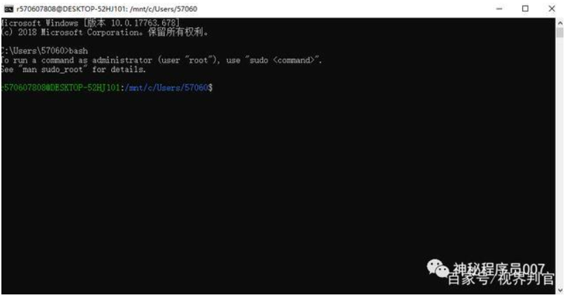

普通用户对于操作系统的选择很简单，经济实用选windows，钱多讲究格调选macOS, 毕竟普通用户切换操作系统的成本并不大。而程序员就不一样了，换一个操作系统，就意味着所有开发环境都要一并更换。而且在程序员群体中，操作系统有以下的鄙视链：macOS-->linux-->windows。

其实操作系统的比较并不是简单粗暴的单一维度比较，用windows并不意味着low，用linux也不等同于你就是一个极客。

不过作为一个程序员，你很有必要学会linux，如果你的程序最终是跑在线上的Linux服务器上，那么你就更应该从现在开始投入linux的怀抱中，早日从windows脱坑

所以今天我们首先从Linux的安装说起。

1.首先我们打开电脑搜索Microsoft Store。

2.然后在搜索框输入Linux

3.找到我们想要下载的Linux版本

4.然后点击下载就行了

5.待下载完成之后先不要着急点击启动，这时候启动会报Error:0x8007007e。这个错误的原因就是没有启动适用于Linux的Windows子系统。所以我们首先要找到win10中打开或关闭Windows功能

5.1右击我的电脑找到【属性】，找到【控制面板主页】

5.2点击控制面板主页找到【程序】

5.3找到【启动或关闭Windows功能】

5.4进入【启动或关闭Windows功能】页面，找到【适用于Linux的Windows子系统】，并勾选确定

5.5待电脑重启后问题解决

6.启动Ubuntu18.04，等待下载安装

7.安装完成后，自己输入用户名和密码，回车

8.输入bash，如下图则证明成功安装

