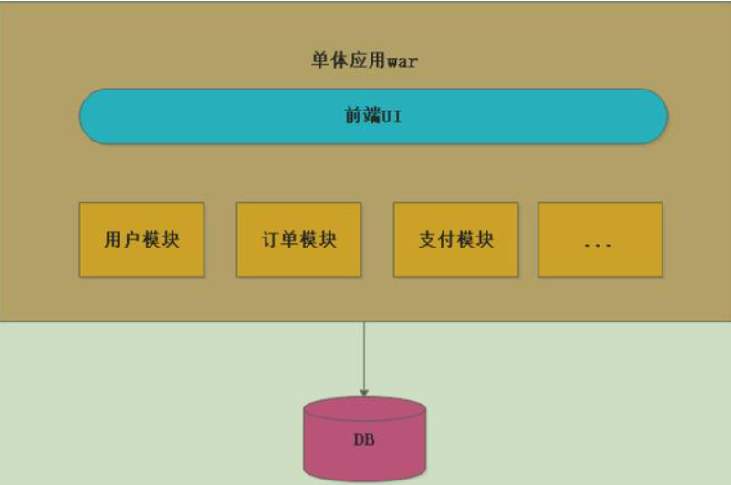
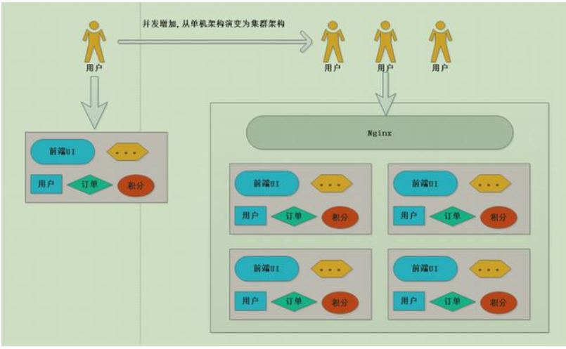
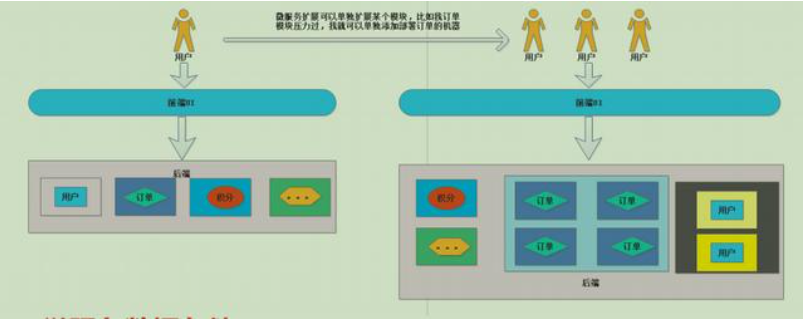
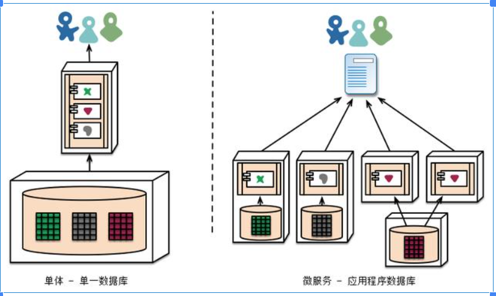
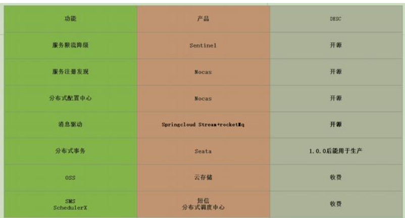
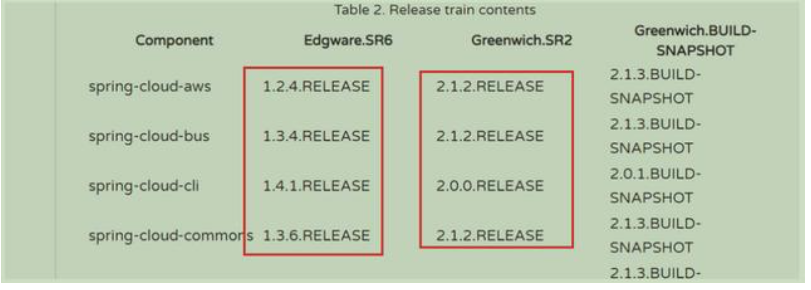
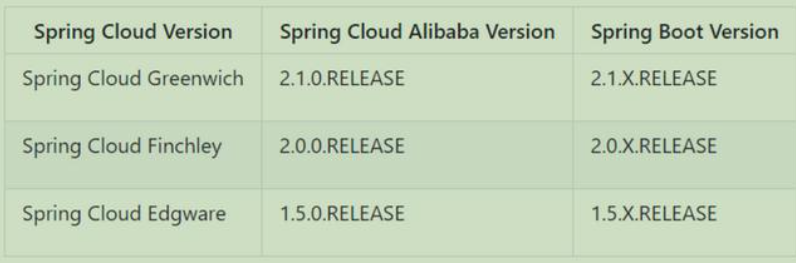

一. 引言

本篇文章是整理笔者在学习微服务时的入门篇，将探讨以下几点：

什么是单体架构及其优劣什么是微服务什么是微服务架构及其优劣微服务和微服务架构的区别单体架构与微服务架构的区别微服务的适用场景微服务架构所涉及的开发框架有哪些如何选择框架的不同版本二. 单体架构

2.1什么是单体架构

简单来说就是一个war包打天下，war包中就包含了各种功能和资源，比如JSP. JS. CSS，业务就是各个功能模块，如下图：

2.2单体架构优缺点

优点：

架构简单，少了很多微服务中的问题(下文会讲是哪些问题)开发. 测试. 部署简单，特别是部署缺点：

随业务扩展，代码量越来越多，由于开发人员水平不同，代码质量参差不齐，改动代码时牵一发而动全身，开发人员如履薄冰部署慢，由于代码量过多，每次部署可能需要几分钟甚至几十分钟扩展成本高，根据单体架构图，假若支付模块为CPU密集型，需要大量计算，即需要更好的CPU，若订单模块为IO密集型，需要大量磁盘读写，即需要更好的内存和磁盘。单体架构又不支持单模块扩展，则我们就需要更好的CPU. 内存. 磁盘，那么硬件成本就会飞速上涨不利于新技术发展，想想老板突然一天说我们把Struts2项目往Spring Boot上迁移...三. 微服务与微服务架构

3.1 什么是微服务

微服务的核心就是将传统的单体架构拆分成单个服务，将业务间进行解耦，每个服务可以单独部署. 可以拥有自己的数据库这样拆分出来的服务就叫做微服务。

就比如说，单体架构中有订单. 支付. 物流. 积分等业务，拆分成微服务，订单服务，支付服务，物流服务，积分服务

这样拆分出来有什么意义呢？

单体架构中若非核心模块出现重大Bug，比如积分模块内存溢出，就会导致整个项目宕机但若是拆分成微服务，则只是说积分服务不能使用，但核心服务并不会受到影响

3.2什么是微服务架构

微服务架构是一种架构风格，包含如下几个特点：

将一个单一应用程序开发为一组小型服务每个服务运行在自己的进程中服务之间通过轻量级的通信机制(http rest api)每个服务都能够独立的部署每个服务甚至可以拥有自己的数据库3.3微服务与微服务架构的区别

微服务是服务的大小和对外提供的单一功能，微服务架构是指把一个个微服务管理起来，对外提供的一套完整服务

3.4微服务架构的优缺点

优点：

每个服务足够小，内聚高，代码更易理解，相较于单体架构，修改几行代码可能需要对整个系统逻辑都要理解易开发，单个服务功能集中单个服务可以由小团队进行开发，效率高扩展成本低，按需扩缩容前后端分离，Java开发人员能更集中精力关心后端接口的安全性和效率每个服务拥有独立的数据库，也可以多个服务使用一个数据库缺点：

增加运维人员工作量，可能会部署非常多的war包(k8s + Docker + Jenkis)服务之间相互调用，增加通信成本数据一致性问题(分布式事务问题). 性能监控等问题定位时间成本增加3.5单体架构和微服务架构的区别

单体架构扩展

并发增加，上集群，硬件成本高

微服务架构扩展

并发增加，灵活扩展，降低硬件成本，但运维成本. 开发成本上升

数据存储区别

单体架构：仅有一个数据库微服务架构：每个微服务都可以有一个数据库

3.6微服务的适用场景

适用于：

大型复杂项目(上百万行代码的项目T_T)快速迭代项目(一天一更，吐血QAQ)高并发项目(考虑弹性扩缩容T~T)不适用：

业务稳定，就修修BUG，改改数据迭代周期长，发布频率按月来算的四. 开发微服务的框架

4.1相关框架

Spring Boot 快速开发微服务的Web框架Spring Cloud 微服务架构的一套工具集Spirng Cloud Alibaba 阿里提供的符合Spring Cloud标准的，一套微服务架构工具集下图便是Spirng Cloud Alibaba提供的一套工具集，注意虽然有些备注是开源，但只是部分开源，一些核心功能依旧需要付费才能使用，比如Sentinel，开源的话本地限流配置是不能持久化的(可以选择付费，大佬可以改源代码来解决该问题)

4.2如何选择框架的版本

Spring Boot

以2.1.6.RELEASE版本为例

其中2：表示的主版本号，表示是我们的SpringBoot第二代产品其中1:表示的是次版本号，增加了一些新的功能但是主体的架构是没有变化的，是兼容的其中6:表示的是bug修复版所以2.1.6合起来就是springboot的第二代版本的第一个小版本的 第6次bug修复版本

RELEASE:存在哪些取值呢？

snapshot(开发版本)M1...M2(里程碑版本,在正式版发布之前会出几个里程碑的版本)release(正式版本)所以选择版本时请认准release

Spring Cloud

第一代版本:Angle第二代版本:Brixton第三代版本:Camden第四代版本:Edgware第五代版本:Finchley第六代版本:GreenWich第七代版本:Hoxton(还在酝酿中，没正式版本)这种发布的版本是 以伦敦地铁站发行地铁的站

为什么我们的SpringCloud会以这种方式来发布版本，因为假如我们传统的5.1.5release这种发布的而SpringCloud会包含很多子项目的版本就会给人造成混淆

SNAPSHOT：快照版本，随时可能修改M：MileStone，M1表示第1个里程碑版本，一般同时标注PRE，表示预览版版RC：版本英文版名字叫Release Candidate（候选版本）一般标注PRE表示预览版SR：Service Release，SR1表示第1个正式版本，一般同时标注GA：(GenerallyAvailable)，表示稳定版本，比如还有一种RELEASE版本（正式版本）比如Greenwich版本顺序：Greenwich.release----->发现bug----->Greenwich.SR1------>发现bug---->Greenwich.SR2

总结：

打死不用 非稳定版本/ end-of-life（不维护）版本release版本先等等推荐SR2以后的可以放心使用Spring Boot. Spring Cloud. Spring Cloud Alibaba

这三个框架的版本关系，及推荐使用的版本如下：

五. 参考

Spring：https://spring.io/微服务：http://blog.cuicc.com/blog/2015/07/22/microservices/

