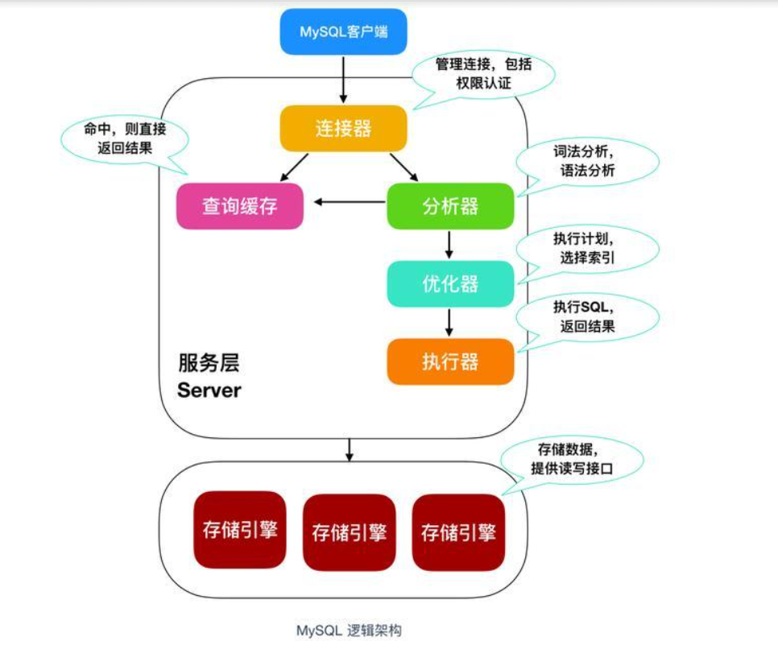
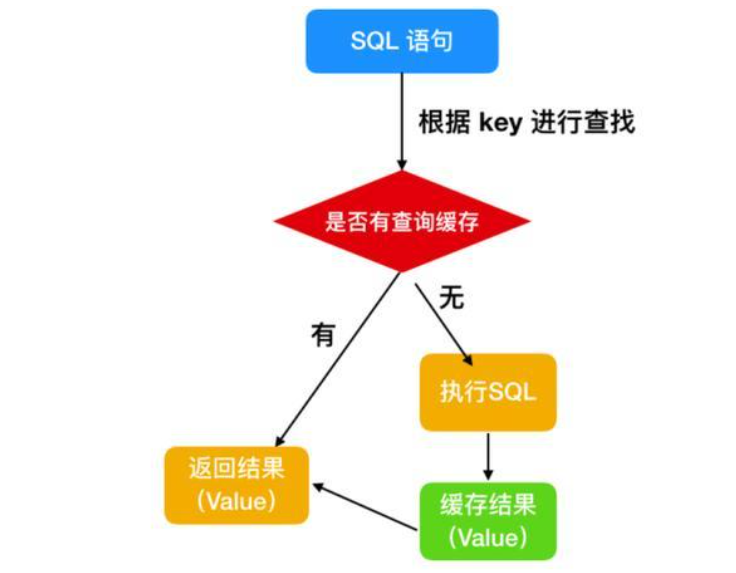
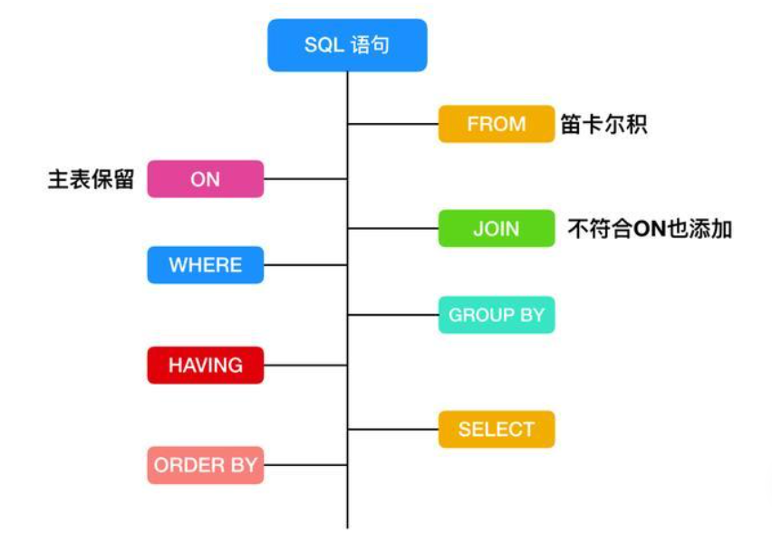
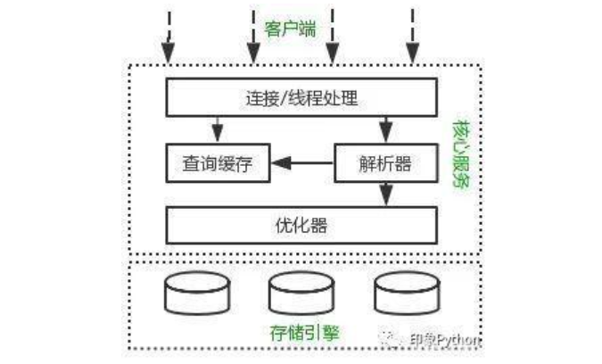

进了互联网公司，整天也就是搬砖搬砖，等到了面试的时候，发现学的数据库方面的东西都已经全部还给了老师。

不管是工作还是面试，互联网对 MySQL 的注重程度是不言而喻的。所以今天很细心地为大家整理了一些数据库方面的知识。

事务四大特性（ACID）原子性、一致性、隔离性、持久性？

原子性（Atomicity）

原子性是指事务包含的所有操作要么全部成功，要么全部失败回滚，因此事务的操作如果成功就必须要完全应用到数据库，如果操作失败则不能对数据库有任何影响。一致性（Consistency）

事务开始前和结束后，数据库的完整性约束没有被破坏。比如 A 向 B 转账，不可能 A 扣了钱，B 却没收到。这里涉及到一个概念，什么是 MySQL 中的事务？

事务是一组操作，组成这组操作的各个单元，要不全都成功要不全都失败，这个特性就是事务。

在 MySQL 中，事务是在引擎层实现的，只有使用 innodb 引擎的数据库或表才支持事务。

隔离性（Isolation）

隔离性是当多个用户并发访问数据库时，比如操作同一张表时，数据库为每一个用户开启的事务，不能被其他事务的操作所干扰，多个并发事务之间要相互隔离。当多个事务同时进行时，就有可能出现脏读(dirty read)、不可重复读(non-repeatable read)、幻读(phantom read) 的情况，为了解决这些并发问题，提出了隔离性的概念。同一时间，只允许一个事务请求同一数据，不同的事务之间彼此没有任何干扰。比如 A 正在从一张银行卡中取钱，在 A 取钱的过程结束前，B 不能向这张卡转账。

持久性(Durability)

持久性是指一个事务一旦被提交了，那么对数据库中的数据的改变就是永久性的，即便是在数据库系统遇到故障的情况下也不会丢失提交事务的操作。

事务的并发

脏读

事务 A 读取了事务 B 更新的数据，然后 B 回滚操作，那么 A 读取到的数据是脏数据

不可重复读

事务 A 多次读取同一数据，事务 B 在事务 A 多次读取的过程中，对数据作了更新并提交，导致事务 A 多次读取同一数据时，结果因此本事务先后两次读到的数据结果会不一致。

幻读

幻读解决了不重复读，保证了同一个事务里，查询的结果都是事务开始时的状态（一致性）。例如：事务 T1 对一个表中所有的行的某个数据项做了从“1”修改为“2”的操作 这时事务 T2 又对这个表中插入了一行数据项，而这个数据项的数值还是为“1”并且提交给数据库。而操作事务 T1 的用户如果再查看刚刚修改的数据，会发现还有跟没有修改一样，其实这行是从事务 T2 中添加的，就好像产生幻觉一样，这就是发生了幻读。小结：不可重复读的和幻读很容易混淆，不可重复读侧重于修改，幻读侧重于新增或删除。解决不可重复读的问题只需锁住满足条件的行，解决幻读需要锁表。

事务的隔离级别

读未提交另一个事务修改了数据，但尚未提交，而本事务中的 SELECT 会读到这些未被提交的数据脏读

不可重复读事务 A 多次读取同一数据，事务 B 在事务 A 多次读取的过程中，对数据作了更新并提交，导致事务 A 多次读取同一数据时，结果因此本事务先后两次读到的数据结果会不一致。

可重复读在同一个事务里，SELECT 的结果是事务开始时时间点的状态，因此，同样的 SELECT 操作读到的结果会是一致的。但是，会有幻读现象

串行化最高的隔离级别，在这个隔离级别下，不会产生任何异常。并发的事务，就像事务是在一个个按照顺序执行一样

MySQL 默认的事务隔离级别为 repeatable-read

事务隔离级别：未提交读时，写数据只会锁住相应的行。 事务隔离级别为：可重复读时，写数据会锁住整张表。 事务隔离级别为：串行化时，读写数据都会锁住整张表。

隔离级别越高，越能保证数据的完整性和一致性，但是对并发性能的影响也越大。

所以对于多数应用程序，可以优先考虑把数据库系统的隔离级别设为 Read Committed，它能够避免脏读取，而且具有较好的并发性能。尽管它会导致不可重复读、幻读这些并发问题，在可能出现这类问题的个别场合，可以由应用程序采用悲观锁或乐观锁来控制。

Mysql结构图

大致上来说，MySQL 可以分为 Server层和 存储引擎层。

Server 层包括连接器、查询缓存、分析器、优化器、执行器，包括大多数 MySQL 中的核心功能，所有跨存储引擎的功能也在这一层实现，包括 存储过程、触发器、视图等。存储引擎层包括 MySQL 常见的存储引擎，包括 MyISAM、InnoDB 和 Memory 等，最常用的是 InnoDB，也是现在 MySQL 的默认存储引擎。存储引擎也可以在创建表的时候手动指定，比如下面

CREATE TABLE t (i INT) ENGINE = ;

然后我们就可以探讨 MySQL 的执行过程了

连接器

首先需要在 MySQL 客户端登陆才能使用，所以需要一个连接器来连接用户和 MySQL 数据库，我们一般是使用

mysql -u 用户名 -p 密码

来进行 MySQL 登陆，和服务端建立连接。在完成 TCP 握手 后，连接器会根据你输入的用户名和密码验证你的登录身份。如果用户名或者密码错误，MySQL 就会提示 Access denied for user，来结束执行。如果登录成功后，MySQL 会根据权限表中的记录来判定你的权限。

查询缓存

连接完成后，你就可以执行 SQL 语句了，这行逻辑就会来到第二步：查询缓存。MySQL 在得到一个执行请求后，会首先去查询缓存中查找，是否执行过这条 SQL 语句，之前执行过的语句以及结果会以key-value对的形式，被直接放在内存中。key 是查询语句，value是查询的结果。如果通过 key 能够查找到这条 SQL 语句，就直接返回 SQL的执行结果。如果语句不在查询缓存中，就会继续后面的执行阶段。执行完成后，执行结果就会被放入查询缓存中。可以看到，如果查询命中缓存，MySQL 不需要执行后面的复杂操作，就可以直接返回结果，效率会很高。

但是查询缓存不建议使用

为什么呢？因为只要在 MySQL 中对某一张表执行了更新操作，那么所有的查询缓存就会失效，对于更新频繁的数据库来说，查询缓存的命中率很低。

分析器

如果没有命中查询，就开始执行真正的 SQL 语句。首先，MySQL 会根据你写的 SQL 语句进行解析，分析器会先做 词法分析，你写的 SQL 就是由多个字符串和空格组成的一条 SQL 语句，MySQL 需要识别出里面的字符串是什么，代表什么。然后进行 语法分析，根据词法分析的结果， 语法分析器会根据语法规则，判断你输入的这个 SQL 语句是否满足 MySQL 语法。如果 SQL 语句不正确，就会提示 You have an error in your SQL syntax

优化器

经过分析器的词法分析和语法分析后，你这条 SQL 就合法了，MySQL 就知道你要做什么了。但是在执行前，还需要进行优化器的处理，优化器会判断你使用了哪种索引，使用了何种连接，优化器的作用就是确定效率最高的执行方案。

执行器

MySQL 通过分析器知道了你的 SQL 语句是否合法，你想要做什么操作，通过优化器知道了该怎么做效率最高，然后就进入了执行阶段，开始执行这条 SQL 语句在执行阶段，MySQL 首先会判断你有没有执行这条语句的权限，没有权限的话，就会返回没有权限的错误。如果有权限，就打开表继续执行。打开表的时候，执行器就会根据表的引擎定义，去使用这个引擎提供的接口。对于有索引的表，执行的逻辑也差不多。至此，MySQL 对于一条语句的执行过程也就完成了。

数据库三范式

所有字段值都是不可分解的原子值。

在一个数据库表中，一个表中只能保存一种数据，不可以把多种数据保存在同一张数据库表中。

数据表中的每一列数据都和主键直接相关，而不能间接相关。

第一范式(确保每列保持原子性)

第一范式是最基本的范式。如果数据库表中的所有字段值都是不可分解的原子值，就说明该数据库表满足了第一范式。第一范式的合理遵循需要根据系统的实际需求来定。比如某些数据库系统中需要用到“地址”这个属性，本来直接将“地址”属性设计成一个数据库表的字段就行。但是如果系统经常会访问“地址”属性中的“城市”部分，那么就非要将“地址”这个属性重新拆分为省份、城市、详细地址等多个部分进行存储，这样在对地址中某一部分操作的时候将非常方便。这样设计才算满足了数据库的第一范式，如下表所示。上表所示的用户信息遵循了第一范式的要求，这样在对用户使用城市进行分类的时候就非常方便，也提高了数据库的性能。

第二范式(确保表中的每列都和主键相关)

第二范式在第一范式的基础之上更进一层。第二范式需要确保数据库表中的每一列都和主键相关，而不能只与主键的某一部分相关（主要针对联合主键而言）。也就是说在一个数据库表中，一个表中只能保存一种数据，不可以把多种数据保存在同一张数据库表中。比如要设计一个订单信息表，因为订单中可能会有多种商品，所以要将订单编号和商品编号作为数据库表的联合主键。

第三范式(确保每列都和主键列直接相关,而不是间接相关)

第三范式需要确保数据表中的每一列数据都和主键直接相关，而不能间接相关。

比如在设计一个订单数据表的时候，可以将客户编号作为一个外键和订单表建立相应的关系。而不可以在订单表中添加关于客户其它信息（比如姓名、所属公司等）的字段。

MySQL 都有什么锁

MySQL 有三种锁的级别：页级、表级、行级。

表级锁：开销小，加锁快；不会出现死锁；锁定粒度大，发生锁冲突的概率最高,并发度最低。

行级锁：开销大，加锁慢；会出现死锁；锁定粒度最小，发生锁冲突的概率最低,并发度也最高。

页面锁：开销和加锁时间界于表锁和行锁之间；会出现死锁；锁定粒度界于表锁和行锁之间，并发度一般

什么情况下会造成死锁

所谓死锁: 是指两个或两个以上的进程在执行过程中。因争夺资源而造成的一种互相等待的现象,若无外力作用,它们都将无法推进下去。此时称系统处于死锁状态或系统产生了死锁,这些永远在互相等待的进程称为死锁进程。表级锁不会产生死锁.所以解决死锁主要还是针对于最常用的 InnoDB。死锁的关键在于：两个(或以上)的 Session 加锁的顺序不一致。

那么对应的解决死锁问题的关键就是：让不同的 session加锁有次序。

死锁的解决办法：

查出的线程杀死 kill

设置锁的超时时间

MySQL完整的执行顺序

SQL Select 语句完整的执行顺序：

1、from 子句组装来自不同数据源的数据；

2、where 子句基于指定的条件对记录行进行筛选；

3、group by 子句将数据划分为多个分组；

4、使用聚集函数进行计算；

5、使用 having 子句筛选分组；

6、计算所有的表达式；

7、select 的字段；

8、使用 order by 对结果集进行排序

Sql优化

SQL语句中IN包含的值不应过多

MySQL对于IN做了相应的优化，即将IN中的常量全部存储在一个数组里面，而且这个组是排好序的。但是如果数值较多，产生的消耗也是比较大的

SELECT语句务必指明字段名称SELECT * 增加很多不必要的消耗（cpu、io、内存、网络带宽）；增加了使用覆盖索的可能性；当表结构发生改变时，前段也需要更新。所以要求直接在select后面接上字名。

当只需要一条数据的时候，使用limit 1

如果排序字段没有用到索引,就尽量少排序

如果限制条件中其他字段没有索引，尽量少用or

尽量用union all代替union

union和union all的差异主要是前者需要将结果集合并后再进行唯一性过滤操作，这就涉及到排序，增加大量的CPU运算，加大资源消耗及延迟。当然，union all的前提条是两个结果集没有重复数据。

使用合理的分页方式以提高分页的效率

分区

mysql地分区是一种简单的水平分区，用户在建表时加上分区参数。对用户来说分区表是一个独立的逻辑表，但是底层由多个物理子表组成。用户的SQL语句是需要针对分区表做优化。SQL条件中要带上分区条件的列，从而使查询定位到少量的分区上，否则就会扫描全部分区，可以通过EXPLAIN PARTITIONS来查看某条SQL语句会落在那些分区上，从而进行SQL优化，我测试，查询时不带分区条件的列，也会提高速度，故该措施值得一试。

分表

分表就是把一张大表，按照如上过程都优化了，还是查询卡死，那就把这个表分成多张表，把一次查询分成多次查询，然后把结果组合返回给用户。

分库

把一个数据库分成多个，建议做个读写分离就行了，真正的做分库也会带来大量的开发成本，得不偿失！不推荐使用。

