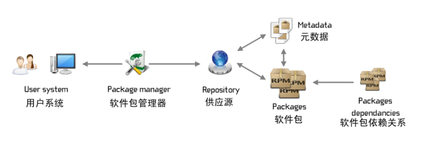

本篇简要介绍 openSUSE 的软件包管理系统。

**目录**

- [1 概览](https://zh.opensuse.org/软件包管理#.E6.A6.82.E8.A7.88)

- - [1.1 软件包](https://zh.opensuse.org/软件包管理#.E8.BD.AF.E4.BB.B6.E5.8C.85)
  - [1.2 元数据](https://zh.opensuse.org/软件包管理#.E5.85.83.E6.95.B0.E6.8D.AE)
  - [1.3 依赖关系](https://zh.opensuse.org/软件包管理#.E4.BE.9D.E8.B5.96.E5.85.B3.E7.B3.BB)
  - [1.4 软件包格式](https://zh.opensuse.org/软件包管理#.E8.BD.AF.E4.BB.B6.E5.8C.85.E6.A0.BC.E5.BC.8F)
  - [1.5 软件包管理器](https://zh.opensuse.org/软件包管理#.E8.BD.AF.E4.BB.B6.E5.8C.85.E7.AE.A1.E7.90.86.E5.99.A8)
  - [1.6 软件源](https://zh.opensuse.org/软件包管理#.E8.BD.AF.E4.BB.B6.E6.BA.90)

- [2 参阅](https://zh.opensuse.org/软件包管理#.E5.8F.82.E9.98.85)

**概览**

Linux 发行版无非就是一堆软件包 (package) 形式的应用程序加上整体地管理这些应用程序的工具。通常这些 Linux 发行版，包括 openSUSE，都是由成千上万不同的软件包构成的。

------

**软件包**

软件包不止是一个文件，内含构成软件的所有文件，包括程序本身、共享库、开发包以及使用说明等。

一般将软件包安装到系统中，需要考虑安装路径、依赖关系、桌面集成以及服务启动脚本等多个问题，故而软件包不可乱安装，安装时要选择对应的发行版及发行版版本。例如 openSUSE 发行版不可安装 Fedora 发行版的软件包，openSUSE 11.2 不可安装 openSUSE 11.1 的软件包（即便可能可以运行）。

**元数据**

元数据 (metadata) 包含于软件包之中，包含软件正常运行所需要的一些信息。软件包安装之后，其元数据就存储于本地的软件包数据库之中，以用于软件包检索。

元数据所含的信息有：

- 软件的全名
- 软件的描述
- 软件的版本
- 软件编译的时间、地点、作者等信息
- 软件的许可协议
- 软件所支持的架构
- 软件正常运行所需的其他软件包，即依赖关系 (dependencies)
- 软件包所含文件的列表
- 软件包里文件的校验和
- 以及其他的信息

**依赖关系**

依赖关系 (dependencies) 是软件包管理的一个重要方面。实际上每个软件包都会涉及到其他的软件包，软件包里程序的运行需要有一个可执行的环境（要求有其他的程序、库等），软件包依赖关系正是用来描述这种关系的。

- 软件包依赖关系是可传递的。就是说如果软件包 A 需要软件包 B，而软件包 B 需要软件包 C，那么软件包 A 也就需要软件包 C，这也是为何有时用户只想安装一个软件包，却最终安装了一大堆软件包。
- 对库文件（通常其名字以“lib”开头）的依赖是非常常见的。几乎每一个程序都依赖一堆的库文件。

软件包和软件包依赖关系是 Linux 系统非常重要的方面（BSD 和 UNIX 系统也是如此），因为他提供了一个模块化的方式来设置和管理操作系统以及操作系统上的应用程序。库文件更是如此，例如 openssl 软件包包含有加密的库文件，该文件为众多程序及其他的库文件所用，当有了新版的提升的 openssl 软件包时，只需升级 openssl 软件包，所有使用该加密库文件的程序也都将从中而受益。

依赖关系同样也是一个维护稳定安全的系统的非常高效的方式：当一个安全性缺陷或是漏洞影响到被一个或多个程序所使用的库文件时，只需升级这个库文件，所有使用该库文件的程序所面临的风险都将一并消除。

**软件包格式**

Linux 下的软件包通常是以下三种格式：

- **tgz** - tar gzip 文件。这类文件是基本的压缩软件包，可以容纳软件包维护者认为有用的所有的东西。此格式除本身的压缩格式外，并没有有关软件包内容的标准。
- **deb** - 此格式的软件包常用于 Debian 系统，是标准的 Debian 软件包格式。
- **rpm** - 此格式由 Red Hat Linux 所创建，并经由 [LSB](http://www.linuxfoundation.org/collaborate/workgroups/lsb) 标准化，现已为众多 Linux 发行版所采用，是一个优秀的软件包格式。openSUSE 即是用此格式。更多信息可以参阅[此处](http://www.rpm.org)。

然而，这些格式的软件包并不具备自动解决依赖关系的能力，当遇到缺少所需的依赖时，仅仅只是呈现给用户一眼所遇到的问题，问题还得由用户自己来解决。例如用户想安装一个 RPM 软件包 A，他依赖 RPM 软件包 B，RPM 不会自动安装软件包 B，只是告知用户需要软件包 B 并停止安装。这得用户先安装了软件包 B 然后才能安装软件包 A。若是软件包 B 又依赖软件包 C 和软件包 D，而软件包 D 又依赖软件包 E，软件包 E 又依赖其他软件包，层层依赖无以穷尽，用户就将陷入解决依赖的巨大迷网之中。

**软件包管理器**

所以这就需要能自动解决依赖关系的软件包管理器。软件包管理系统就是一个工具集，为系统提供一个统一的安装、升级、删除软件的方式。openSUSE 的软件包管理器是 [Libzypp](http://en.opensuse.org/Portal:Libzypp)，提供有界面形式的 [YaST 软件管理模块](https://zh.opensuse.org/YaST_Software_Management)和命令形式的 [Zypper](https://zh.opensuse.org/SDB:Zypper_用法)。openSUSE 的软件包管理器基于 RPM 软件包管理系统，能从软件源（网上服务器、CD、DVD等）上获取软件包，自动解决依赖关系并安装，而且日后的移除或更新等操作也很方便。

**软件源**

软件源 (package repositories) 指包含软件包和各种软件包信息（元数据 metadata）的本地或远端目录。具体可参阅[软件源介绍](https://zh.opensuse.org/软件源介绍)。

一般在软件包管理器里可搜索并安装的都是软件源里的软件包，所以可搜索并安装的软件包的数量取决于所添加的软件源，但也并非添加越多软件源越好，软件源过多不仅影响软件管理的效率，还影响系统的稳定性。