***\*HTTP keep-alive和TCP keepalive的区别\****

 

文章目录

一、简介

1.1、TCP协议简介

1.2、HTTP协议简介

二、TCP keepalive

2.1、简介

2.2、实验

2.3、扩展

三、HTTP keep-alive

3.1、简介

3.2、实验

3.2.1、实验一：禁用keep-alive的http请求

3.2.2、实验二：启用keep-alive的http请求

3.3、扩展

四、总结

五、彩蛋

 

1、从文中找出我的IP

2、http请求中是客服端还是服务端主动关闭的tcp连接？
请阅读到最后的彩蛋部分

 

HTTP和TCP都是老生常谈的知识点，本文不进行铺开赘述。我们可能在HTTP和TCP中都听说“长连接”的说法，也听过HTTP中有keep-alive，TCP中有keepalive。那么，HTTP和TCP的长连接有何区别？HTTP中的keep-alive和TCP中keepalive又有什么区别？

 

Tips：HTTP中是keep-alive，TCP中是keepalive，HTTP中是带中划线的。大小写无所谓。

 

# **一、简介**

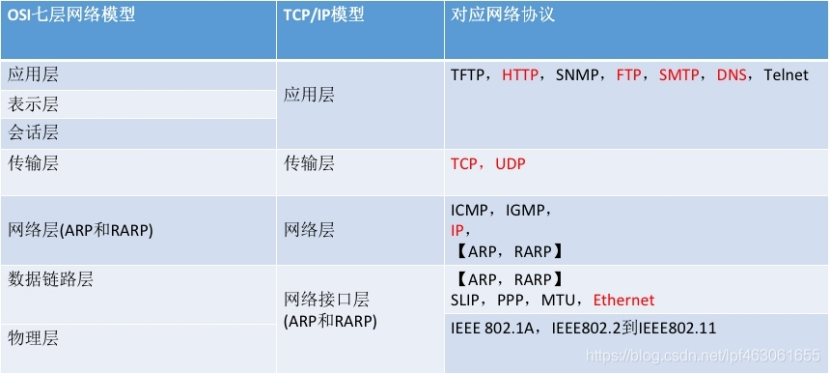 

上面是我先前做TCP协议分享时整理的一张表格，从上面可以看出：不管是在OSI七层网络模型还是在TCP/IP五层网络模型中，**TCP是传输层的一种协议，而HTTP是应用层的一种协议**。

HTTP和TCP的理论和实现还是相当复杂的，下面只简单介绍和本文主题相关的知识点。

1.1、TCP协议简介

TCP协议也叫传输控制协议（TCP，Transmission Control Protocol）是一种面向连接的、可靠的、基于字节流的传输层通信协议。使用TCP的两个程序（客户端和服务端）在交换数据前，通过三次握手来建立TCP连接，建立连接后就可以进行基于字节流的双工通讯，由TCP内部实现保证通讯的可靠性，完全通讯完成后，通过四次挥手断开连接。

 

在客户端和服务端间的网络一切正常、且双方都没主动发起关闭连接的请求时，此TCP连接理论上可以永久保持。但是，网络情况是及其复杂的，在双方长时间未通讯时，如何得知对方还活着？如何得知这个TCP连接是健康且具有通讯能力的？

1.2、HTTP协议简介

HTTP协议是Hyper Text Transfer Protocol（超文本传输协议）的缩写。HTTP是万维网的数据通信的基础。HTTP是一个应用层协议，通常运行在TCP协议之上。它由请求和响应构成，是一个标准的客户端服务器模型（C/S模型）。HTTP是一个无状态的协议。

 

无状态怎么解释？HTTP协议永远都是客户端发起请求，服务器回送响应。每次连接只处理一个请求，当服务器返回本次请求的应答后便立即关闭连接，下次请求客户端再重新建立连接。也就无法实现在客户端没有发起请求的时候，服务器主动将消息推送给客户端。

 

HTTP协议运行在TCP协议之上，它无状态会导致客户端的每次请求都需要重新建立TCP连接，接受到服务端响应后，断开TCP连接。对于每次建立、断开TCP连接，还是有相当的性能损耗的。那么，如何才能尽可能的减少性能损耗呢？

 

# **二、TCP keepalive**

2.1、简介

正如上面提出的问题：在双方长时间未通讯时，如何得知对方还活着？如何得知这个TCP连接是健康且具有通讯能力的？

 

TCP的保活机制就是用来解决此类问题，这个机制我们也可以称作：keepalive。保活机制默认是关闭的，TCP连接的任何一方都可打开此功能。有三个主要配置参数用来控制保活功能。

 

如果在一段时间（保活时间：tcp_keepalive_time）内此连接都不活跃，开启保活功能的一端会向对端发送一个保活探测报文。

 

若对端正常存活，且连接有效，对端必然能收到探测报文并进行响应。此时，发送端收到响应报文则证明TCP连接正常，重置保活时间计数器即可。

若由于网络原因或其他原因导致，发送端无法正常收到保活探测报文的响应。那么在一定**探测时间间隔（tcp_keepalive_intvl）后，将继续发送保活探测报文。直到收到对端的响应，或者达到配置的探测循环次数上限（tcp_keepalive_probes）**都没有收到对端响应，这时对端会被认为不可达，TCP连接随存在但已失效，需要将连接做中断处理。

在探测过程中，对端主机会处于以下四种状态之一：

 

| ***\*状态\****                                         | ***\*处理\****                                               |
| ------------------------------------------------------ | ------------------------------------------------------------ |
| 对方主机仍在工作，并且可达                             | TCP连接正常，将保活计时器重置。                              |
| 对方主机已崩溃，包括：已关闭或者正在重启               | TCP连接不正常，经过指定次数的探测依然没得到响应，则断开连接  |
| 对方主机崩溃并且已经重启                               | 重启后原连接已失效，对方由于不认识探测报文，会响应重置报文段，请求端将连接断开 |
| 对方主机仍在工作，但由于某些原因不可达（如：网络原因） | TCP连接不正常，经过指定次数的探测依然没得到响应，则断开连接  |

 

2.2、实验

这里，强烈推荐《TCP/IP详解 卷1:协议》的第二版（这里一定是第二版）， 第17章：TCP保活机制。这里建议17章都看，17.1和17.2小节就涵盖了我上面介绍的内容。

 

17.2.1 小节中还通过实验的方式详细验证了“对端主机会处于以下四种状态”以及对于这四种状态TCP都是如何去处理。

 

这本书中的实验已经比较通俗易懂了，我暂且没有亲自动手去模拟实践，后续时间充足，会亲自动手进行实验。

 

2.3、扩展

上面提到了三个参数保活时间：tcp_keepalive_time、探测时间间隔：tcp_keepalive_intvl、探测循环次数：tcp_keepalive_probes。

 

这三个参数，在linux上可以在/proc/sys/net/ipv4/路径下找到，或者通过sysctl -a | grep keepalive命令查看当前内核运行参数。

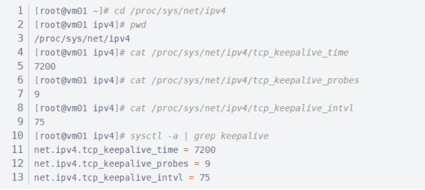 

l 保活时间（tcp_keepalive_time）默认：7200秒

l 保活时间间隔（tcp_keepalive_intvl）默认：75秒

l 探测循环次数（tcp_keepalive_probes）默认：9次

 

也就是默认情况下一条TCP连接在2小时（7200秒）都没有报文交换后，会开始进行保活探测，若再经过9*75秒=11分钟15秒的循环探测都未收到探测响应，即共计：2小时11分钟15秒后会自动断开TCP连接。

 

别走开，还有一个骚操作

 

Linux平台下我们还可以借助man命令查看TCP协议的一些描述和参数定义。下面两个命令的效果相同：

 

命令一：man tcp

命令二：man 7 tcp

7的含义是：man命令使用手册共9章，TCP的帮助手册位于第7章。不知道在第几章也无所谓，使用man tcp也可，弹出的手册左上角也有写第几章。(man ls等同于man 1 ls、man ip等同于man 8 ip，可以自己尝试使用 )。

 

下面我们看下man tcp下的和我们本文有关的几个点：

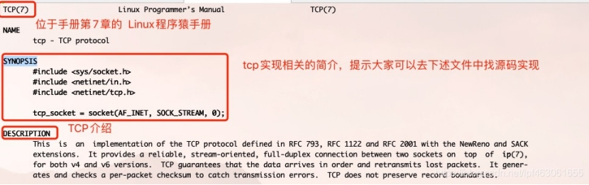 

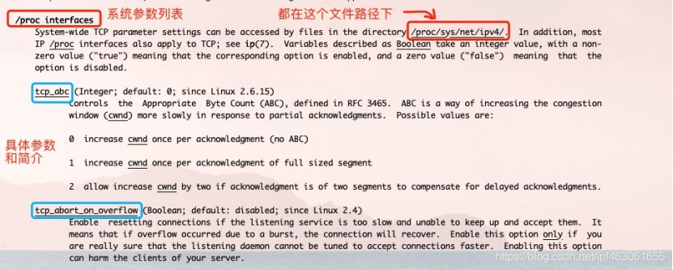 

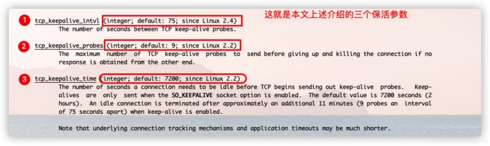 

上面介绍的三个参数tcp_keepalive_time、tcp_keepalive_intvl、tcp_keepalive_probes都是系统级别的，针对整个系统生效。下面介绍针对单条Socket连接细粒度设置的三个选项参数：保活时间：TCP_KEEPIDLE、保活探测时间间隔：TCP_KEEPINTVL、探测循环次数：TCP_KEEPCNT

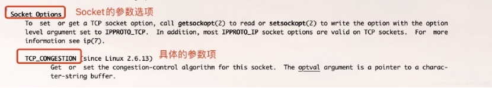 

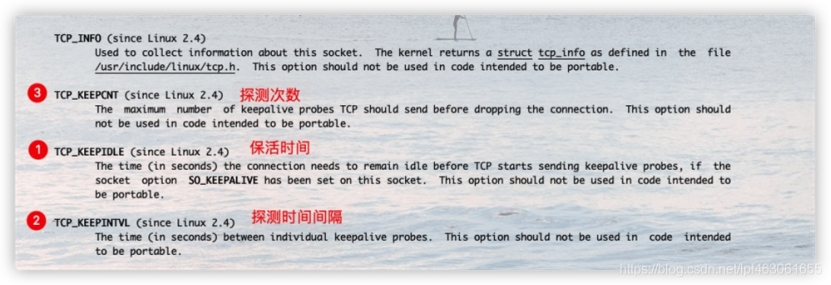 

在我们的Netty的框架中可以看到针对Socket选项的配置，如使用epoll的IO模型中EpollSocketChannelConfig类中的配置：

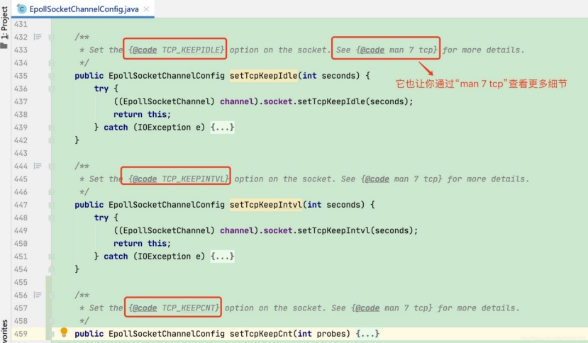 

**更多细节，等你挖掘。**

**三、HTTP keep-alive**

**3.1、简介**

HTTP协议简介中提到http协议是一个运行在TCP协议之上的无状态的应用层协议。它的特点是：客户端的每一次请求都要和服务端创建TCP连接，服务器响应后，断开TCP连接。下次客户端再有请求，则重新建立连接。

 

在早期的http1.0中，默认就是上述介绍的这种“请求-应答”模式。这种方式频繁的创建连接和销毁连接无疑是有一定性能损耗的。

 

所以引入了keep-alive机制。http1.0默认是关闭的，通过http请求头设置“connection: keep-alive”进行开启；http1.1中默认开启，通过http请求头设置“connection: close”关闭。

 

keep-alive机制：若开启后，在一次http请求中，服务器进行响应后，不再直接断开TCP连接，而是将TCP连接维持一段时间。在这段时间内，如果同一客户端再次向服务端发起http请求，便可以复用此TCP连接，向服务端发起请求，并重置timeout时间计数器，在接下来一段时间内还可以继续复用。这样无疑省略了反复创建和销毁TCP连接的损耗。

 

## **3.2、实验**

下面用两组实验证明**HTTP keep-alive**的存在。

实验工具：Wireshark

客户端IP：*.*.3.52

服务端IP：*.*.17.254

### **3.2.1、实验一：禁用keep-alive的http请求**

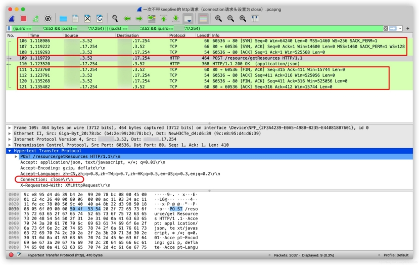 

从上图请求列表区中，我们可以发现：

 

106、107、108三个请求是TCP建立连接三次握手的请求

109、110两个请求分别是：http的请求报文和http的响应报文

111、112、120、121这四个请求是TCP断开连接四次挥手的请求

（由于一台机器上网络请求较多，我加了筛选条件，仅显示客户端和服务端通信的网络请求，所以请求的序号是不连续的）

 

从上图中间的请求数据解析区，可以确定：此次http请求的请求头中有“Connection: close”，即keep-alive是关闭的。

 

结论：禁用keep-alive的http请求时，会先建立TCP连接，然后发送报文、响应报文、最后断开TCP连接。

### **3.2.2、实验二：启用keep-alive的http请求**

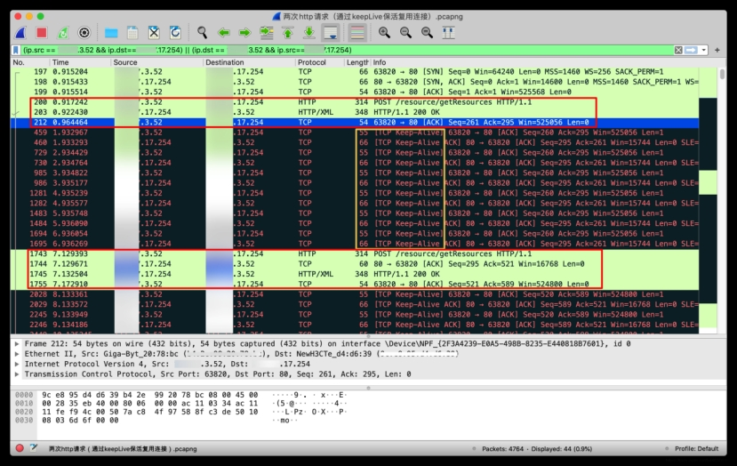 

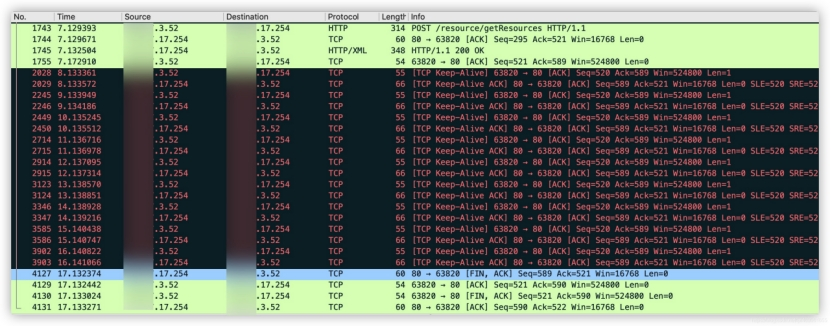 

 

这次实验请求较多，一张图放不下，两张图是连续的，图1的第二块绿色区域和图2的第一块绿色区域是重叠的（注意看第一列的No.编号）

 

先说下我的操作：

 

开启keep-alive前提下发起第一次http请求

7秒左右时，同样的机器同样的http请求，再重新调用一次

我们根据图中抓包，分析下网络请求：

 

197、198、199请求：三次握手建立TCP建立连接

200、203请求：http的请求报文和http的响应报文

212请求：可以通过Protocol列看到它是一条TCP报文。我的理解是：在keep-alive这种机制下，客户端收到服务端响应报文后，需要告知服务端“已收到”。由于要复用TCP连接，所以会多一层保障机制，类似TCP的握手和挥手

459-1965请求（图1中的第一块黑色区域中）：6秒内（第二列代表Time），每隔1秒，发生一对TCP请求的来回，用来维护TCP连接的可用性。保证和等待该TCP连接被复用

1743、1744、1745、1755请求：其中的1743和1745是我第二次发起http请求的请求报文和响应报文。1744请求是：客户端发起请求时，服务端先回复客户端“已收到，马上处理”。紧接着1745将结果响应给客户端。1755则是客户端收到响应后，回复服务端“已收到响应，多谢”。

2028-3903请求：10秒内，每隔1秒，发生一对TCP请求的来回，用来维护TCP连接的可用性。保证和等待该TCP连接被复用

4127-4131请求：10秒内我没再发起http请求，四次挥手断开TCP连接。长时间没被复用，也没必要一直维持下去，浪费资源，还可能造成网络拥堵。

注意：10秒无请求，TCP连接在断开，10秒也不是默认的，只是环境的配置。是Httpd守护进程，提供的keep-alive timeout时间设置参数。比如nginx的keepalive_timeout，和Apache的KeepAliveTimeout。

## **3.3、扩展**

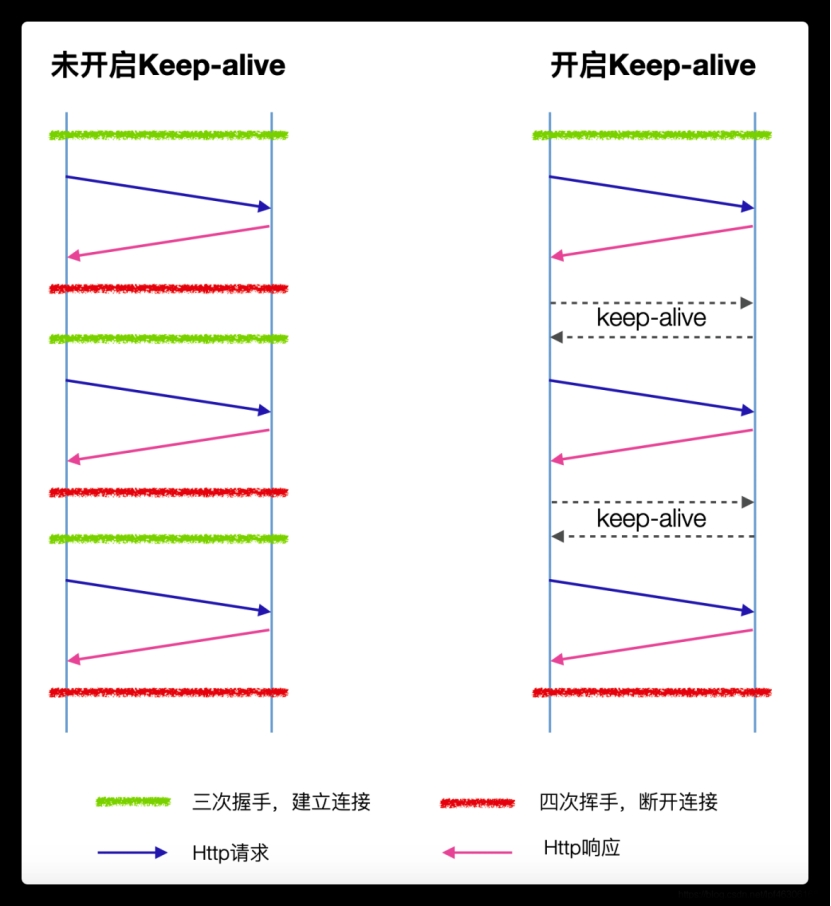 

其实对于HTTP keep-alive机制可以总结为上图所示。

 

启用HTTP keep-Alive的优缺点：

优点：keep-alive机制避免了频繁建立和销毁连接的开销。 同时，减少服务端TIME_WAIT状态的TCP连接的数量(因为由服务端进程主动关闭连接)

缺点：若keep-alive timeout设置的时间较长，长时间的TCP连接维持，会一定程度的浪费系统资源。

 

总体而言，HTTP keep-Alive的机制还是利大于弊的，只要合理使用、配置合理的timeout参数。

# **四、总结**

回到文章开头提出的问题：HTTP和TCP的长连接有何区别？HTTP中的keep-alive和TCP中keepalive又有什么区别？

 

1、TCP连接往往就是我们广义理解上的长连接，因为它具备双端连续收发报文的能力；开启了keep-alive的HTTP连接，也是一种长连接，但是它由于协议本身的限制，服务端无法主动发起应用报文。

 

2、TCP中的keepalive是用来保鲜、保活的；HTTP中的keep-alive机制主要为了让支撑它的TCP连接活的的更久，所以通常又叫做：HTTP persistent connection（持久连接） 和 HTTP connection reuse（连接重用）。

# **五、彩蛋**

**彩蛋一**

 

你能从文中找出我在HTTP keep-alive实验中客户端和服务端的完整IP吗？

 

如能找出，说明对网络协议的了解已如火纯青。

 

**彩蛋二**

 

在HTTP请求中，到底是「服务端」还是「客户端」主动关闭连接呢？

 

看到过很多文章，有人说服务端、有人说客户端、有人说分情况（keep-alive的开启与否）既可能是客户端也可能是服务端。你信谁？最后翻来覆去发现各个网站的各种文章基本类似，只有观点，没有论据。

 

HTTP keep-alive章节的实验结果：无论开启keep-alive与否，最终由服务端主动断开TCP连接。

 

但是我给出问题的答案是：通常由服务端主动关闭连接。没有写“肯定由服务端主动关闭连接”的原因是，我没遇到客户端主动关闭连接的场景，并不代表没有。网络和协议博大精深，等待我们继续去探索。

 

这个彩蛋的目的由两个：

 

1、告诉大家：网上的文章、他人的观点，还是要思辨的看待。

 

2、我确实想知道什么情况下，客户端主动关闭连接？欢迎大家私信讨论，一定要有真凭实据

**彩蛋三**

 

Wireshark是一款功能强大的网络封包分析可视化软件。《TCP/IP详解 卷1:协议》第二版相比第一版，书中的抓包工具也将tcpdump改为****Wireshark。****

 

个人观点：《TCP/IP详解 卷1:协议》第一版和第二版结合起来看效果更好。第一版的TCP阻塞控制将的更通俗易懂，第二版的TCP保活机制讲的更清晰。

 

客户端和服务端的完整IP:

172.17.17.254,172.17.3.52