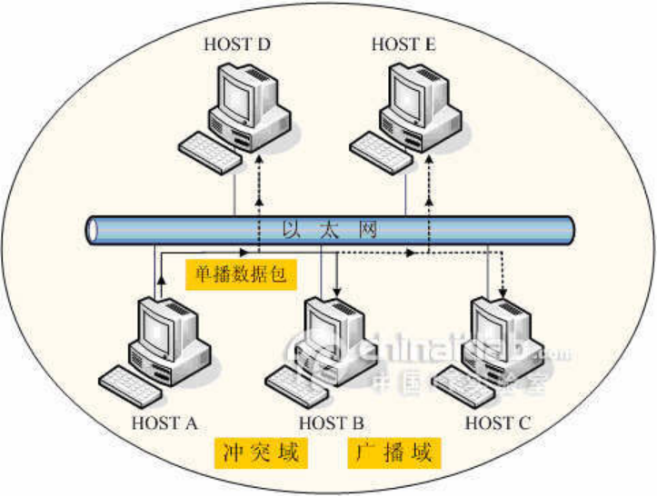
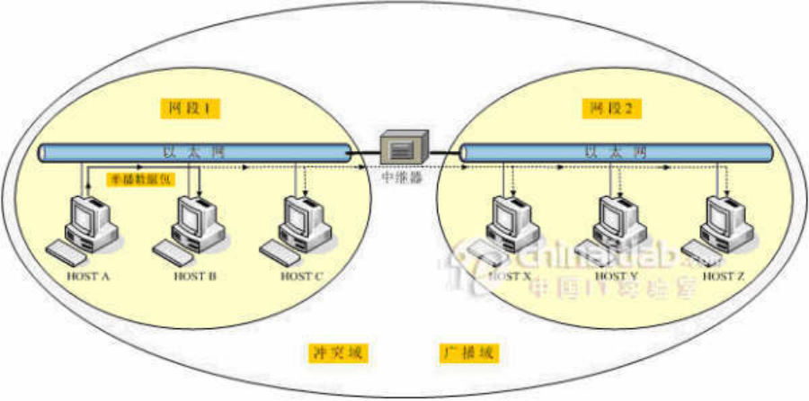
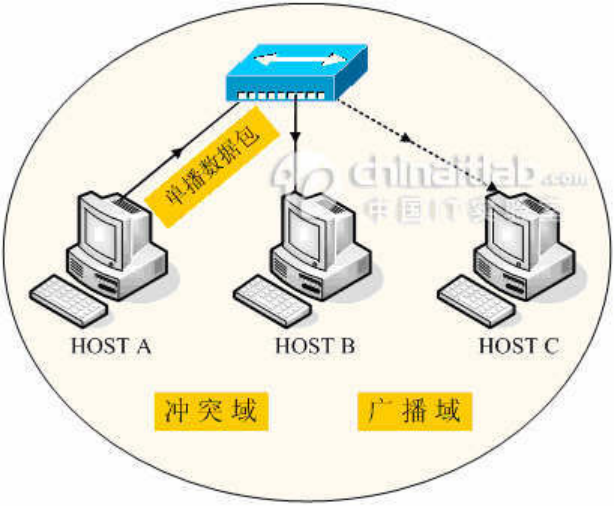
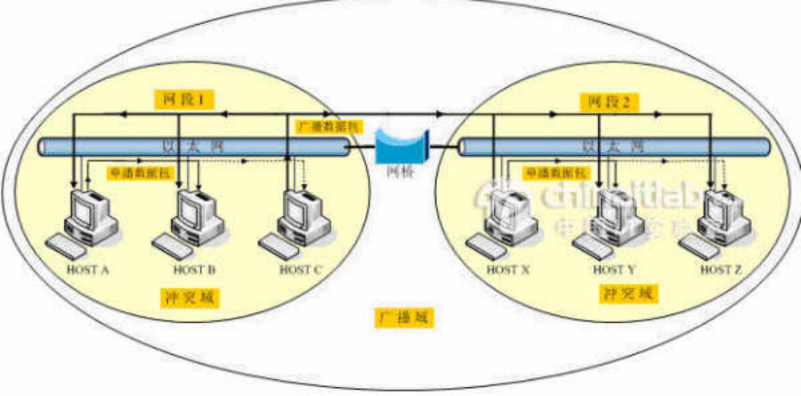
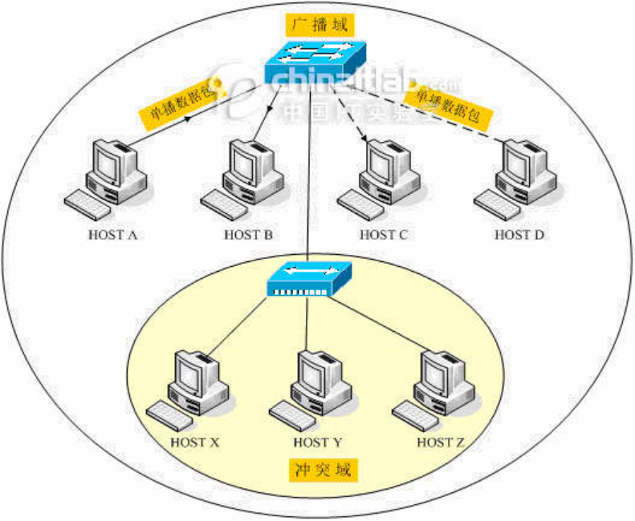
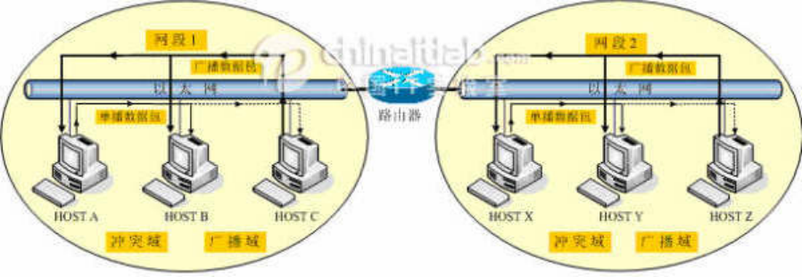

# **冲突域与广播域（区别、知识要点）** 

 

1、冲突域指的是会产生冲突的最小范围，在计算机和计算机通过设备互联时，会建立一条通道，如果这条通道只允许瞬间一个数据报文通过，那么在同时如果有两个或更多的数据报文想从这里通过时就会出现冲突了。冲突域的大小可以衡量设备的性能，多口hub的冲突域也只有一个，即所有的端口上的数据报文都要排队等待通过。而交换机就明显的缩小了冲突域的大小，使到每一个端口都是一个冲突域，即一个或多个端口的高速传输不会影响其它端口的传输，因为所有的数据报文不同都按次序排队通过，而只是到同一端口的数据才要排队。

2、如果一个数据报文的目标地址是这个网段的广播地址或者目标计算机的MAC地址是FF-FF-FF-FF-FF-FF，那么这个数据报文就会被这个网段的所有计算机接收并响应，这就叫做广播。通常广播用来进行ARP寻址等用途，但是广播域无法控制也会对网络健康带来严重影响，主要是带宽和网络延迟。这种广播所能覆盖的范围就叫做广播域了，二层的交换机是转发广播的，所以不能分割广播域，而路由器一般不转发广播，所以可以分割或定义广播域。

 

　网络互连设备可以将网络划分为不同的冲突域、广播域。但是，由于不同的网络互连设备可能工作在OSI模型的不同层次上。因此，它们划分冲突域、广播域的效果也就各不相同。如中继器工作在物理层，网桥和交换机工作在数据链路层，路由器工作在网络层，而网关工作在OSI模型的上三层。而每一层的网络互连设备要根据不同层次的特点完成各自不同的任务。

　　下面我们讨论常见的网络互连设备的工作原理以及它们在划分冲突域、广播域时各自的特点。

### **1、传统以太网操作**

　　传统共享式以太网的典型代表是总线型以太网。在这种类型的以太网中，通信信道只有一个，采用介质共享（介质争用）的访问方法（第1章中介绍的CSMA/CD介质访问方法）。每个站点在发送数据之前首先要侦听网络是否空闲，如果空闲就发送数据。否则，继续侦听直到网络空闲。如果两个站点同时检测到介质空闲并同时发送出一帧数据，则会导致数据帧的冲突，双方的数据帧均被破坏。这时，两个站点将采用"二进制指数退避"的方法各自等待一段随机的时间再侦听、发送。

　　

　　在图1中，主机A只是想要发送一个单播数据包给主机B。但由于传统共享式以太网的广播性质，接入到总线上的所有主机都将收到此单播数据包。同时，此时如果任何第二方，包括主机B也要发送数据到总线上都将冲突，导致双方数据发送失败。我们称连接在总线上的所有主机共同构成了一个冲突域。

　　

　　当主机A发送一个目标是所有主机的广播类型数据包时，总线上的所有主机都要接收该广播数据包，并检查广播数据包的内容，如果需要的话加以进一步的处理。我们称连接在总线上的所有主机共同构成了一个广播域。

 

 

**图1　 传统以太网**

### **2、中继器（Repeater）**

　　中继器（Repeater）作为一个实际产品出现主要有两个原因：

　　

　　第一，扩展网络距离，将衰减信号经过再生。

　　

　　第二，实现粗同轴电缆以太网和细同轴电缆以太网的互连。

　　

　　通过中继器虽然可以延长信号传输的距离、实现两个网段的互连。但并没有增加网络的可用带宽。如图2所示，网段1和网段2经过中继器连接后构成了一个单个的冲突域和广播域。　

 

**图2　 中继器连接的网络**

### **3、集线器（HUB）**

　　集线器实际上相当于多端口的中继器。集线器通常有8个、16个或24个等数量不等的接口。

　　

　　集线器同样可以延长网络的通信距离，或连接物理结构不同的网络，但主要还是作为一个主机站点的汇聚点，将连接在集线器上各个接口上的主机联系起来使之可以互相通信。

　　

　　如图3所示，所有主机都连接到中心节点的集线器上构成一个物理上的星型连接。但实际上，在集线器内部，各接口都是通过背板总线连接在一起的，在逻辑上仍构成一个共享的总线。因此，集线器和其所有接口所接的主机共同构成了一个冲突域和一个广播域。

 

**图3　 集线器连接的网络**

### **4、网桥（Bridge）**

　　网桥（Bridge）又称为桥接器。和中继器类似，传统的网桥只有两个端口，用于连接不同的网段。和中继器不同的是，网桥具有一定的"智能"性，可以"学习"网络上主机的地址，同时具有信号过滤的功能。

　　

　　如图4所示，网段1的主机A发给主机B的数据包不会被网桥转发到网段2。因为，网桥可以识别这是网段1内部的通信数据流。同样，网段2的主机X发给主机Y的数据包也不会被网桥转发到网段1。可见，网桥可以将一个冲突域分割为两个。其中，每个冲突域共享自己的总线信道带宽。

 

**图4　 网桥连接的网络**

　　但是，如果主机C发送了一个目标是所有主机的广播类型数据包时，网桥要转发这样的数据包。网桥两侧的两个网段总线上的所有主机都要接收该广播数据包。因此，网段1和网段2仍属于同一个广播域。

### **5、交换机（Switch）**

　　交换机（Switch）也被称为交换式集线器。它的出现是为了解决连接在集线器上的所有主机共享可用带宽的缺陷。

　　

　　交换机是通过为需要通信的两台主机直接建立专用的通信信道来增加可用带宽的。从这个角度上来讲，交换机相当于多端口网桥。

　　

　　如图5所示，交换机为主机A和主机B建立一条专用的信道，也为主机C和主机D建立一条专用的信道。只有当某个接口直接连接了一个集线器，而集线器又连接了多台主机时，交换机上的该接口和集线器上所连的所有主机才可能产生冲突，形成冲突域。换句话说，交换机上的每个接口都是自己的一个冲突域。

 

**图5　 交换机连接的网络**

　但是，交换机同样没有过滤广播通信的功能。如果交换机收到一个广播数据包后，它会向其所有的端口转发此广播数据包。因此，交换机和其所有接口所连接的主机共同构成了一个广播域。

　　

　　我们将使用交换机作为互连设备的局域网称为交换式局域网。

### **6、路由器（Router）**

　　路由器工作在网络层，可以识别网络层的地址-IP地址，有能力过滤第3层的广播消息。实际上，除非做特殊配置，否则路由器从不转发广播类型的数据包。因此，路由器的每个端口所连接的网络都独自构成一个广播域。如图6所示，如果各网段都是共享式局域网，则每网段自己构成一个独立的冲突域。

 

**图6　 路由器连接的网络**

### **7、网关（Gateway）**

　　网关工作在OSI参考模型的高三层，因此，并不使用冲突域、广播域的概念。网关主要用来进行高层协议之间的转换。例如，充当LOTUS 1-2-3邮件服务和Microsoft Exchange邮件服务之间的邮件网关。

　　注意，这里网关的概念完全不同于PC主机以及路由器上配置的默认网关（default gateway）。

 