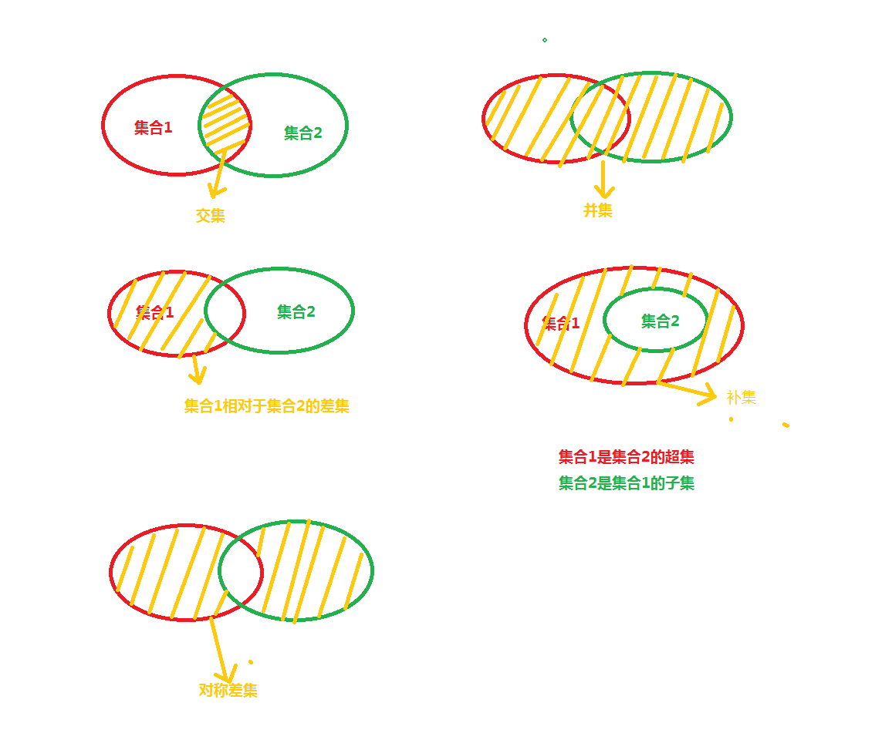

```shell
1 并集
记A，B是两个集合，以属于A或属于B的元素为元素的集合称为A与B的并（集），记作A∪B（或B∪A），读作“A并B”（或“B并A”），即A∪B={x|x∈A,或x∈B} 。

2 交集
记A，B是两个集合，以属于A且属于B的元素为元素的集合称为A与B的交（集），记作A∩B（或B∩A），读作“A交B”（或“B交A”），即A∩B={x|x∈A,且x∈B}

3 差集
记A，B是两个集合，则所有属于A且不属于B的元素构成的集合，叫做集合A减集合B(或集合A与集合B之差)，类似地，对于集合A、B，把集合{x∣x∈A,且x∉B}叫做A与B的差集。

4 补集
记A，U是两个集合，属于全集U不属于集合A的元素组成的集合称为集合A的补集，记作CuA，即CuA={x|x∈U,且x不属于A}。

5 扩展资料
摩根定律，又叫反演律，用文字语言可以简单的叙述为：两个集合的交集的补集等于它们各自补集的并集，两个集合的并集的补集等于它们各自补集的交集。

若集合A、B是全集U的两个子集，则以下关系恒成立：

（1）∁U（A∩B）=（∁UA）∪（∁UB），即“交之补”等于“补之并”；

（2）∁U（A∪B）=（∁UA）∩（∁UB），即“并之补”等于“补之交”
```




